# ELF格式与动态链接

## ELF文件格式

- ELF: Executable and Linkable Format
- 一种Linux下常用的可执行文件、对象、共享库的标准文件格式
- 还有许多其他可执行文件格式: PE、Mach-O、COFF、COM...
- 内核中处理ELF相关代码参考：fs/binfmt_elf.c
- ELF中的数据安装Segment和Section两个概念进行划分

### Segment与Section

- Segment
   - 用于告诉内核，在执行ELF文件时应该如何映射内存
   - 每个Segment主要包含加载地址、文件中的范围、内存权限、对齐方式等信息
   - 是运行时必须提供的信息

- Section
   - 用于告诉链接器，ELF中每个部分是什么，哪里是代码，哪里是只读数据，哪里是重定位信息
   - 每个Section主要包含Section类型、文件中的位置、大小等信息
   - 链接器依赖Section信息将不同的对象文件的代码、数据信息合并，并修复互相引用

- Segment与Section的关系
   - 相同权限的Section会放入同一个Segment，例如.text和.rodata seciton
   - 一个Segment包含许多Section，一个Section可以属于多个Segment

### ELF文件类型

- 可执行文件(ET_EXEC)

   可直接运行的程序，必须包含segment

- 对象文件（ET_REL, *.o)

   需要与其他对象文件链接，必须包含section

- 动态库 （ET_DYN, *.so)

   与其他对象文件/可执行文件链接。必须同时包含segment和section


### ELF文件格式

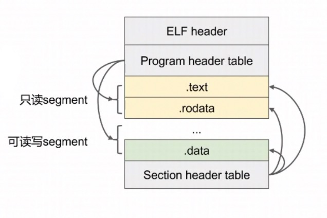

- ELF Header
   - 架构、ABI版本等基础信息
   - program header table的位置和数量
   - section header table的位置和数量

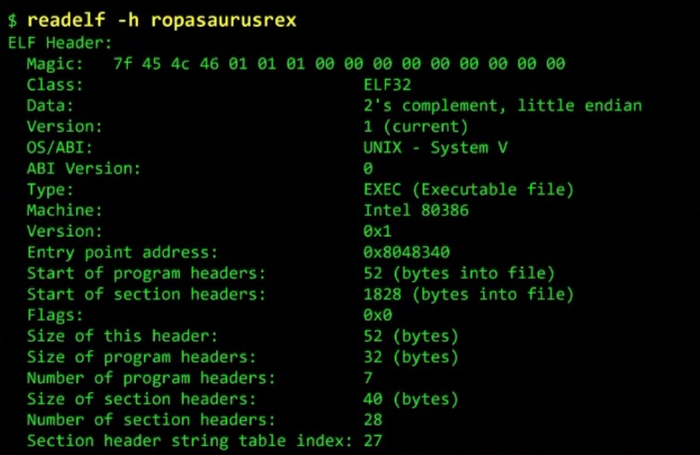

- Program header table
   - 每个表项定义了一个segment
   - 每个segment可包含多个section

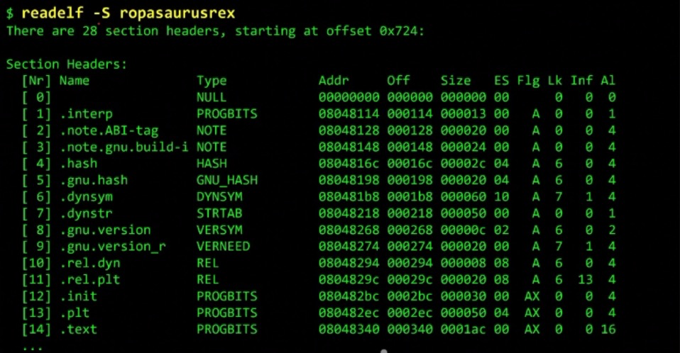

- Section header table
   - 每个表项定义了一个section

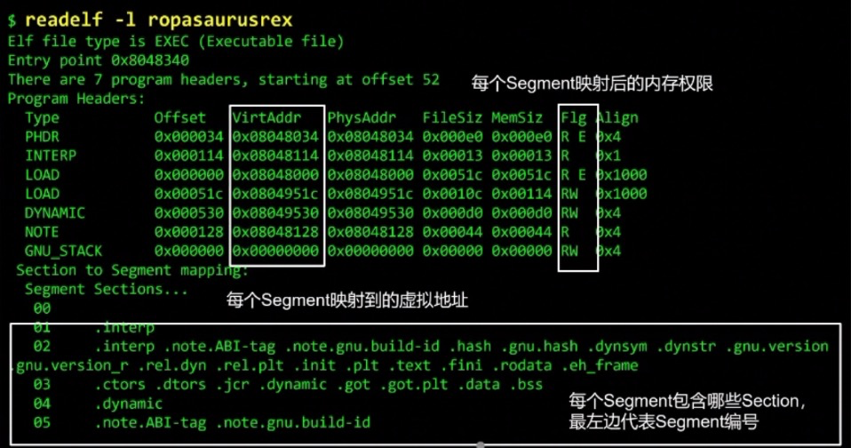


### 进程内存空间

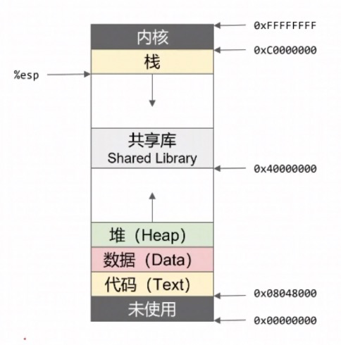

### 内存空间中的栈帧 (Stack Frame)

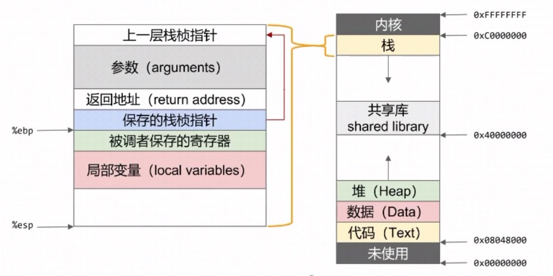

### 内存映射

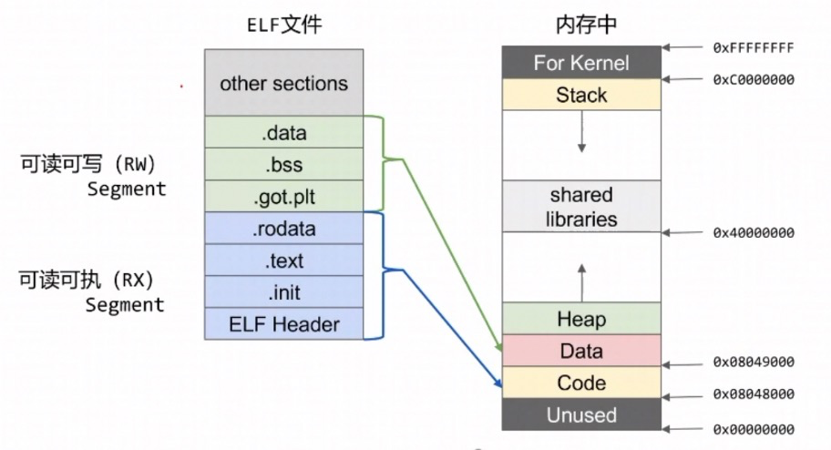

通过/proc/[pid]/maps查看内存映射情况

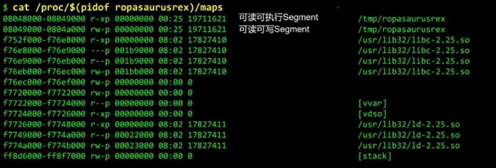

### 静态链接的程序的启动过程

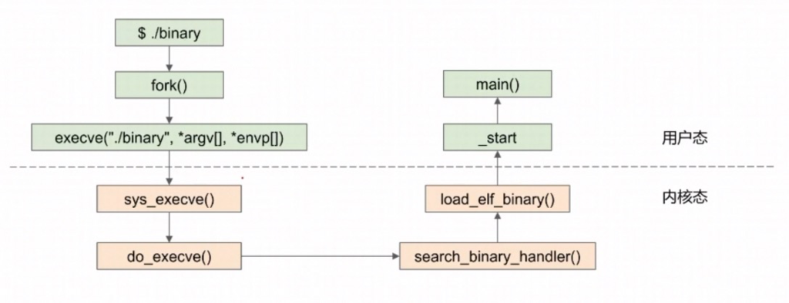

### 动态链接的程序的启动过程

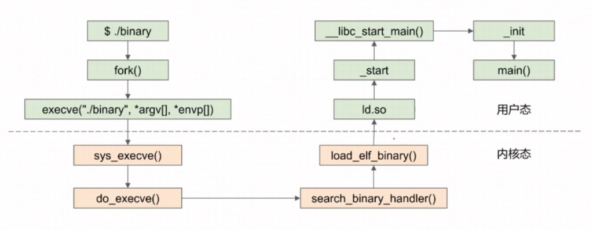

### 程序是如何启动的

- sys_execve()
   - 检查参数和环境变量

- do_execve()
   - 解析ELF头，填充二进制格式相关参数(linux_binprm结构体)

- search_binary_handler()
   - 搜索已注册的二进制格式列表，找到正确的格式

- load_elf_binary()
   - 解析program header
   - 从.interp节(section)中找到装载器ld.so的路径
   - 映射内存段(segment)
   - 修改sys_execve的返回值为ld.so或静态链接ELF的入口地址

- ld.so & _start & __libc_start_main
   - ld.so
        - 负责加载所有共享库
        - 初始化GOT表
   - _start
        - 为 __libc_start_main传递环境变量和.init/.fini/main函数
   - __libc_start_main
        - 调用 .init
        - 调用 main
        - 调用 .fini
        - 调用exit

- ELF启动过程流程图


## 动态链接(Dynamic Linking)

### 动态链接

- 一种运行时才会加载和链接程序所依赖的共享库的技术
- Linux最常见的共享库是libc

### 重定位 (Relocations)
- 指二进制文件中的待填充项
   - 链接器在链接时填充，例如链接多个目标文件时，修正相互引用的函数、变量地址
   - 动态链接器在运行时填充，例如动态解析库函数(例如printf)

### 动态链接中的延迟绑定
   - 外部函数的地址在运行时才会确定
   - 外部函数符号通常在首次调用时才会被解析
   - 外部变量不使用延迟绑定机制

### GOT表 (Global Offset Table)
   - GOT表常常用于存放外部函数地址(或外部变量)
   - GOT表项初始状态指向一段PLT(过程链接表，Procedure Linkage Table)代码
   - 当库函数被首次调用，真正的函数地址会被解析并填入相应的GOT表项
   - 每个外部函数均有一段PLT（过程链接表，Procedure Linkage Table）代码，用于跳转到相应GOT表项中存储的地址。

#### 在gdb中观察延迟绑定
我们使用gdb调试hello程序，在调用动态库函数puts之前下一个断点，随后观察整个调用过程。

```
void main() {
    puts("Hello World!");
}
```

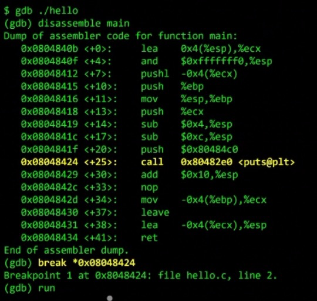

在gdb中，使用display命令可以设置每次单步执行后自动显示的内容，此次我们设置为显示后续三条指令。
单步执行call puts@plt，跳转到puts函数的PLT代码，第一条指令是jmp *puts@got，即puts的GOT表项(左边图中GOT表项位于0x804a00c)中包含的地址，初始状态为0x80482e6，指向puts@plt+6

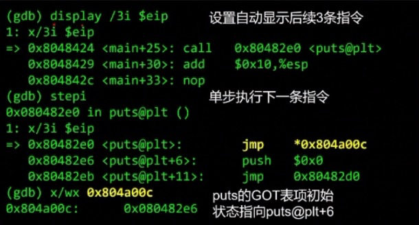

GOT表项初始化为puts@plt+6，第一次调用puts()函数会执行_dl_runtime_resolve，执行完毕后GOT表项内的值就会填充正确的puts()函数地址。
后续所有对puts函数的调用都无需再次解析，可以直接找到相应代码。

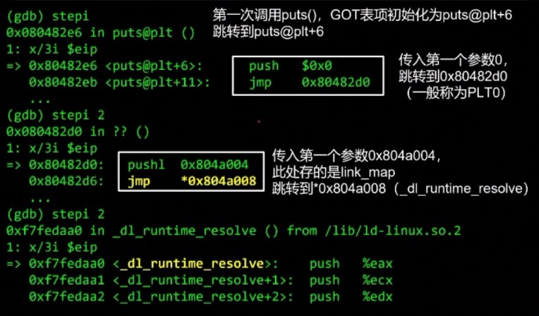

GOT表项初始化为puts@plt+6，首先跳转到这里。
puts@plt+6处的代码会push第一个参数0，然后跳到0x80482d0(称为PLT0)
PLT0处的代码会push第一个参数0x804a004(此处存的是link_map)，然后跳到*0x804a008，实际是_dl_runtime_resolve函数，一个用来解析动态链接函数的函数。


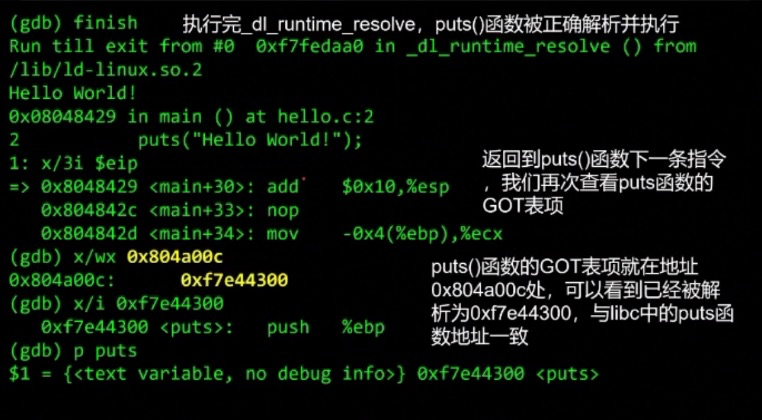

#### GOT表位置

GOT表位于.got和.got.plt Section

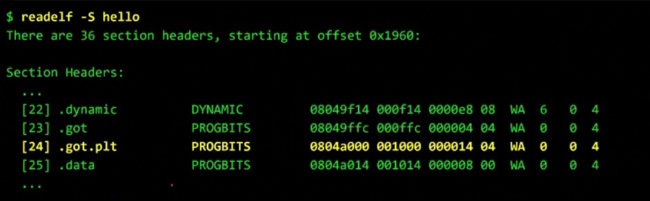

   - .got Section中存放外部全局变量的GOT表，例如stdin/stdout/stderr，非延迟绑定
   - .got.plt Sectioon中存放外部函数的GOT表，例如printf，采用延迟绑定。

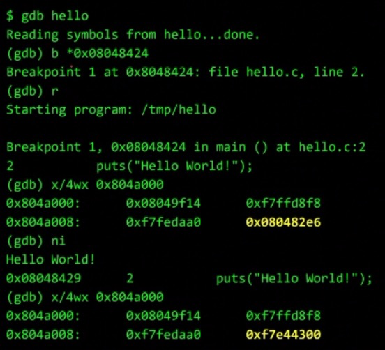

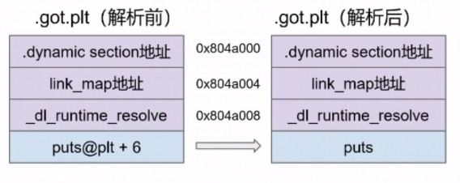

   - .got.plt前三项有特殊含义，第四项开始保存引用的各个外部函数的GOT表项：
       - 第一项保存的是.dynamic seciton的地址
         .dynamic seciton —— 为动态链接提供信息，例如符号表、字符串表
       - 第二项保存的是link_map结构地址
         link_map —— 一个链表，包含所有加载的共享库信息
       - 第三项保存了_dl_runtime_resolve函数的地址
         _dl_runtime_resolve —— 位于loader中，用于解析外部函数符合的函数。解析完成后会直接执行该函数。

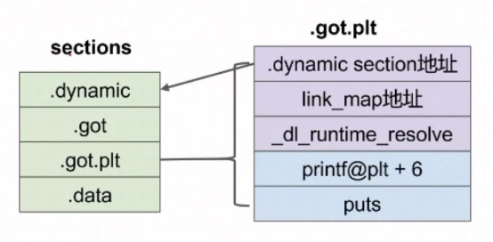

#### .plt section

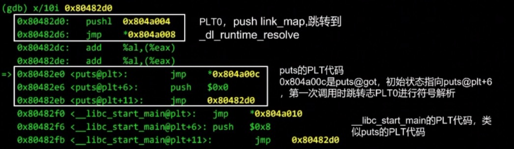

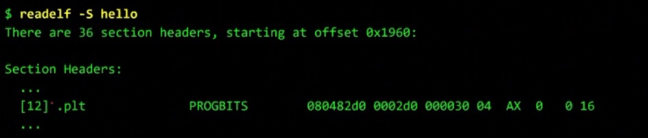

   - .plt Section中存放所有外部函数对应的PLT代码

#### 延迟绑定(Lazy Binding)

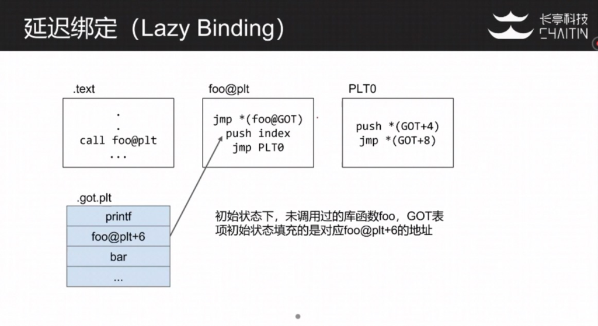

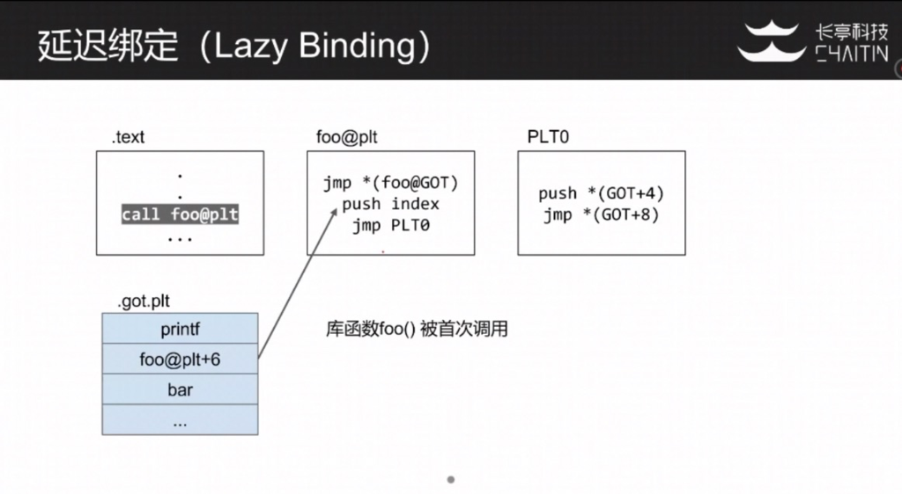

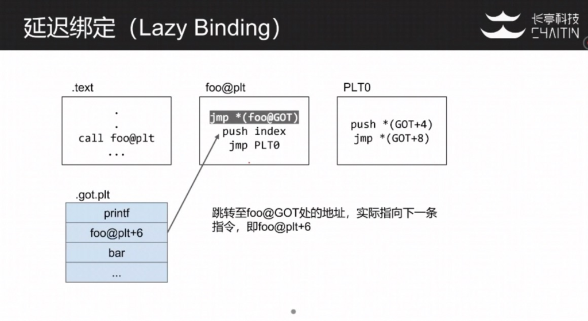

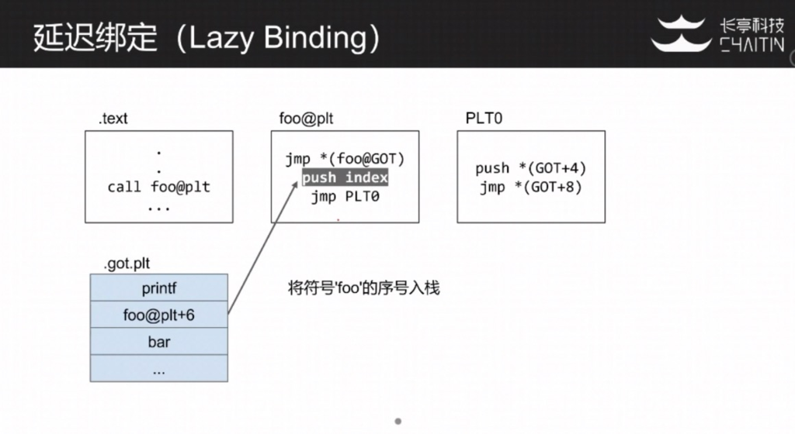

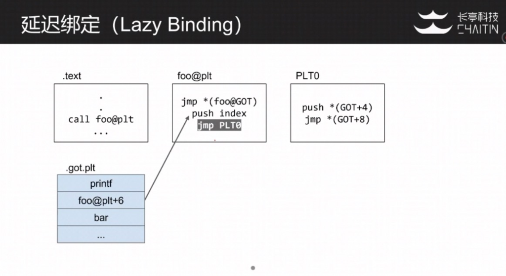

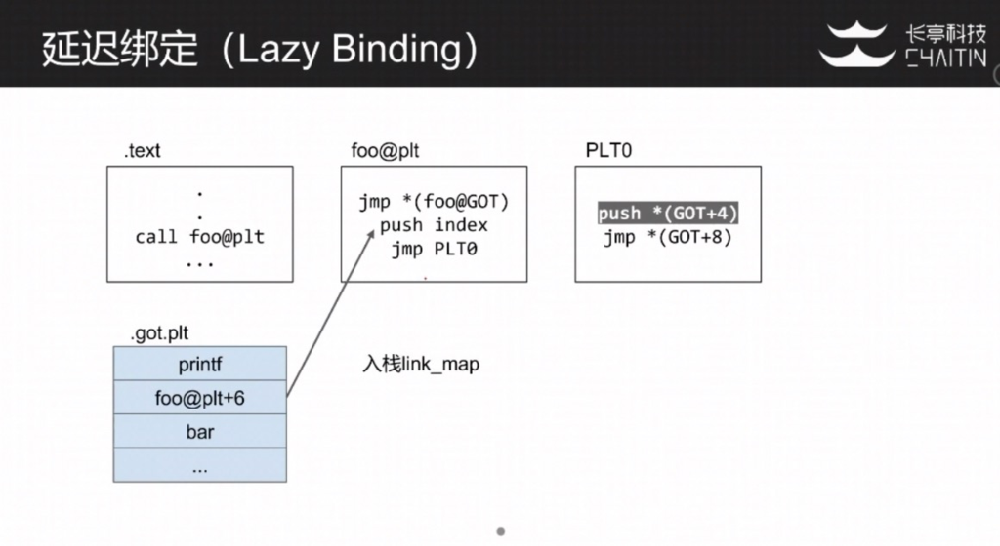

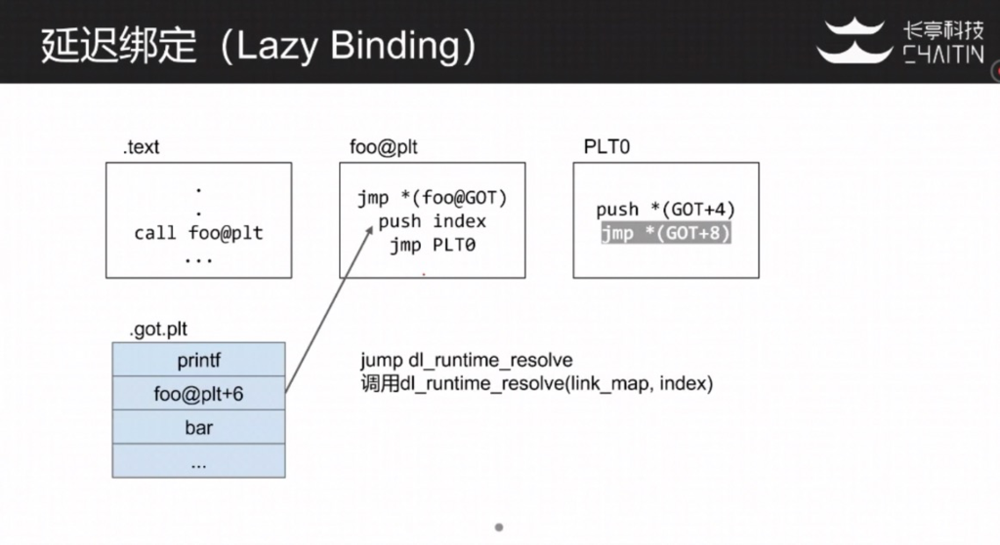

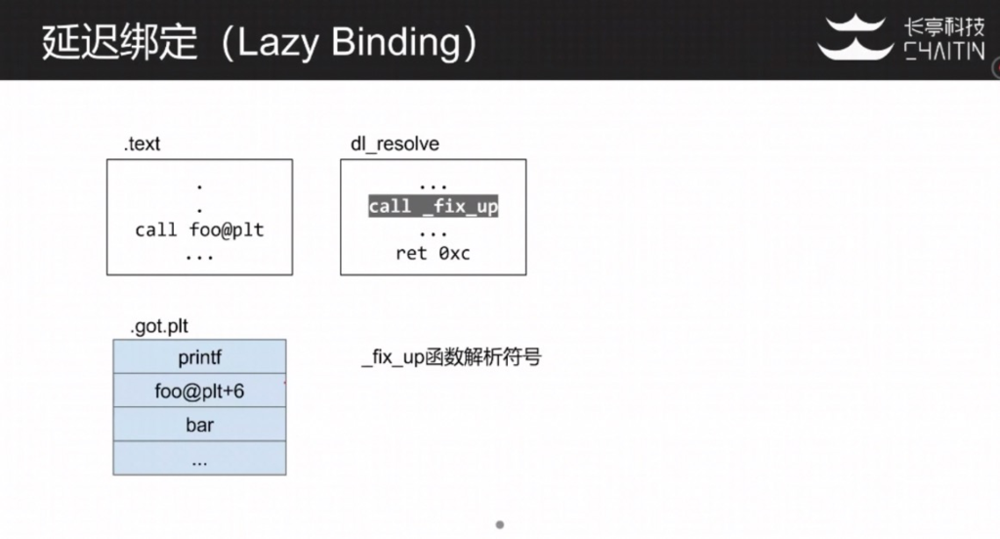

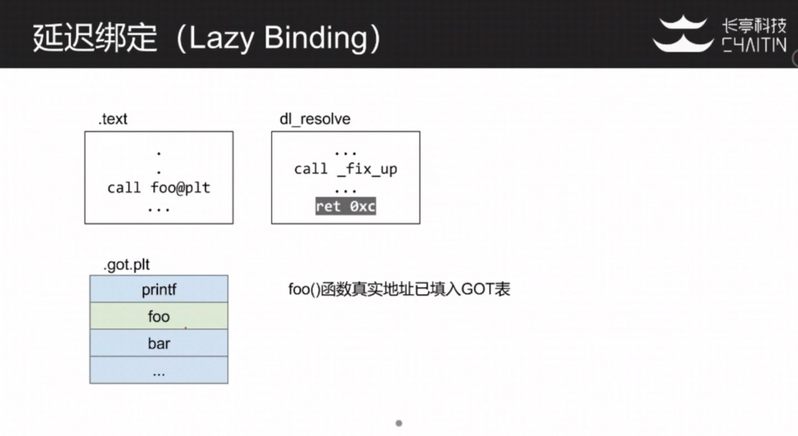

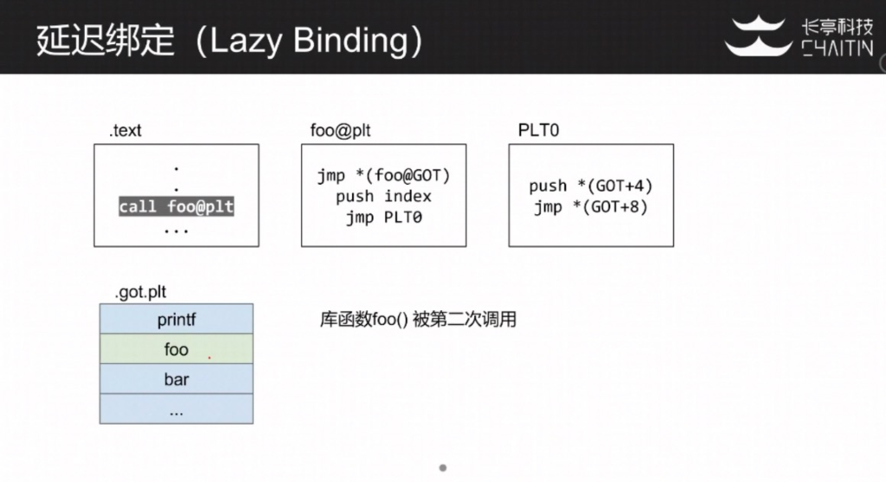

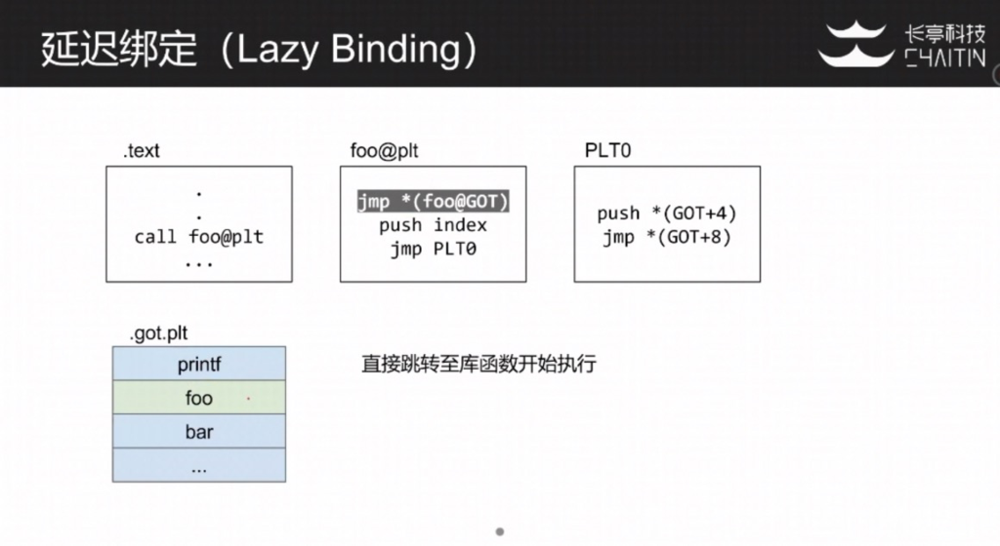

#### 查找GOT表项

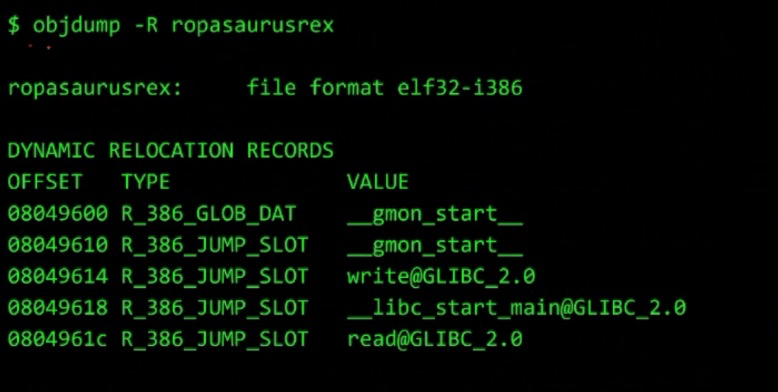

## 参考

 - 【长亭科技PWN系列公开课程 #1二进制程序基础原理入门 2020.04.13】