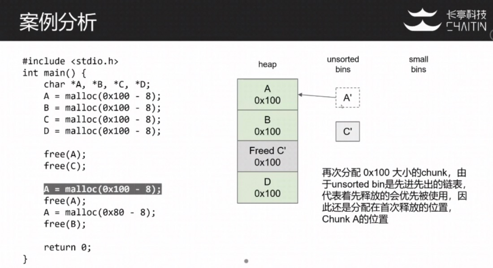

# 堆漏洞利用基础

- 什么是堆

- glibc的堆管理实现
  + arena
  + bins
  + chunk

- malloc和free的工作流程
- 新版本glibc中的tcache


## 堆相关基础

### 什么是堆


- 栈通常用于为函数分配固定大小的局部内存
- 堆是可以根据运行时的需要进行动态分配和释放的内存，大小可变
     + malloc/new
  + free/delete
- 堆的实现重点关注内存块的组织和管理方式，尤其是空闲内存块
     + 如何提高分配和释放效率
  + 如何降低碎片化，提高空间利用率
- 举例：浏览器的DOM树通常分配在堆上
     + 堆的实现算法影响堆分配网页加载的动态效果速度
  + 堆的实现算法影响浏览器对内存的使用效率

### 常见堆实现

- dlmalloc - 通用分配器
- ptmalloc2 - glibc 基于dlmalloc fork出来，在2006年增加了多线程支持
- jemalloc - FreeBSD、Firefox、Android
- tcmalloc - Google Chrome
- libumem - Solaris
- Windows 10 - segment heap    

### ptmalloc2的多线程支持

这里我们重点了解一下针对glibc的ptmalloc的实现和攻击利用方法。

- 不同的线程维护不同的堆，称为per thread arena
- 主线程创建的堆，称为main arena
- arena数量受到CPU核数的限制
     - 对于32位系统：arena数量上限 = 2*核数
     - 对于64位系统：arena数量上限 = 8*核数

### glibc的堆管理实现

- arena
  - 指的是堆内存区域本身，并非结构
  - 主线程的main arena通过sbrk创建
  - 其他线程arena通过mmap创建

- malloc_state
  - 管理arena核心结构，包含堆的状态信息，bins链表等
  - main arena对应的malloc_state结构存储在glibc的全局变量中
  - 其他线程arena对应的malloc_state存储在arena本身当中

- bins
  - bins用来管理空闲内存块，通常使用链表结构来进行组织

- chunks
  - 内存块的结构

> 以下介绍的堆管理环境为glibc 2.26以下(不含2.26)，即出现tcache之前的堆管理方式
> 以下演示的环境均是64位程序及操作系统
> 建议下载阅读glibc源码，详细了解堆管理的逻辑，代码阅读工具可以用sourceinsight等等

### arena头部结构：malloc_state

- malloc_state存储了arena的状态，其中包括了很多用于管理空闲块的bins链表
- 主线程的malloc_state结构存储在glibc的全局变量中，变量名为main_arena

```
struct malloc_state
{
    mutex_t mutex;                      /* Serialize access. */
    int flags;                          /* Flags (formerly in max_fast). */
    mfastbinptr fastbinsY[NFASTBINS];   /* Fastbins */
    mchunkptr top;                      /* Base of the topmost chunk, not otherwise kept in a bin */
    mchunkptr last_remainder;           /* The remainder from the most recent split of a small request */
    mchunkptr bins[NBINS * 2 - 2];      /* Normal bins packed as described above */
    unsigned int binmap[BINMAPSIZE];    /* Bitmap of bins */
    struct malloc_state *next;          /* Linked list */
    struct malloc_state *next_free;     /* Linked list for free arenas. */
    INTERNAL_SIZE_T system_mem;         /* Memory allocated from the system in this arena. */
    INTERNAL_SIZE_T max_system_mem;
};
static struct malloc_state main_area; /* global variable in libc.so */
```

其中重点关注的字段：

```
mfastbinptr fastbinsY[NFASTBINS]; # 管理fastbin，即小的chunk
mchunkptr top;        # (top chunk，预留的内存块，当top chunk不够时，可通过sbrk系统调用分配top chunk，抬高top chunk上限)
mchunkptr last_remainder;
mchunkptr bins[NBINS * 2 - 2];    # (链表形式传起来free chunk，管理空闲内存块的链表结构)
```

### Main Arena概览


> 可以看到bin是一个链表，将所有free chunk即空闲的块连起来，最后再指回bin
> top指向内存上限top chunk，如果不够了，可以通过sbrk系统调用分配top chunk，抬高top chunk上限

### 空闲内存块(free chunk)结构


- 在64位平台下，free chunk的第一个字段prev_size(8字节)，当前一个chunk是free_chunk的时候会用到，存储前一个chunk的大小。
- free chunk的第二个字段size记录了当前chunk的大小，该字段最低三个bit被用作其他含义:
   - P代表PREV_INUSE, 即代表前一个chunk是否被使用
   - M代表IS_MMAPED, 代表当前chunk是否是mmap出来的
   - N代表NON_MAIN_ARENA，代表该chunk是否属于非main arena
- 第三字段fd和第四字段bk(8字节)前向指针和后向指针，这两个字段用于bin链表中，用来链接大小相同或相近的free chunk，便于后续分配时查找。

> 由于分配的堆内存是对齐的，所以size的低三位字节用不到，用于存储NMP标志

### 已分配的内存块(allocated chunk)结构


- allocated chunk的前两个字段和free chunk相同
- 第三个字段开始到最后. chunk中存储的都是用户数据，甚至下一个chunk的第一个字段prev_size，也可被用来存放数据，原因是这个prev_size字段只有当"前一个"chunk是free的时候才有意义，如果"前一个"chunk是已经分配的，堆管理器并不关心。
- 所以对一个chunk来说，用户可用大小从偏移+8开始，一直到下一个chunk的pre_size字段。
- 在64位平台下，chunk的大小一定是0x10字节的整数倍。malloc返回的指针为图中mem指向的位置，即数据开头。

> 可以看到，已分配的内存块中，上面的前向指针和后向指针fd和bk，以及下一个chunk的pre_size，都被用来存储数据了，节约了空间

### malloc参数与chunk大小的关系

- malloc参数为用户申请的内存大小
- chunk包含数据和metadata
- 返回的chunk只要保证其中可用数据大小大于等于用户申请即可
- 在x86 32位平台下，chunk的大小一定是8字节的整数倍；x64平台下，chunk的大小一定是16字节的整数倍

### Bins结构

- Bins是用来管理和组织**空闲**内存块的链表结构，根据chunk的大小和状态，有许多种不同的Bins结构

- Fast bins
  - 用于管理小的chunk (即main_arean中的fastbinsY)

- Bins
  - small bins - 用于管理中等大小的chunk
  - large bins - 用于管理较大的chunk
  - unsorted bins - 用于存放未整理的chunk (类似垃圾桶，什么都放)

### Fast bins

```
struct malloc_state
{
    mutex_t mutex;
    int flags;
    mfastbinptr fastbinsY[NFASTBINS];   /* Fastbins */
    mchunkptr top;
    mchunkptr last_remainder;
    mchunkptr bins[NBINS * 2 - 2];
    ...
};
```

- 大小：x86_32平台：16~64字节；x64平台：32-128字节 (这里大小指的是chunk大小，而非分配内存的大小)

- 相同大小的chunk放在一个bin中
  
  > 相同大小的bin才会串成一个链表，即fastbinsY[NFASTBINS]中的一个元素是相同大小的chunk的链表
  > 例如64位里，fastbinsY[0]指向32字节的一个chunk链表，链表是单向的，最终最后一个chunk再指回fastbinsY[0]
  
- 单向链表

- 后进先出 (First in last out) (即最后被释放的内存，在下一次分配时会最先被分配使用)

- 相邻的空闲fast bin chunk不会被合并

- 当chunk被free时，不会清理PREV_INUSE标志

### Fast bin在内存中的结构示例


> 可以看到示例中的，0x00000021中的低位即P标志)


> 当程序free了a1和a2后，a2对应的chunk的后向指针指向了前一个被释放的chunk即0x60200处，而且PREV_INUSE标志没有被清理）

### Small Bins

```
struct malloc_state
{
    mutex_t mutex;
    int flags;
    mfastbinptr fastbinsY[NFASTBINS];
    mchunkptr top;
    mchunkptr last_remainder;
    mchunkptr bins[NBINS * 2 - 2];      /* Normal bins packed as described above */
    ...
};
```

   - chunk大小 < 1024 bytes (64bit)
   - 相同大小的chunk放在一个bin中
   - 双向循环链表
   - 先进先出 (First in first out) (即先释放出来的，下次分配先被使用)
   - 当有空闲块相邻时，chunk会被合并成一个更大的chunk
     (如何确定相邻chunk是否空闲：检查当前chunk的P位，可确定前一个chunk是否空闲；以及检查下下个chunk的P位，确定后面相邻的chunk是否空闲)
   - bins[2],bins[3],...,bins[124],bins[125]共62组smallbin，大小范围[0x20,0x3f0](64位)
     (因为是双向链表，需存储fd、bk两个指针，故两个为一组，bins[2]和bins[3]为一组，分别存储fd和bk，bins[4]和bins[5]为一组，依次类推，共62组)

> 相比fast bin，small bin结构比较复杂，检查比较多，因此针对small bin的攻击相对比较困难

### Large Bins

```
struct malloc_state
{
    mutex_t mutex;
    int flags;
    mfastbinptr fastbinsY[NFASTBINS];
    mchunkptr top;
    mchunkptr last_remainder;
    mchunkptr bins[NBINS * 2 - 2];      /* Normal bins packed as described above */
    ...
};
```

   - chunk大小 >= 1024 bytes (64bit)

   - 每组bin表示一组size范围而不是具体的size，例如bins[126],[127]的链表中保存长度在[0x400,0x440]的chunk
     
     > 这一点和smallbin有区别
     
   - 双向循环链表

   - 先进先出

   - chunk按照大小从大到小排序

   - 当有空闲块相邻，chunk会被合并

   - bins[126],bins[127],...,bins[250],bins[251]共63组largebin，大小范围[0x400,X](64位)

   - 每组bins中的chunk大小不一定相同(划重点，不一定相同)，按由大到小的顺序在链表中排列

  > 相比之下结构最复杂，本节不讨论针对large bin的攻击

### Unsorted bin

```
struct malloc_state
{
    mutex_t mutex;
    int flags;
    mfastbinptr fastbinsY[NFASTBINS];
    mchunkptr top;
    mchunkptr last_remainder;
    mchunkptr bins[NBINS * 2 - 2];      /* Normal bins packed as described above */
    ...
};
```

   - 64位平台中：chunk大小>128字节
   - 只存在唯一一个unsorted bin
   - 双向循环链表
   - 当一个chunk(非fast bin)被free，它首先被放入unsorted bin，等后续整理时才会放入对应的small bin/large bin
   - bins[0],bins[1]

### Unsorted bins与small bins


### 其他chunk

- top chunk
    + 不属于任何bin
    + 在arena中处于最高地址
    + 当没有其他空闲块时，top chunk就会被用于分配
    + 分裂时
      * 一块是请求大小的chunk
      * 另一块余下的chunk将成为新的top chunk
- last_reminder (在本节内容中不是重点)
    + 当请求small chunk大小的内存时，如发生分裂，则剩余的chunk保存为last_remainder

### malloc()的工作流程

- 如果size < max fast, 在fast bins中寻找fast chunk，如找到则结束
- 如果size in_smallbin_range, 在small bins中寻找small chunk，如找到则结束
- 如果size not in_smallbin_range, 合并所有fastbin的chunk
- 循环
  + 检查unsorted bin中的last_remainder
    * 如果满足一定条件(是多个条件判断，具体参考源码)，则分裂之，将剩余的chunk标记为新的last_remainder
  + 在unsorted bin中搜索，同时进行整理
    * 如遇到精确大小，则返回，否则就把当前chunk整理到small/large bin中去
  + 在small bin和large bin中搜索最合适的chunk(不一定是精确大小)
- 使用top chunk

### free()的工作流程

- 如果size < max fast, 放入fast bin，结束
- 如果前一个chunk是free的
  + unlink前面的chunk (这里针对老的unlink实现可以进行攻击)
  + 合并两个chunk，并放入unsorted bin
- 如果后一个chunk是top chunk，则将当前chunk并入top chunk
- 如果后一个chunk是free的
  + unlink后面的chunk
  + 合并两个chunk，并放入unsorted bin
- 前后chunk都不是free的，放入unsorted bin

### 案例分析





### tcache

glibc在2.26的版本之后引入了一个新的堆管理结构。多线程程序中存在对堆的同时访问，此时不断进行的获得/释放锁的操作会影响程序的效率。tcache就是为了解决这个问题而出现的。

- tcache引入的函数
  
  ```
  static __always_inline void tcache_put(mchunkptr chunk, size_t tc_idx)
  {
      tcache_entry *e = (tcache_entry *)chunk2mem(chunk);
      assert(tc_idx < TCACHE_MAX_BINS);
      e->next = tcache->entries[tc_idx];
      tcache->entries[tc_idx] = e;
      ++(tcache->counts[tc_idx]);
  }
  
  static __always_inline void *tcache_get(size_t tc_idx)
  {
      tcache_entry *e = tcache->entries[tc_idx];
      assert(tc_idx < TCACHE_MAX_BINS);
      assert(tcache->entries[tc_idx] > 0);
      e->next = tcache->entries[tc_idx];
      tcache->entries[tc_idx] = e->next;
      --(tcache->counts[tc_idx]);
      return (void *)e;
  }
  ```
  
  + tcache_put用于向对应的tache链表中插入tcache
  + tcache_get用于从对应的tache链表中取出tcache
  + 不会像fastbin一样检查堆头!
  
-  tcache引入后的malloc
   
  > 方括号中标示的是差异部分
  
  + **[如果size in tcache，在tcache中寻找chunk，如找到则结束]**
  + 如果size < max fast，在fast bins中寻找fast chunk，如找到**[则将剩余相同大小的fastbin填充至对应的tcache，]**结束
  + 如果size in_smallbin_range, 在small bins中寻找small chunk，如找到**[则将剩余相同大小的smallbin填充至对应的tcache，]**结束
  + 如果size not in_smallbin_range, 合并所有fastbin的chunk
  + 循环
    * 检查unsorted bin中的last_remainder
      如果满足一定条件，则分裂之，将剩余的chunk标记为新的last_remainder
    * 在unsorted bin中搜索，同时进行整理
      如遇到精确大小，则**[填充入tcache后]**返回，否则就把当前chunk整理到small/large bin中去
    * 在small bin和large bin中搜索最合适的chunk(不一定是精确大小)
  + 使用top chunk


## 补充

- Ubuntu版本和对应glibc版本关系：
  - glibc2.23
  - glibc2.27对应Ubuntu18，并在这一版本中glibc引入了tmalloc
  - glibc2.29对应Ubuntu19.04

- 在CTF题目涉及到的libc一般都会给

- 如何调试libc：网上有教程，需要下载源码，编译后放入系统中进行调试

- 针对unlink攻击很早以前有，后面加了一些检查，现在有针对的一些绕过
  针对fastbin的攻击方式，目前所有版本都可以利用

## 参考

- 【长亭科技PWN系列公开课程 #4PWN术进阶，玩转堆溢出 2020.04.30 长亭科技安全研究员 f1yy (yanyuzhang)】

- https://sploitfun.wordpress.com/2015/02/10/understanding-glibc-malloc/comment-page-1/

- https://github.com/cloudburst/libheap 