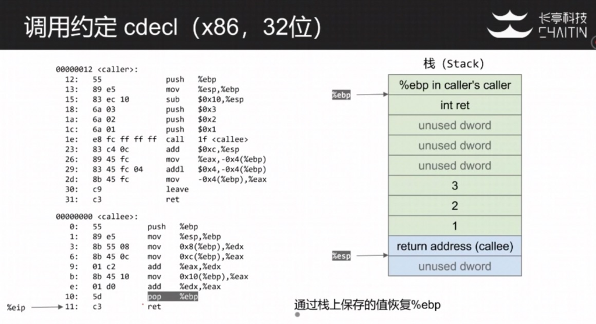

# 汇编语言基础

## 寻址模式

- 立即数寻址 (Immediate Addressing)

  操作数包含在指令中，紧跟在操作码之后，作为指令的一部分

  举例:

```
mov al, 5
mov eax, 1000h
```

- 寄存器寻址 (Register Addressing)

  操作数在寄存器中，指令指定寄存器

  举例:

```
mov ax, bx
mov ebp, esp
```

- 直接内存寻址 (Direct/Displacement Only Addressing)

  操作数在内存中，指令直接指定寄存器地址

  举例:

```
mov ax, [2000h]
```

- 寄存器间接寻址 (Register Indirect Addressing)

  操作数在内存中，操作数的地址在寄存器中

  举例:

```
mov eax, [ebx]
```

- 索引寻址 (Indexed Addressing)

  通过基址寄存器内容加上一个索引值来寻址内存中的数据

  举例:

```
mov ax, [di+100h]
```

- 相对基址索引寻址 (Based Indexed Addressing)

  用一个基址寄存器加上一个编制寄存器的内容再加上一个偏移量来完成内容单元的寻址

  举例:

```
mov dh, [bx+si+10h]
```

- 比例寻址变址

  通过基址寄存器的内容加上变址寄存器的内容与一个比例因子的乘积来寻址内存中的数据

  举例:

```
mov eax, [ebx+4*ecx]
```

## 常见指令:

 针对Pwn来说，只需熟悉常见指令即可，遇到陌生指令可以随时查询。

- mov

  语法：

```
mov <reg>, <reg>
mov <reg>, <mem>
mov <mem>, <reg>
mov <reg>, <const>
mov <mem>, <const>
```

  举例(不同的寻址方式):

```
mov eax, ebx
mov byte ptr[val], 5
mov eax, [ebx]
mov [var], ebx
mov eax, [esi-4]
mov [esi+eax], ci
mov edx, [esi+4*ebx]
```

- push

  语法:

```
push <reg32> ；相当于sub esp, 4; mov [esp], <reg32>
push <mem>
push <con32>
```

  举例:

```
push eax
push [var]
```

- pop

  语法:

```
pop <reg32>
pop <mem>
```

  举例:

```
pop edi

pop [ebx]
```

- lea - 加载有效地址 (Load Effective Address)

  语法:

```
lea <reg32>, <mem>
```

  举例:

```
lea eax, [var] ; 将地址var放入寄存器eax中
lea edi, [ebx+4*esi] ; edi = ebx+4*esi ;某些编译器会使用lea指令来进行算数运算，因为速度更快
```

- 算数与逻辑指令

```
add/sub
inc/dec
imul/idiv
and/or/xor
not/neg
shl/shr
```

- 控制转义指令

```
jmp - 无条件跳转
j[condition] - 条件调整
cmp - 比较
call/ret - 函数调用/函数返回
```

## Intel语法与AT&T语法

 - 操作数顺序不同

 - 寄存器记法有差异

 - 立即数记法有差异

 - 访存寻址计法不同

 - 操作码助记符不同


## 调用约定

- 什么是调用约定

  + 实现层面（底层）的规范

  + 约定了函数之间如何传递参数

  + 约定了函数如何传递返回值

- 常见x86调用约定

  + 调用者负责清理栈上的参数(Caller Clean-up)

     + cdecl

     + optlink

  + 被调者负责清理栈上的参数(Callee Clean-up)
    + stdcall

    + fastcall

- 调用约定cdecl实例讲解 (x86, 32位)





- 关于调用约定cdecl补充说明
  - x86 (32位) cdecl调用约定

    用栈来传递参数

    用寄存器%eax来保存返回值

  - arm64 (64位) cdecl调用约定

    使用寄存器%rdi, %rsi, %rdx, %rcx, %r8, %r9 来传递前6个参数

    第七个及以上的参数通过栈来传递

  - 栈帧指针 %ebp(%rbp) 的用途

    索引栈上的参数(例如x86下，%ebp+8指向第一个参数)
  
    保存栈顶位置%esp(%rsp)
    
    
  
- 进程内存空间布局 (Linux x86)


高地址为内核区域，用户无权访问，低地址为用户区域，在内核没用开启SMAP时，内核代码可以访问用户空间数据，在内核没有开启SMEP保护时，内核态可以执行用户区域代码。

0x08048000 这个数值是定义在ld script中的，当链接时，会将这个数值写入可执行程序中。

# 参考

- 【长亭科技PWN系列公开课程 #1二进制程序基础原理入门 2020.04.13】

