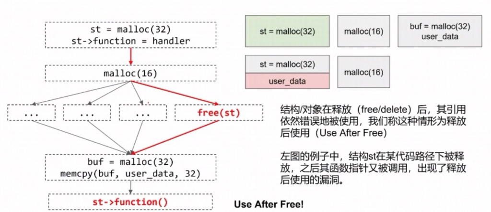
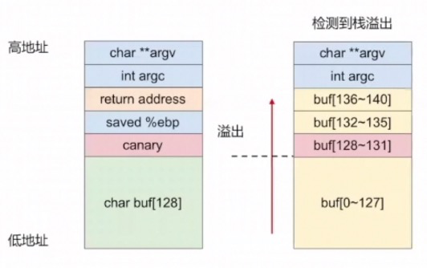
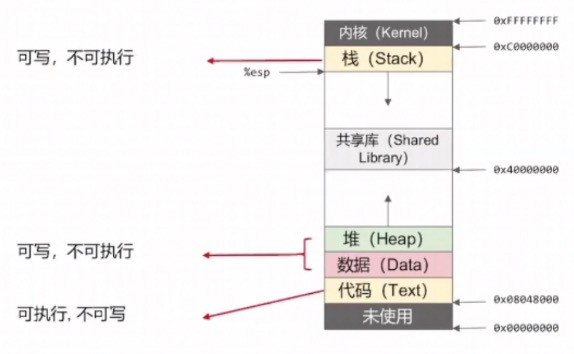
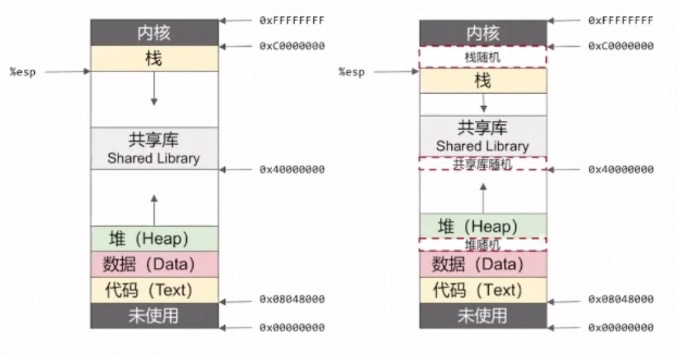
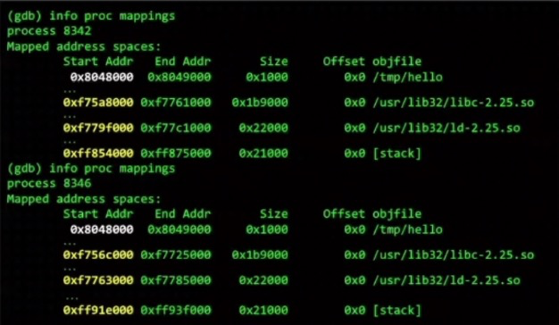

# 漏洞类型与缓解措施

## 常见漏洞类型

### 栈溢出(Stack Overflow)

- 栈溢出的历史
  - 概念提出于美国空军发布的论文《Computer Security Technology Planning Studt》(1972)
  - Morris蠕虫(1998)
  - 发表在Phrack杂志上的利用技术文章《Smashing the Stack for Fun and Profit》(Aleph One 1996)

- 实例. 文章 《Smashing the Stack for Fun and Profit》 中的Demo

```
void function(char *str) {
  char buffer[16];
  strcpy(buffer, str);
}

void main() {
  char large_string[256];
  int i;
  for (i = 0; i < 255; i++)
    large_string[i] = 'A';
    function(large_string);
}
```


## 堆溢出(Heap Overflow)

- 历史

  \- 《Vudo Malloc Tricks》, 2001

  \- 《Once Upon A free()》, 2001

  \- 《The Malloc Maleficarum》, 2005

  \- 《MALLOC DES-MALEFICARUM》，2009

  \- 自2014年hack.lu CTF赛题oreo以来，越来越多的堆利用技巧被发明

- 实例

```
#define BUFSIZE 256
int main(int argc, char **argv[]) {
    char *buf;
    buf = (char *)malloc(sizeof(char)*BUFSIZE);
    strcpy(buf, argv[1]);
}
```


### 整数溢出(Integer Overflow)

- 历史
  - 1996年，欧洲航天局阿丽亚娜5号火箭爆炸，事故原因就是整数溢出
  - M. Dowd, C. Spencer, N. Metha, N. Herath, and H. Flake. Advanced Software Vulnerability Assessment. In Blackhat USA, 2002年8月

- IO2BO (Integer Overflow to Buffer Overflow)

```
void safe_memcpy(char *src, int size) {
    char dst[512];
    if (size < 512) {
        memcpy(dst, src, size);
    }
}
```

   当size为负数，即可绕过条件size<512，在memcpy时将size是做无符号数，即可拷贝过大字节，产生溢出。

+ 数组下标越界

```
void safe_set_element(char *arr, int index, char value, int arr_size) {
    if (index < arr_size) {
        arr[index] = value;
    }
}
```

​    同样当index为负数，即可绕过条件index < arr_size, 在数组写入时即可产生越界。

- 类型转换导致的整数溢出

```
int main() {
   int num;
   short int tmp;
   char buf[16] = {0};
   puts("input len:");
   read(0, buf, 16);
   num = atoi(buf);
   tmp = num;
   char *note = malloc(tmp);
   puts("input note:");
   read(0, note, num);
}
```

  num为int型，分配数据时却类型转换使用tmp/short int型来设置大小，当num=0x10000时，tmp则为0，造成溢出。

- 整数溢出案例：CVE-2013-2094

```
static int perf_swenvent_init(struct perf_event *event)
{
    int event_fd = event->attr.config; // dangerous !
    ...
    if (event_fd >= PERF_COUNT_SW_MAX)
        return -ENOENT;
    if (!event->parent) {
        int err;
    err = swevent_hlist_get(event);
    if (err)
        return err;
    atomic_int(&perf_swenvent_enabled[event_id]);
    event->destory = sw_perf_event_destory;
    }
}
```


## 释放后使用 (Use After Free)

  结构/对象在释放(free/delete)后，其引用依然错误地被使用，我们称这种情形为释放后使用(Use After Free)

  下图的例子中，结构st在某代码路径下呗释放，之后其函数指针又被调用，出现了释放后使用的漏洞。



下面简单的案例展示了ptr在某些条件下被释放，同时后续又被使用所产生的UAF漏洞。

```
char* ptr = (char*) malloc(SIZE);
if (err) {
    abrt = 1;
    free(ptr);
}
...
if (abrt) {
    logError("operation aborted before commit", ptr);
}
```

一般来说，在真实软件中，例如浏览器，很多结构，对象的操作非常复杂，分支路径甚多，能触发UAF的可能只有少数几条路径，因此想要肉眼找到这些罕见的路径，必须充分理解所有代码分支。

采用代码审计/逆向分析的方法肉眼找UAF的漏洞对研究人员要求非常高，目前大部分UAF漏洞是通过模糊测试发现的。

修复：要释放的对象/结构及时置空指针。


## 数组越界

越界访问包括越界读和越界写。这里的数组可能是在栈上，也可能是在堆上。

如果是栈上数组越界写，可以考虑覆写返回地址实现利用，也可以考虑覆写GOT表。

如果是在堆上，通常可以通过覆写GOT表会比较简单，也可以考虑堆漏洞利用。


## 缓解措施

### Stack Canary/Stack Cookie/Stack Protector

对应checksec检查中的CANARY

对于要保护的函数，在执行之前，栈上会放一个随机值，叫做Canary，在函数运行完毕返回之前，会再次检查栈上这个随机值Canary是否被改变。如果发生改变，则检测到栈溢出发生，程序报错退出。gcc的-fstack-protector选项可以启用这一机制，Canary放置和检查的代码会通过编译器自动植入。



编译时添加参数`-fno-stack-protector`禁用Stack Protector：

```
 gcc -fno-stack-protector -o level1 level1.c
```

```
-fno-stack-protector    # 关闭
-fstack-protector       # 开启
-fstack-protector-all   # 全开启
```

- Stack Canary/Cookie绕过思路
  - 泄露Canary，每个线程不同函数的Canary都相同
  - 只覆盖局部变量，不覆盖返回地址
  - 修改Thread-local Storage中的Canary

### NX/W^X/DEP

对应于checksec检查中的NX

编译时添加参数`-z execstack`禁用DEP：

```
 gcc -z execstack -o level1 level1.c
```

如果你通过`sudo cat /proc/[pid]/maps`查看，你会发现关闭DEP的stack是rwx的，打开dep即不带`-z execstack`参数编译的stack却是rw的。

```
 level1: bffdf000-c0000000 rw-p 00000000 00:00 0 [stack]
 level2: bffdf000-c0000000 rwxp 00000000 00:00 0 [stack]
```

这时候我们如果使用普通硬编码栈上shellcode地址覆盖返回地址方法，参考简单栈溢出的例子，系统会拒绝执行我们的shellcode。

- 栈不可执行保护思路：内存权限精细划分
  - 可写、不可执行：栈、堆、数据
  - 不可写、可执行：只读数据、代码
  - 可写、可执行二者不可兼得



- 历史：
  - Alexander给出了一个linux补丁(1997)：实现了栈不可执行
  - Pax研究组提出了W^X(2000)：更细粒度的保护
  - RedHat Linux ExecShield, Windows DEP(2004)
  - NX被绕过：return-to-libc/ROP(代码重用攻击)

- NX/W^X/DEP保护机制绕过思路
  - return-to-libc: 由于可写可执行二者不可兼得，攻击者只能执行已有代码，无法引入新的代码，所以只能考虑跳转到已有的代码中执行。因此，可以复用libc中大量函数，例如执行命令system()，这种攻击方法就是return to libc。

- gcc参数

  ```
  -z execstack    # 关闭
  -z noexecstack  # 开启
  ```

  

### ASLR/PIE

地址空间随机化(ASLR)

通过如下命令查看或关掉整个linux系统的ASLR保护，改写ASLR需要root权限。

```
cat /proc/sys/kernel/randomize_va_space
echo 0 > /proc/sys/kernel/randomize_va_space
```

ASLR添加到Linux内核默认是2.6.12以上，如果是该版本以下，默认不存在ASLR，不需要考虑ASLR。

> 注意,使用gdb调试时,每次看到的栈地址可能是不变的,这并不代表系统没有打开ASLR,gdb调试时会自动关闭ASLR

- 历史

  ASLR，最早由Pax研究组提出，通过提交Linux内核补丁的方式实装

  + 用户栈随机化(2001)
    
  + 内核栈随机化(2002)
    
  + 堆随机化(2003)

- PC/移动操作系统均已支持

- 大量IoT设备仍未启用

开启ASLR后栈、共享库、堆地址都会被随机化。



- ASLR配置

  ASLR与系统配置有关，与可执行文件无关。ASLR添加到Linux内核默认是2.6.12以上

```
/proc/sys/kernel/randomize_va_space = 0    # 无随机化
/proc/sys/kernel/randomize_va_space = 1    # 栈、共享库随机化，堆无随机化
/proc/sys/kernel/randomize_va_space = 2    # 堆、栈、共享库随机化
```

- ASLR启用效果

两次执行程序，动态库、栈地址都不同，随机粒度为0x1000,相当于一个内存页的大小

两次执行程序，程序本身加载地址相同，都是0x8048000

程序本身加载地址是否也可以随机化？



- 地址空间随机化防护绕过思路

  + 如果未开启PIE，return to PLT(2001)，可绕过共享库随机化

  + x86_32架构下可爆破：内存地址随机化粒度以页为单位：0x1000字节对齐
  
    - 信息泄露
  
    - 在shellcode之前布置一长串nop指令(nop sled)
  
    - 堆喷(Heap spray)
  
    - 本地环境小技巧：ulimit -s unlimited

- 补充说明

  + 使用gdb调试时会自动关闭ASLR，每次看到的栈地址可能是不变的，这并不代表系统没有打开ASLR,
  + 开启ALSR情况下，如果目标程序是fork-accept形式的程序，每次子进程退出内存布局不变，则可以多次连接来获取一些必须的信息。否则每次连接libc地址都会改变，因此这种情况下只能通过一次连接来完成信息获取和漏洞的触发，这就需要保证整个过程无崩溃退出。
  + fork出来的进程模块地址一样，所以能取到其中一个进程的模块基地址或者自身本身就是其中一个子进程，也就不需要泄露其他子进程的模块基地址了。例如Android环境中system_server和一般应用都是从Zygote fork出来的，模块地址一样，不需要泄漏system_server的模块基地址.

- PIE gcc参数

  ```
  -no-pie    # 关闭
  -pie       # 开启
  ```

## RELRO

- RELRO gcc参数

```
-z norelro    # 关闭
-z lazy       # 部分开启
-z now        # 完全开启
```

### FORTIFY

通过在源码开头添加`#undef _FORTIFY_SOURCE`代码可禁用FORTIFY


## 补充说明

- 栈溢出代码举例

```
memcpy(dest, src, strlen(src));
scanf("%s", buf);
strcpy(dest, src);
strncpy(dest, src, strlen(src));
sprintf(dest, "%s\n", str);
snprintf(dest, len, "%s\n", str); // 虽然有边界检查，但len计算错误情况下还是会溢出
```

- scanf

程序使用scanf取得输入，则输入不能包含如下字符，否则会被截断

0x09，0x0A，0x0B，0x0C，0x0D，0x00，0x20

> 实测scanf遇到0x00字符并不会被截断，后面字符还会继续输入，其他0x09 0x0A 0x0B 0x0C 0x0D 0x20的确是可以截断的

有些输入经过函数过滤，只允许指定的字符输入，如只允许小写字母等等。解决方案是shellcode加密、指令变形等等。而加密常用的方式就是异或，或者直接使用msf等工具加密

- strtol

程序判断输入是否为负数，只检查了第一个字符是否为'-'，然后用strtol函数将输入的字符串转换成数字。然而strtol函数会把字符串前导的空白字符忽略掉，所以只需要先输入一个空格再输入一个负数即可使得后续的数组访问越界，从而修改到栈上的数据，也就是可以修改返回地址。

- getc

接收用户输入用函数是getc()，终止条件是判断输入了换行或EOF则停止。注意getc()函数遇到\x00空字符是不会中止输入的。

